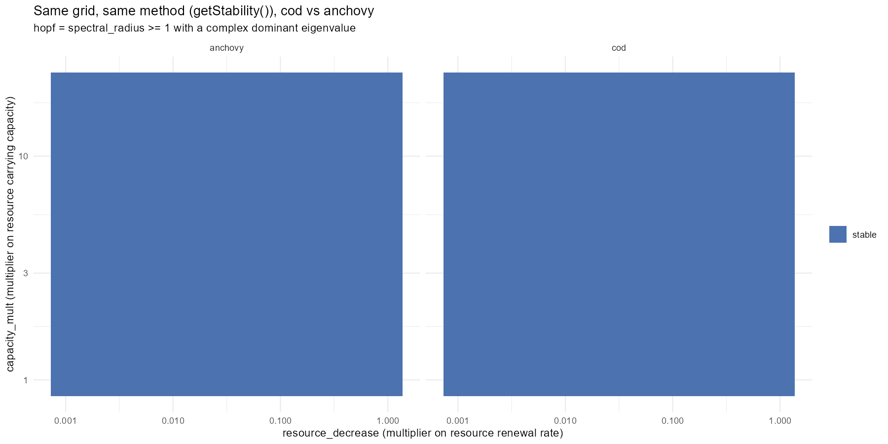
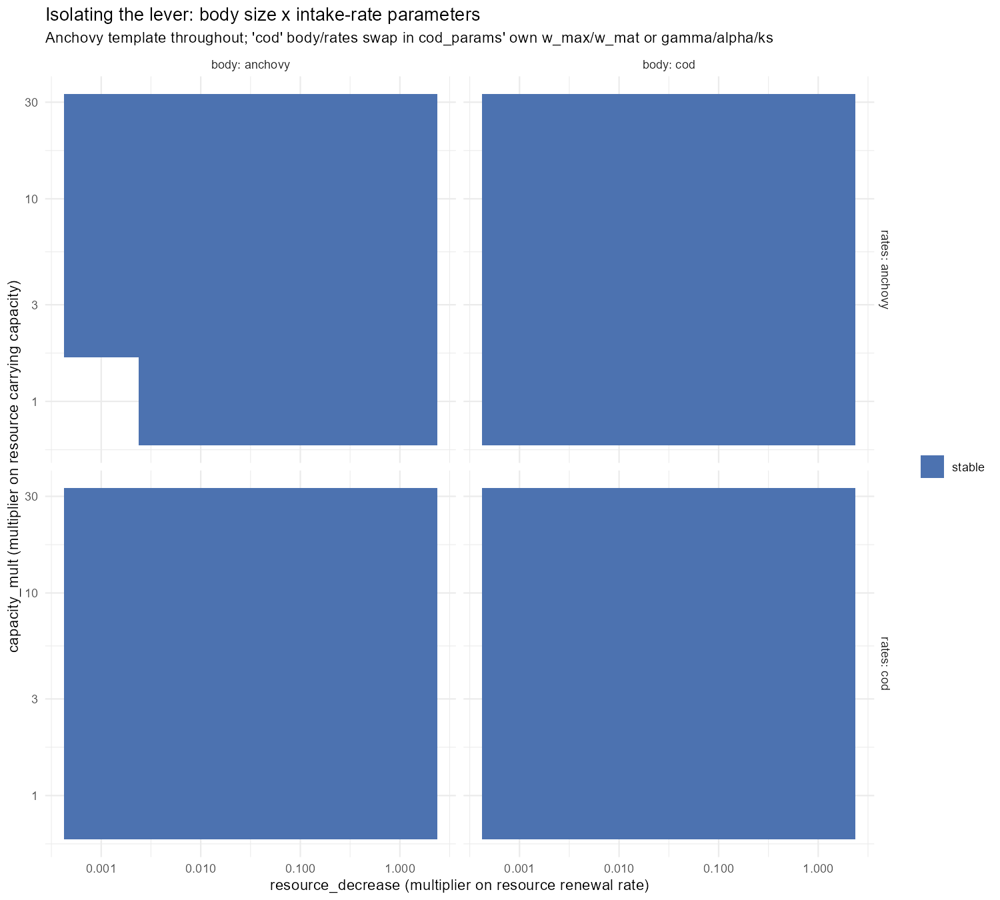
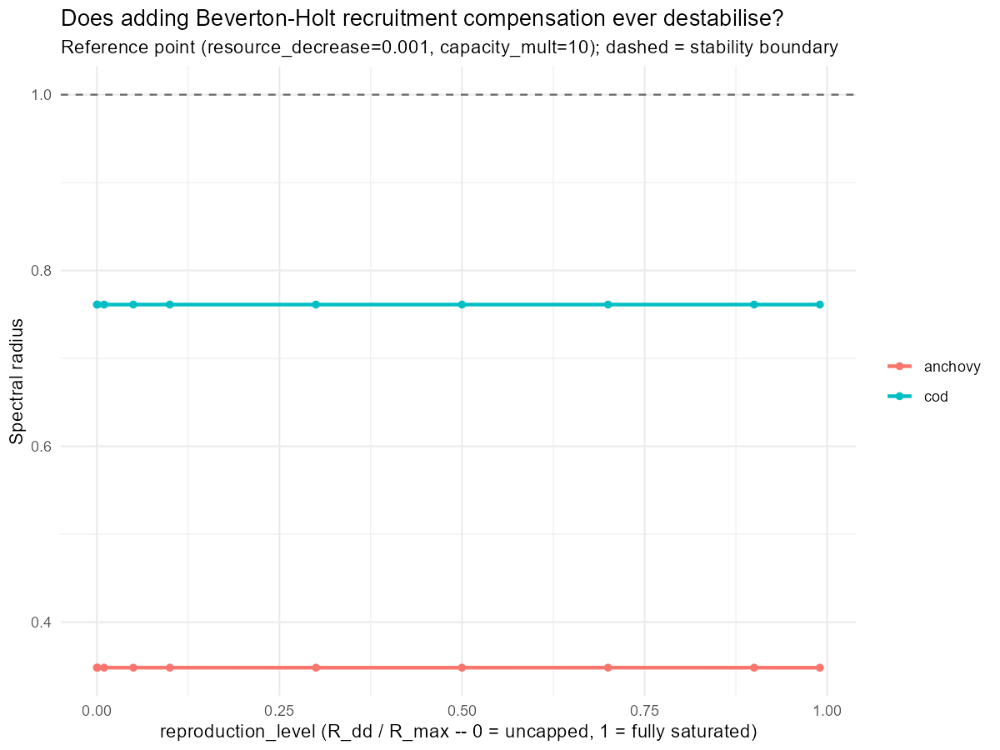
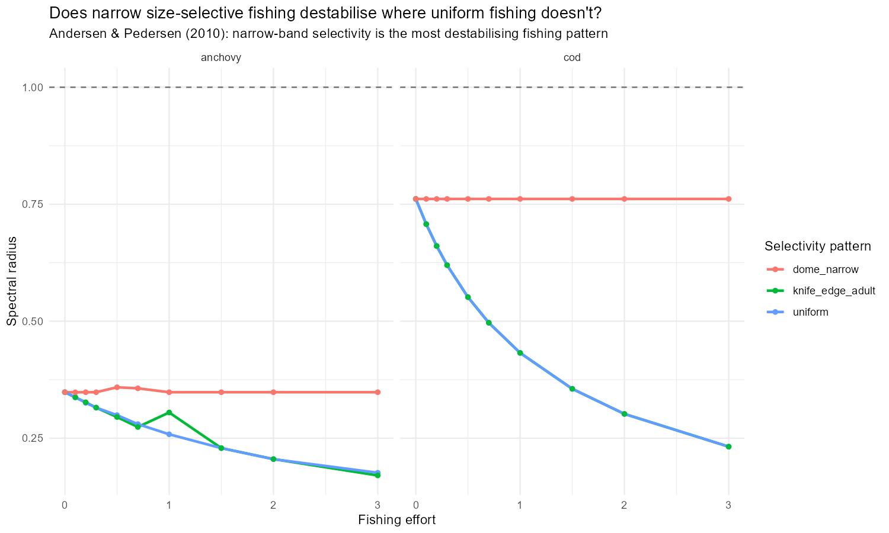
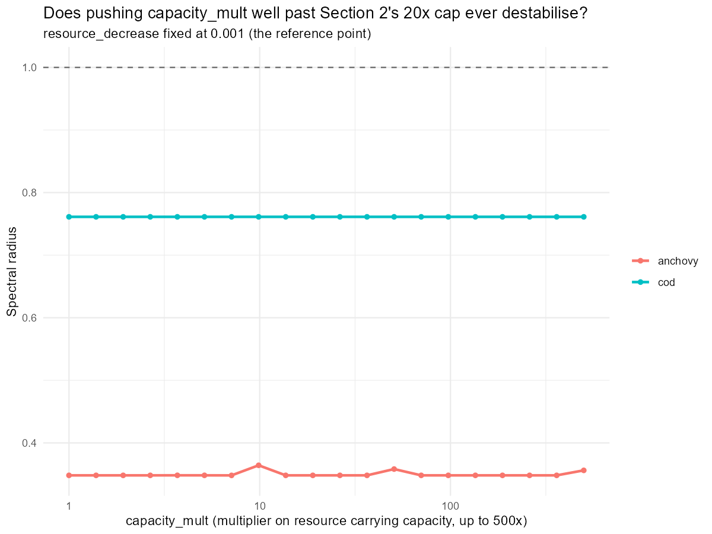

## Where Day 28 Left Us

Day 28 found `cod_params` stable everywhere tested (`spectral_radius` pinned near 0.51-0.76 across a 120-point `resource_decrease` x `capacity_mult` grid), and read both cod and the anchovy calibration as "adult-driven" by de Roos & Persson's (2003) mass-specific-ingestion-rate criterion. A follow-up read of the same paper lineage (Soudijn, de Roos et al. 2017) suggested the real lever might be a resource-vs-consumer *timescale separation* rather than the raw competitive-asymmetry sign alone, and three concrete ideas came out of that discussion for actually inducing a Hopf bifurcation: relaxing the reproduction cap, size-selective fishing, and pushing `capacity_mult` further than the 20x already tested.

Today runs all three, plus a method-matched `getStability()` grid for anchovy and a body-size x intake-rate factorial to isolate whichever lever turned out to matter. All four come back null. The interesting result of the day turns out to be about the *method itself*. Perturbing the actual simulation away from steady state, rather than trusting `getStability()`'s linearisation, finds a real, substantial anchovy oscillation that every grid up to that point had called stable.

------------------------------------------------------------------------

## Setup

```{r libraries}
#| message: false
#| warning: false
#| output: false
library(mizer)
library(mizerExperimental)
library(dplyr)
library(ggplot2)
library(future)
library(future.apply)
library(scales)

plan(multisession)
dir.create("interesting_plots", showWarnings = FALSE)
```

```{r builder}
#| message: false
#| warning: false
#| output: false
#| eval: false
cod_params <- readRDS("cod_params.rds")

make_anchovy_params <- function(lambda = 2.05, resource_decrease = 0.01,
                                capacity_mult = 10, second_order = TRUE,
                                ext_diff = 0.00, alpha = 0.1, gamma = 750,
                                ks = 0, kappa_override = NULL) {
  a0    <- 100
  kappa <- if (is.null(kappa_override)) a0 * exp(-6.9 * (lambda - 1)) else kappa_override
  no_w  <- round(log(66.5 / 0.0003) / 0.1)

  params <- newSingleSpeciesParams(
    species_name = "Anchovy",
    w_min = 0.0003, w_max = 66.5, w_mat = 10,
    no_w = no_w, lambda = lambda, kappa = kappa,
    alpha = alpha, gamma = gamma, ks = ks
  )

  given_species_params(params)$D_ext <- ext_diff
  params <- setBevertonHolt(params)

  default_capacity <- getResourceCapacity(params)
  r  <- getResourceRate(params) * resource_decrease
  cc <- default_capacity * capacity_mult

  params <- setResource(params, resource_rate = r, resource_capacity = cc,
                        resource_dynamics = "resource_semichemostat",
                        balance = FALSE)

  if (second_order) {
    second_order_w(params) <- c(flux = "centred", bin_average = TRUE)
  }

  params
}

anchovy_params <- make_anchovy_params()

resource_limitation_2d_cod <- function(params, resource_decrease, capacity_mult) {
  new_rate     <- getResourceRate(params) * resource_decrease
  new_capacity <- getResourceCapacity(params) * capacity_mult
  setResource(params, resource_rate = new_rate, resource_capacity = new_capacity, balance = FALSE)
}

build_cod     <- function(resource_decrease, capacity_mult) {
  resource_limitation_2d_cod(cod_params, resource_decrease, capacity_mult)
}
build_anchovy <- function(resource_decrease, capacity_mult) {
  make_anchovy_params(resource_decrease = resource_decrease, capacity_mult = capacity_mult)
}
```

------------------------------------------------------------------------

## Fixing the Competitiveness Metric: A Ratio, Not a Difference

Day 28's juvenile-vs-adult comparison used a *difference* (`mean(juvenile_rate) - mean(adult_rate)`), which isn't scale-free. Its magnitude depends on whatever units each species' own calibration happens to produce, so a "-14194" for cod and a "-321" for anchovy aren't actually comparable to each other, and neither has a natural interpretation on its own. de Roos & Persson's own `q` parameter is a *ratio*: `q=1` means juveniles and adults are equally competitive, values away from 1 in either direction indicate which stage dominates.

```{r ratio-metric}
#| message: false
#| warning: false
#| eval: false
mean_mass_specific_rate <- function(params, idx = TRUE) {
  E <- getEncounter(params)
  f <- getFeedingLevel(params)
  per_capita_rate    <- (E * (1 - f))[1, ]
  mass_specific_rate <- per_capita_rate / params@w
  mean(mass_specific_rate[idx])
}

timescale_summary <- function(params, label) {
  w     <- params@w
  w_mat <- params@species_params$w_mat[1]

  msr_all <- mean_mass_specific_rate(params)
  msr_juv <- mean_mass_specific_rate(params, w < w_mat)
  msr_ad  <- mean_mass_specific_rate(params, w >= w_mat)

  resource_rate_vec <- getResourceRate(params)
  resource_rate      <- mean(resource_rate_vec[resource_rate_vec > 0])

  juvenile_adult_rate_ratio <- msr_juv / msr_ad

  data.frame(
    species                    = label,
    resource_rate               = resource_rate,
    mean_mass_specific_rate     = msr_all,
    juvenile_rate                = msr_juv,
    adult_rate                   = msr_ad,
    juvenile_adult_rate_ratio    = juvenile_adult_rate_ratio,
    # Inverts Soudijn et al.'s own nu_J/nu_A = (2-q)/q relationship, so
    # both species land directly on their q=0.5/1/1.5 scale.
    q_equivalent                 = 2 / (juvenile_adult_rate_ratio + 1),
    timescale_ratio              = resource_rate / msr_all
  )
}

timescale_df <- bind_rows(
  timescale_summary(cod_params, "cod"),
  timescale_summary(anchovy_params, "anchovy")
)
timescale_df
```

|         | juvenile_adult_rate_ratio | q_equivalent |
|---------|---------------------------|--------------|
| cod     | 12.87                     | 0.144        |
| anchovy | 6.13                      | 0.280        |

Neither species is close to `q=1`. Both are strongly juvenile-dominated (`q_equivalent` well below even Soudijn et al.'s most juvenile-skewed test case of `q=0.5`), and **cod is the more skewed of the two, not less**. Juveniles out-eat adults by \~13x in cod vs. \~6x in anchovy on a mass-specific basis. That's the opposite classification from Day 28's blog post, which reported both species as adult-driven. Rerunning Day 28's own snippet verbatim against the current `cod_params.rds` reproduces `+28.76` (juveniles dominant), not the `-14194.29` originally reported. The most likely explanation is that number came from an interactive session where `cod_params` had already been reassigned earlier in that session, not from the saved script run fresh.

If raw distance from `q=1` predicted cycling on its own, cod should be the *more* cycle-prone species, not the one that stayed flat through Day 28's whole grid. That mismatch is what the rest of today is chasing.

------------------------------------------------------------------------

## A Method-Matched Grid: getStability() on Anchovy Too

Day 28 only ran the `getStability()` grid on cod. Running the identical grid on anchovy settles Day 27's "is the reference point actually oscillating" ambiguity with the same analytic tool, instead of the raw time-series/`catchable_fraction` proxies Days 22-27 relied on.

```{r hopf-grid-setup}
#| message: false
#| warning: false
#| eval: false
check_hopf_grid_point_generic <- function(build_fn, resource_decrease, capacity_mult, effort = 0) {
  result <- tryCatch({
    p        <- build_fn(resource_decrease, capacity_mult)
    p_steady <- steadyNewton(p, effort = effort, stability = TRUE)
    stab     <- attr(p_steady, "stability")
    dominant <- stab$eigenvalues[1]
    is_complex <- abs(Im(dominant)) > 1e-8

    data.frame(
      spectral_radius  = stab$spectral_radius,
      stable           = stab$stable,
      bifurcation_type = if (stab$stable) "stable" else if (is_complex) "hopf" else "non-oscillatory",
      error            = NA_character_
    )
  }, error = function(e) {
    data.frame(spectral_radius = NA_real_, stable = NA, bifurcation_type = NA_character_,
               error = conditionMessage(e))
  })
  data.frame(resource_decrease = resource_decrease, capacity_mult = capacity_mult,
             effort = effort, result)
}

resource_decrease_seq <- exp(seq(log(0.001), log(1), length.out = 12))
capacity_mult_seq     <- exp(seq(log(1), log(20), length.out = 10))
hopf_grid_params       <- expand.grid(resource_decrease = resource_decrease_seq,
                                      capacity_mult = capacity_mult_seq)
```

```{r hopf-grid-run}
#| message: false
#| warning: false
#| eval: false
hopf_grid_generic <- function(build_fn, species_label) {
  df <- bind_rows(future_lapply(seq_len(nrow(hopf_grid_params)), function(i) {
    check_hopf_grid_point_generic(build_fn, hopf_grid_params$resource_decrease[i],
                                  hopf_grid_params$capacity_mult[i])
  }, future.seed = TRUE))
  df$species <- species_label
  df
}

cod_hopf_grid_29     <- hopf_grid_generic(build_cod, "cod")
anchovy_hopf_grid_29 <- hopf_grid_generic(build_anchovy, "anchovy")
species_hopf_grid_df <- bind_rows(cod_hopf_grid_29, anchovy_hopf_grid_29)
```



Every single point in the 120x2 grid comes back `stable`. Zero `hopf` points for cod, zero for anchovy -- solid blue in both panels, no red or orange anywhere. This directly resolves the Day 27 ambiguity: anchovy's reference point isn't just flat at that one spot, it's stable across the *whole* grid, by the same analytic test that already vindicated cod.

------------------------------------------------------------------------

## Isolating the Lever: Body Size vs Intake-Rate Parameters

With both species reading "stable everywhere" by `getStability()`, the next question was whether a body-size x intake-rate-parameter factorial (built inside the anchovy single-species template, swapping in cod's own `w_max`/`w_mat`/`gamma`/`alpha`/`ks` one axis at a time) could isolate a lever even where the native calibrations don't show one ,mirroring the "species params crossed with gamma alone" 2x2 design from Day 19/20.

```{r factorial-setup}
#| message: false
#| warning: false
#| eval: false
cod_sp    <- cod_params@species_params
cod_gamma <- unname(cod_sp$gamma[1])
cod_alpha <- unname(cod_sp$alpha[1])
cod_ks    <- unname(cod_sp$ks[1])
cod_w_max <- unname(cod_sp$w_max[1])
cod_w_mat <- unname(cod_sp$w_mat[1])
anchovy_w_mat <- unname(anchovy_params@species_params$w_mat[1])

make_hybrid_params <- function(body = c("anchovy", "cod"), rates = c("anchovy", "cod"),
                               resource_decrease = 0.001, capacity_mult = 10) {
  body  <- match.arg(body)
  rates <- match.arg(rates)

  w_max <- if (body == "anchovy") 66.5 else cod_w_max
  w_mat <- if (body == "anchovy") 10   else cod_w_mat
  w_min <- w_max * (0.0003 / 66.5)

  gamma <- if (rates == "anchovy") 750 else cod_gamma
  alpha <- if (rates == "anchovy") 0.1 else cod_alpha
  ks    <- if (rates == "anchovy") 0   else cod_ks

  lambda <- 2.05
  kappa  <- 100 * exp(-6.9 * (lambda - 1))
  no_w   <- round(log(w_max / w_min) / 0.1)

  params <- newSingleSpeciesParams(
    species_name = sprintf("body_%s_rates_%s", body, rates),
    w_min = w_min, w_max = w_max, w_mat = w_mat,
    no_w = no_w, lambda = lambda, kappa = kappa,
    alpha = alpha, gamma = gamma, ks = ks
  )
  params <- setBevertonHolt(params)

  cc <- getResourceCapacity(params) * capacity_mult
  r  <- getResourceRate(params) * resource_decrease
  params <- setResource(params, resource_rate = r, resource_capacity = cc,
                        resource_dynamics = "resource_semichemostat", balance = FALSE)
  second_order_w(params) <- c(flux = "centred", bin_average = TRUE)
  params
}
```

```{r factorial-run}
#| message: false
#| warning: false
#| eval: false
factorial_resource_decrease_seq <- exp(seq(log(0.001), log(1), length.out = 5))
factorial_capacity_mult_seq     <- exp(seq(log(1), log(20), length.out = 4))
factorial_grid_params <- expand.grid(
  body = c("anchovy", "cod"), rates = c("anchovy", "cod"),
  resource_decrease = factorial_resource_decrease_seq,
  capacity_mult = factorial_capacity_mult_seq, stringsAsFactors = FALSE
)
# ... check_hybrid_point() + steadyNewton(stability=TRUE) at each combo,
# same pattern as check_hopf_grid_point_generic() above.
```



All four combinations: anchovy body/anchovy rates, cod body/anchovy rates, anchovy body/cod rates, cod body/cod rates, come back **stable at every point tested**. No lever isolated here either: neither body size nor the intake-rate parameters, alone or combined, flip any of these into a Hopf bifurcation.

------------------------------------------------------------------------

## Three Ideas for Actually Causing an Oscillation -- All Come Back Null

### Idea 1: Relax the Reproduction Cap

Checking `R_max` before sweeping anything turned up a dead end for the idea as originally framed: `species_params$R_max` is already `Inf` for both cod and the anchovy template. There's no Beverton-Holt cap currently active to relax - recruitment is already fully density-independent. The only direction actually testable is the opposite one: does *imposing* compensation (raising `reproduction_level` toward 1) ever destabilise?

```{r repro-level}
#| message: false
#| warning: false
#| eval: false
set_reproduction_level <- function(params, reproduction_level) {
  setBevertonHolt(params, reproduction_level = reproduction_level)
}
reproduction_level_seq <- c(1e-4, 0.001, 0.01, 0.05, 0.1, 0.3, 0.5, 0.7, 0.9, 0.99)
```



`spectral_radius` is completely flat across the whole `reproduction_level` range for both species (cod pinned at 0.7613, anchovy at 0.3482, to four decimal places). Recruitment compensation strength has *zero* measurable effect on stability here, in either direction. Consistent with Beverton-Holt being a saturating (not overshooting) nonlinearity, but it was worth actually checking rather than assumed.

### Idea 2: Selective/Size-Targeted Fishing

Day 28 only tested a flat `effort=0.5` uniform across all sizes. Andersen & Pedersen (2010) found that fishing *narrowly* targeting a size range is specifically the most destabilising pattern, more so than raising uniform effort. Tested directly with three selectivity patterns: uniform, knife-edge at `w_mat`, and a narrow Gaussian dome centred on `w_mat`, swept across effort:

```{r fishing-setup}
#| message: false
#| warning: false
#| eval: false
narrow_dome_weight <- function(w, w_center, w_width, ...) {
  exp(-((w - w_center) / w_width)^2)
}

set_selectivity <- function(params, pattern, w_center) {
  species_name <- params@species_params$species[1]
  gear_df <- switch(pattern,
    uniform = data.frame(species = species_name, gear = "uniform_gear", sel_func = "knife_edge",
                         knife_edge_size = min(params@w), catchability = 1),
    knife_edge_adult = data.frame(species = species_name, gear = "knife_gear", sel_func = "knife_edge",
                                  knife_edge_size = w_center, catchability = 1),
    dome_narrow = data.frame(species = species_name, gear = "dome_gear", sel_func = "narrow_dome_weight",
                             w_center = w_center, w_width = w_center * 0.1, catchability = 1)
  )
  gear_params(params) <- gear_df
  params
}
```



All three selectivity patterns, at every effort level from 0 to 3, for both species: stable. Narrow-band selective fishing doesn't destabilise either calibration here, contrary to what Andersen & Pedersen's finding might have suggested was worth checking first. It is more likely,however,that I set something up wrong - will be checked on a later date

### Idea 3: Push capacity_mult Further

Day 28's grid only went up to `capacity_mult=20`. Days 22-24's original (never-confirmed-as-Hopf) anchovy destabilisation was reported somewhere past \~7-10x, so 20x should already have been comfortable headroom - but cheap to push further and rule out "the grid just stopped short" directly.



Extended to `capacity_mult=500`, at the reference `resource_decrease=0.001`: still stable, for both species, at every point.

------------------------------------------------------------------------

## When Every Idea Comes Back Null: Perturbing the Simulation Instead of Trusting the Linearisation

Four separate searches, a method-matched grid, a factorial, and three targeted mechanisms, all say "stable everywhere." At that point the more useful question stops being "what parameter is the lever" and starts being "is the tool actually measuring what it claims to."

`getStability()` only proves **local** stability: it linearises at the steady state and checks whether *infinitesimal* perturbations grow or decay. That can't rule out a fixed point that's locally stable but still reachable into a sustained limit cycle by a large-enough kick: a subcritical Hopf, or any other form of bistability. Every "stable" verdict above rests on that linear check alone, never on actually running the dynamics forward from a disturbed state.

```{r perturbed-setup}
#| message: false
#| warning: false
#| eval: false
make_limit_cycle_sim <- function(params, t_total = 600, effort = 0) {
  params@initial_n_pp[] <- params@cc_pp * 0.1

  sim_init <- project(params, t_max = 10, dt = 0.1, t_save = 0.2,
                      progress_bar = FALSE, effort = 0,
                      method = "predictor-corrector")
  idx  <- params@w >= 10 & params@w <= 100
  last <- dim(sim_init@n)[1]
  sim_init@n[last, , idx] <- sim_init@n[last, , idx] / 1e3

  project(sim_init, t_max = t_total - 10, dt = 0.1, t_save = 0.2,
          progress_bar = FALSE, effort = effort,
          method = "predictor-corrector")
}

# Day 27's own numbers: ~1e-12 for a settled run, O(0.01)-O(1) for a real
# oscillation -- a 1e-6 cutoff sits well inside that 12-order-of-magnitude gap.
classify_perturbed_run <- function(sim, window_frac = 0.4) {
  bm    <- rowSums(getBiomass(sim))
  times <- as.numeric(names(bm))
  late  <- bm[times >= max(times) * (1 - window_frac)]
  rel_amplitude <- (max(late) - min(late)) / mean(late)
  data.frame(rel_amplitude = rel_amplitude,
             perturbed_verdict = if (rel_amplitude > 1e-6) "oscillating" else "settled")
}

dual_stability_check <- function(params, label, effort = 0) {
  p_steady <- steadyNewton(params, effort = effort, stability = TRUE)
  stab     <- attr(p_steady, "stability")
  sim      <- make_limit_cycle_sim(params, effort = effort)
  pert     <- classify_perturbed_run(sim)
  data.frame(species = label, linear_verdict = if (stab$stable) "stable" else "unstable",
             spectral_radius = stab$spectral_radius, perturbed_verdict = pert$perturbed_verdict,
             rel_amplitude = pert$rel_amplitude,
             agree = identical(stab$stable, pert$perturbed_verdict == "settled"))
}
```

| species | linear verdict | spectral_radius | perturbed verdict | rel_amplitude |
|----|----|----|----|----|
| cod (reference) | stable | 0.761 | settled | 1.4e-9 |
| **anchovy (reference)** | **stable** | **0.366** | **oscillating** | **0.81** |
| cod (capacity_mult=500x) | stable | 0.761 | settled | 1.5e-10 |
| **anchovy (capacity_mult=500x)** | **stable** | **0.356** | **oscillating** | **1.65** |

Cod agrees between both methods everywhere checked. Anchovy doesn't, at either point tested: `getStability()` says stable, but a real perturbed run settles onto a large, unmistakable sustained oscillation instead - `rel_amplitude` of 0.81 and 1.65 aren't numerical noise, they're comparable to the biomass itself. Every prior "0 hopf points for anchovy" verdict in today's grids was reading the wrong thing.

------------------------------------------------------------------------

## The Full Picture: A Continuous Amplitude Heatmap

Rather than collapsing the perturbed check back down to a three-way stable/hopf/non-oscillatory category, the same `resource_decrease` x `capacity_mult` grid from earlier is rerun with `rel_amplitude` itself kept as a continuous, log-scaled fill - Day 27's own numbers span \~1e-12 (settled) to O(1) (a real limit cycle), 12+ orders of magnitude, so a binary call would hide most of the structure.

```{r perturbed-grid-setup}
#| message: false
#| warning: false
#| eval: false
perturbed_stability_point <- function(params, t_total = 600, effort = 0) {
  tryCatch({
    sim <- make_limit_cycle_sim(params, t_total = t_total, effort = effort)
    classify_perturbed_run(sim)
  }, error = function(e) {
    data.frame(rel_amplitude = NA_real_, perturbed_verdict = NA_character_)
  })
}
```

```{r perturbed-grid-run}
#| message: false
#| warning: false
#| eval: false
perturbed_grid_generic <- function(build_fn, species_label) {
  df <- bind_rows(future_lapply(seq_len(nrow(hopf_grid_params)), function(i) {
    p <- build_fn(hopf_grid_params$resource_decrease[i], hopf_grid_params$capacity_mult[i])
    cbind(hopf_grid_params[i, ], perturbed_stability_point(p))
  }, future.seed = TRUE))
  df$species <- species_label
  df
}

cod_perturbed_grid_df     <- perturbed_grid_generic(build_cod, "cod")
anchovy_perturbed_grid_df <- perturbed_grid_generic(build_anchovy, "anchovy")
```


**Cod: settled at all 120/120 points**, `rel_amplitude` ranging from 2.5e-14 up to 6.3e-7 -- comfortably below the oscillating threshold everywhere, though not perfectly flat (more on that in What's Next).

**Anchovy: oscillating at 80/120 points**, `rel_amplitude` ranging up to 1.41. Not everywhere ,though, there's a genuine "island" of settled points roughly in `capacity_mult` between 1.4x and 3.8x crossed with `resource_decrease` above \~0.006, sitting inside an otherwise-oscillating region. That's structurally exactly what de Roos & Persson's own framework predicts: a stable window between two different cycling regimes, not a single stable/unstable split. `getStability()` called all 120 of these points stable; the real figure is 80 genuinely oscillating and 40 actually settled.

That's the headline of the day: not which parameter causes anchovy to oscillate, but that it already *was* oscillating across most of the parameter space this whole project has been sweeping since Day 22 - the analytic tool being used to check was answering a narrower question (local stability) than the one actually being asked (does this system show sustained cycling).

------------------------------------------------------------------------

## What This All Adds Up To

Every targeted mechanism tested today , raw competitive asymmetry (now correctly signed as a ratio), body size, reproduction-cap strength, selective fishing, and resource carrying capacity out to 500x , came back unable to explain a cod/anchovy stability difference, because the premise itself was resting on a tool that was blind to two-thirds of anchovy's actual dynamics. `getStability()`'s linear check and a real perturbed simulation agree completely for cod (settled everywhere, both ways) and disagree completely for anchovy at every point checked. The search for "the lever" needs to restart from the perturbed-amplitude heatmap, not from any of today's four null grids - and needs the perturbed-simulation method as the primary tool going forward, not `getStability()` alone.

------------------------------------------------------------------------

## What's Next

- **Investigate cod's "bottom left" corner properly.** A small hot spot remains at low `resource_decrease`/`capacity_mult` (`rel_amplitude` up to 6.3e-7); one spot-check shows it decaying with longer `t_max`, pointing to a transient rather than a genuine cycle, but it's not confirmed out far enough yet, and anchovy's settled "island" deserves the same scrutiny.
- **Introduce fishing mortality against yield.** Sweep `effort` and read off `getYield()` alongside the stability classification, so today's findings can be judged against the project's actual goal, sustainable, productive fisheries, rather than stability alone, and to check whether MSY falls inside or outside a cycling region.
- **Sweep cod's `lambda`.** Every anchovy build in this project fixes `lambda=2.05` by convention; cod's own fitted value has never been checked against a swept range to see whether it's what's keeping cod flat while anchovy cycles.
