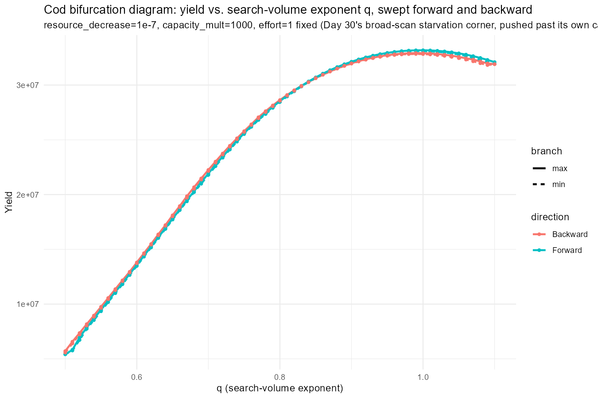

## Where Day 30 Left Us

Day 30 closed with a short but pointed "What's Next" list: finish the `q` sweep and the corrected competitiveness metric (both left as methodology-only -- written and queued, not run to final numbers); understand the `capacity_mult < 1` collapse boundary; get fishing mortality against yield actually running on cod, a thread carried unfinished since Day 29; and write up a summary document so the last month's results aren't scattered across thirty individual posts. Today closes the first, third, and last of those, opens a new one, and leaves an old, familiar bug sitting unresolved at the end.

------------------------------------------------------------------------

## Finishing the q Sweep: From a Heatmap Grid to a Bifurcation Diagram

Day 30's `q` sweep was left as a grid of binary oscillating/settled verdicts -- the same shape as every perturbed-amplitude heatmap since Day 29 -- and it hadn't even finished running. Rather than just letting that grid finish, today rebuilt it entirely as a classic forward/backward bifurcation diagram, the format every `resource_decrease`/`capacity_mult` sweep in this project has used since Day 18: sweep `q` itself forward then backward, carrying each step's own converged state into the next, and plot max/min per step rather than a single stable/oscillating label per point.

```{r q-bifurcation-setup}
#| message: false
#| warning: false
#| eval: false
native_cod_q <- unname(cod_params@species_params$q[1])

build_cod_q_variant <- function(q, resource_decrease, capacity_mult) {
  p <- cod_params
  given_species_params(p)$q <- q
  resource_limitation_2d_cod(p, resource_decrease, capacity_mult)
}

# Centred on cod's own fitted value, +/- 0.3, stepped by 0.01 rather than
# a coarse handful of points -- see the projectToSteady() section below
# for why the step size itself changed today.
q_seq_bif <- seq(native_cod_q - 0.3, native_cod_q + 0.3, by = 0.01)
```

The other change is what gets plotted. Every bifurcation diagram so far has tracked biomass, but biomass alone can't say anything about the project's actual stated goal -- sustainable, *productive* fisheries -- so today's sweep tracks yield instead, via `getYield()`. Yield is identically zero at `effort = 0`, so this is also the first sweep in this project to actually fish cod rather than just watch it sit unfished, closing part of the "introduce fishing mortality against yield" thread Day 29 flagged and Day 30 carried forward.

```{r q-bifurcation-run}
#| message: false
#| warning: false
#| eval: false
bif_q_df <- run_bifurcation_sweep_cod(
  q_seq_bif, "q",
  fixed_params = list(resource_decrease = 1e-7, capacity_mult = 1000),
  effort = 1,
  metric_fn = function(sim) rowSums(getYield(sim))
)
```

### The result: completely flat



Forward and Backward sit exactly on top of each other across the whole `q` range, and the max and min branches never separate anywhere either. No oscillation, no hysteresis -- just a smooth, concave curve, yield rising from `q≈0.5`, peaking somewhere around `q≈0.65-0.7`, and falling off more steeply toward `q≈1.1` than it rose on the way up.

That's not actually a contradiction of Day 30's own broad scan -- it's consistent with it. That scan found oscillation retreating as `capacity_mult` rose past cod's native baseline: real at `capacity_mult=1` (`rel_amplitude=0.041`), down to `~2e-6` by `capacity_mult=10`, `~2e-5` by `100`. Today's fixed point, `capacity_mult=1000`, pushes an order of magnitude further in exactly the direction that was already killing the effect. This was always the more speculative of two candidate corners for the `q` sweep, not the confirmed-oscillating one -- `capacity_mult=1` is, and that's exactly where this sweep should be re-pointed next (see What's Next).

------------------------------------------------------------------------

## A New Lever, Same Machinery: Sweeping alpha

Day 25 found that `alpha` (assimilation efficiency) was the single dominant lever for anchovy's juvenile-pileup metric -- a genuine viability threshold spanning 27.5 orders of magnitude in catchable fraction, with anchovy's own native `alpha` sitting right at the foot of that climb. That sweep was never carried over to cod, and never asked the oscillation question at all. Today reuses the exact same bifurcation-diagram machinery from the `q` sweep above -- `run_bifurcation_sweep_cod()`, `plot_bifurcation_cod()` -- with `alpha` as the swept parameter instead.

```{r alpha-bifurcation-setup}
#| message: false
#| warning: false
#| eval: false
native_cod_alpha <- unname(cod_params@species_params$alpha[1])

build_cod_alpha_variant <- function(alpha, resource_decrease, capacity_mult) {
  p <- cod_params
  given_species_params(p)$alpha <- alpha
  resource_limitation_2d_cod(p, resource_decrease, capacity_mult)
}

# Proportional, not additive: alpha sits on a much smaller, strictly-
# positive scale than q's own O(1) range, so q's +/- 0.3 bracket doesn't
# translate directly -- half to 1.5x cod's own native value instead,
# still centred on the native value, same "bracket it" logic as every
# sweep since Day 25.
alpha_seq_bif <- native_cod_alpha * exp(seq(log(0.5), log(1.5), length.out = 21))

bif_alpha_df <- run_bifurcation_sweep_cod(
  alpha_seq_bif, "alpha",
  fixed_params = list(resource_decrease = 1, capacity_mult = 1),
  params_fn = build_cod_alpha_variant,
  effort = 1,
  metric_fn = function(sim) rowSums(getYield(sim))
)
```

This one is written, self-contained, and ready to run -- same convention as Day 30's own `q` grid at the point it was left unfinished -- but the results aren't in hand yet, so there's no verdict to report here today.

------------------------------------------------------------------------

## Retiring t_max Guesswork: project() for projectToSteady()

Every bifurcation sweep in this project, from Day 18 through this morning's first pass at the `q` sweep, has worked the same way: pick a `t_max`, run `project()` for that long, and hope it was enough. When that guess is wrong in one direction, a genuinely settled point gets read as still-transient; wrong in the other, and time is wasted running well past convergence. The fix that started this morning -- carrying state between steps and giving only the first, genuinely cold-started point a longer run (800 years, versus 400 for everything after) -- was still a guess, just a smaller one.

`projectToSteady()` removes the guess itself. Instead of running for a fixed clock time, it projects forward in chunks and checks its own convergence tolerance between them -- consecutive states agreeing to within `tol` -- stopping the moment they do, rather than at a time picked in advance. `t_max` becomes a safety ceiling for a run that never converges at all, not a per-point settling estimate. That non-convergent case matters here specifically: a point that's genuinely oscillating has no fixed point to settle onto, so `projectToSteady()` failing to converge on such a point isn't a bug, it's exactly the signal this whole exercise is looking for -- it surfaces as a warning, not an error, and the trajectory it does return still shows a real, unsettled max/min spread.

The narrower step size in `q_seq_bif` above (`by = 0.01` instead of a coarse handful of points) is the other half of this change: each `projectToSteady()` call starts from the previous step's own converged state, so a small step keeps that starting guess close to the new answer -- the same reason numerical continuation methods take small steps in the parameter being swept rather than large ones.

### Two real bugs, caught against the actual documentation

The first pass at this swap assumed a plausible-sounding API rather than checking it, and [the real mizer documentation](https://sizespectrum.org/mizer/reference/projectToSteady.html) caught two mistakes before they could quietly corrupt the results:

- **`method` defaults to `"euler"`.** Every `project()` call in this project has used `"predictor-corrector"` since Day 6, specifically because Day 6 showed the default (Euler-family) integrator produces numerical ringing that can look exactly like a real oscillation. Leaving `projectToSteady()` at its own default would have silently reintroduced a six-day-old lesson. Fixed by passing `method = "predictor_corrector"` explicitly -- underscored, unlike `project()`'s own hyphenated method names, a small but real gotcha of its own.
- **`t_per` defaults to 1.5 years**, controlling both how often convergence is checked and the spacing of points in the returned trajectory. Left at default, any real oscillation with a period under about a year and a half would be badly undersampled, and the late-window max/min this sweep depends on would be unreliable. Set to `0.2`, matching the `t_save` this project's own `project()` calls have used throughout.

Neither of these would have thrown an error. Both would have run to completion and produced a plausible-looking, quietly wrong plot -- exactly the kind of mistake that's cheap to catch against real documentation and expensive to catch any other way.

------------------------------------------------------------------------

## An Old Bug Resurfaces: plotSpectra2()

While comparing steady states at different `q` values interactively, `geom_line()` errored out with:

```         
Error in `geom_line()`:
! Problem while computing aesthetics.
Caused by error:
! Aesthetics are not valid data columns.
✖ The following aesthetics are invalid:
• `y = value`
```

This isn't new. Day 19's own script already carries a note that both `plotSpectra()` and `plotSpectra2()` "hit internal errors with this mizer version," worked around at the time by building the spectrum manually from `sim@n[last, 1, ] * sim@params@w` instead of trusting either plotting function. Today's occurrence is the same shape of failure, months later, on different objects (`MizerParams` from `projectToSteady()` rather than a `MizerSim`), which is worth treating as more evidence the bug lives in the plotting function's own internals rather than in whatever happens to be passed to it.

The honest state of this thread: the exact call that produced today's error hasn't been pinned down precisely enough yet to file a solid bug report against it -- the scratch code exploring this interactively has at least one undefined-variable slip in it (`cod_q_params_low`/`cod_q_params_high` referenced but never actually assigned), which needs cleaning up before the reproduction is trustworthy. Parked rather than fixed today.

------------------------------------------------------------------------

## The Summary Document

Day 30's last "What's Next" item is done: a [summary post](2026-07-20-summary.qmd) now exists, read back over every day-by-day post from Day One through Day 30 and organised by the arc of the investigation -- five acts, from the original traffic-jam analogy through the hysteresis debugging saga to the real cod model -- rather than by date, plus a section pulling together the methodological lessons that recurred across multiple days under different names.

------------------------------------------------------------------------

## What This All Adds Up To

Today was more about method than result. The `q` sweep is finished in the sense that Day 30 asked for -- a proper bifurcation diagram, plotting yield, with fishing actually switched on -- but the specific corner it was run at came back flat, for reasons that fit the existing picture rather than expanding it. The more durable change is underneath: `projectToSteady()` replaces a settling-time guess with mizer's own convergence check, the same machinery now also drives a brand-new `alpha` sweep, and two real correctness bugs got caught against actual documentation before they could produce a confidently wrong plot. The one open thread from today, rather than from Day 30, is the `plotSpectra2()` error -- familiar, unresolved, and now flagged as connected to a months-old note rather than a fresh mystery.

------------------------------------------------------------------------

## What's Next

- **Point the `q` (and `alpha`) sweep at the corner that actually oscillates.** `capacity_mult=1000` was always the speculative choice; `resource_decrease≈1e-7, capacity_mult=1` is the one point in cod's parameter space with a confirmed real oscillation (Day 30, `rel_amplitude=0.041`), and neither sweep has been run there yet.
- **Run the `alpha` sweep to completion** and report an actual verdict, not just the methodology.
- **Pin down and file the `plotSpectra2()` bug properly**, once the exact reproducing call is cleaned up and confirmed.
- **Try out balance=TRUE** to see whether varying resource against that causes oscillations
- **Install new branch of Mizer.**
