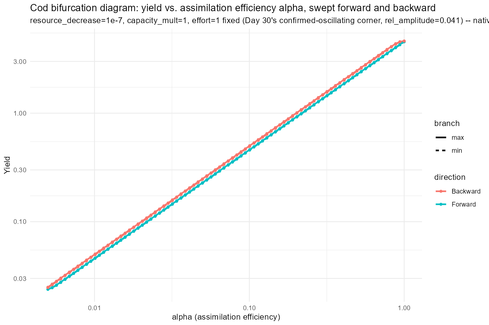
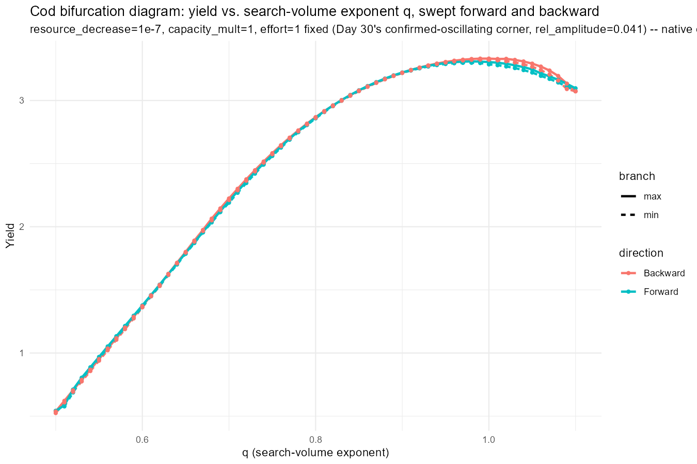

## Where Day 31 Left Us

Day 31 wrote the `alpha` bifurcation sweep and left it unrun. It also ran the `q` sweep to a flat verdict, but at `resource_decrease=1, capacity_mult=1` -- a corner chosen for convenience, not because it was the one place Day 30's own broad scan had actually confirmed a real oscillation. That confirmed corner, `resource_decrease~=1e-7, capacity_mult=1` (`rel_amplitude=0.041`), had never actually been tested by either sweep. Today fixes both problems: `alpha` gets run for the first time, and both `q` and `alpha` get pointed at the corner that matters.

------------------------------------------------------------------------

## Un-Indirecting Both Sweeps

Both sweeps went through `run_bifurcation_sweep_cod(param_seq, param_name, params_fn = ...)` -- a generic dispatcher that's correct but one layer removed from how the sweep loop actually reads, since it was generalised *from* a `q`-specific loop in the first place (Day 23's Follow-up 5). Today rewrites both as direct, un-indirected `projectToSteady()` loops hardcoded to the parameter being swept -- no `param_name` string, no `params_fn` argument, no `fixed_params` list:

```{r direct-loop-shape}
#| message: false
#| warning: false
#| eval: false
run_bifurcation_sweep_alpha <- function(alpha_seq, resource_decrease, capacity_mult,
                                        t_max = 2000, effort = 1,
                                        metric_fn = function(sim) rowSums(getYield(sim))) {
  run_one_direction <- function(seq_vals, init_n = NULL, init_n_pp = NULL) {
    # ...
    for (i in seq_along(seq_vals)) {
      p <- build_cod_alpha_variant(seq_vals[i], resource_decrease, capacity_mult)
      if (!is.null(state_n)) {
        p@initial_n[]    <- state_n
        p@initial_n_pp[] <- state_npp
      }
      result <- tryCatch({
        sim <- projectToSteady(p, effort = effort, t_max = t_max,
                               t_per = 0.2, method = "predictor_corrector",
                               return_sim = TRUE, progress_bar = FALSE)
        # ... late-window max/min
      }, error = function(e) {
        # ... recorded as an NA/error point, sweep continues
      })
    }
  }
  fwd <- run_one_direction(alpha_seq)
  bwd <- run_one_direction(rev(alpha_seq), init_n = fwd$n_final, init_n_pp = fwd$npp_final)
  # ... bind forward/backward, max/min into one long data frame
}
```

`run_bifurcation_sweep_q()` is the same shape, with `build_cod_q_variant()` in place of `build_cod_alpha_variant()`. Every setting that mattered in Day 31 -- `method = "predictor_corrector"` (not `projectToSteady()`'s own `"euler"` default, which Day 6 showed can produce numerical ringing that looks like a real oscillation), `t_per = 0.2` (not the 1.5-year default, which would undersample any real oscillation), the `tryCatch` convention that records a crash as an NA point rather than killing the whole sweep -- carries over unchanged for both. Only the indirection is gone.

------------------------------------------------------------------------

## Widening alpha's Bracket

Day 31's `alpha` bracket was proportional and narrow: half to 1.5x cod's own native value (0.6), i.e. roughly 0.3 to 0.9. Today pushes that out much further, down to near-total assimilation failure, log-spaced across 84 points from `alpha=0.005` up to `alpha=1`. `q`'s bracket is left as Day 31 set it -- centred on cod's native value, `+/- 0.3`, stepped by `0.01` -- since today's fix is about the fixed point, not the swept range.

------------------------------------------------------------------------

## Re-Pointing at the Corner That Actually Oscillates

```{r repoint}
#| message: false
#| warning: false
#| eval: false
bif_alpha_df <- run_bifurcation_sweep_alpha(
  alpha_seq_bif,
  resource_decrease = 1e-7, capacity_mult = 1,   # was 1, 1
  effort = 1,
  metric_fn = function(sim) rowSums(getYield(sim))
)

bif_q_df <- run_bifurcation_sweep_q(
  q_seq_bif,
  resource_decrease = 1e-7, capacity_mult = 1,   # was 1, 1
  effort = 1,
  metric_fn = function(sim) rowSums(getYield(sim))
)
```

`resource_decrease=1, capacity_mult=1` -- what both sweeps used until today -- is worth naming explicitly rather than waved at as "the same corner as before," since Day 31's own `q`-sweep subtitle text actually claimed `resource_decrease=1e-7, capacity_mult=1000` in its plot caption while the code underneath it ran `1` and `1`. That pre-existing contradiction is exactly why today's captions state the fixed point directly rather than deferring to a cross-reference that doesn't resolve cleanly.

------------------------------------------------------------------------

### The alpha result: same power law, three orders of magnitude smaller



Shape-wise, nothing changed. Forward and Backward still sit on top of each other across the whole range, and the curve is still a dead-straight line on log-log axes -- a log-log regression of yield against `alpha` gives a slope of **0.999** with **R² \> 0.9999**, essentially identical to the fit at the old corner. What did change is scale: yield now runs from about **0.024** at `alpha=0.005` up to **4.62** at `alpha=1`, against roughly **2.4x10\^5** to **4.6x10\^7** at the old, unstarved corner. Extreme resource starvation (`resource_decrease=1e-7`) collapses the population's absolute output by close to seven orders of magnitude, but doesn't touch the underlying relationship between assimilation efficiency and yield at all -- it's still just proportional.

### The q result: an actual hump, and a shifted peak



This one looks genuinely different from Day 31. Rather than the smooth concave curve peaking around `q~0.65-0.7` that Day 31 found at the old corner, yield now rises from `q=0.5` (yield\~0.52) up to a peak around `q~0.98-1.0` (yield\~3.3), then turns over and declines slightly toward `q=1.1` (yield\~3.10). The peak has moved by roughly a third of a unit in `q` between the two corners -- a real, visible difference driven by the fixed point, not noise.

What hasn't changed is the branch behaviour: Forward and Backward sit on top of each other across the entire curve here too, hump included. A hump is not a bifurcation -- it's a single-valued function of `q` with a maximum, the same shape a simple optimisation problem would produce, not two branches disagreeing anywhere.

------------------------------------------------------------------------

## A Threshold That Breaks at Small Yields

Both plots look flat by eye -- Forward and Backward genuinely overlap, no fanning, no visible hysteresis loop. But running the same 1e-6 relative-amplitude check this project has used since Day 25 against the raw numbers gives an uncomfortable answer: **every single point in both sweeps** -- 84/84 `alpha` values, 61/61 `q` values -- technically crosses that threshold. That would nominally read as "100% oscillating" under the exact rule this project has trusted for seven days.

It isn't. The actual relative amplitudes involved are small -- typically under 2% within a single direction's own late window, occasionally up to 3.3% for `q` -- and the largest forward/backward disagreement (around 11-16% of the local yield scale, depending on the parameter) shows up as a barely-perceptible thickening of the line in the plot, not a visible second branch. This is the same convergence-residual pattern Day 17 and Day 30 already flagged, just large enough relative to this corner's much smaller absolute yield (single digits and below, versus the hundreds of thousands to tens of millions the old corner produced) to blow straight through a threshold that was implicitly calibrated against that larger scale. `1e-6` was never a principled cutoff -- it was "small enough to ignore" at yields in the `1e5`-`1e7` range, and at yields under `5`, "small enough to ignore" is a much bigger absolute number.

The verdict logic in the script (`bif_alpha_check`/`bif_q_check`) will print the "N/M values cross into oscillation" branch for both sweeps today, and that printed verdict is, read literally, wrong -- or at least badly miscalibrated for this corner. The honest read is the visual one: both plots show a single curve, forward and backward together, no genuine limit cycle in either.

------------------------------------------------------------------------

## A Third Lever: resource_rate with balance=TRUE

Sections 1 and 2 both held the resource state fixed and varied a species trait (`alpha`, `q`) against it. Today also opens a different angle on the same question: rather than setting `resource_rate` and `resource_capacity` independently the way `resource_limitation_2d_cod()` does, what if `resource_capacity` is never set directly at all, and is instead left for mizer to derive implicitly from `resource_rate` via `setResource(..., balance = TRUE)`? Letting the two move together, rather independently, is a genuinely different resource manipulation from anything tried so far -- worth asking whether it's what surfaces an oscillation the other two didn't find.

```{r resource-rate-balance-setup}
#| message: false
#| warning: false
#| eval: false
resource_limitation_balance_cod <- function(params, resource_rate_mult) {
  new_rate <- getResourceRate(params) * resource_rate_mult
  setResource(params, resource_rate = new_rate, balance = TRUE)
}

build_cod_resource_rate_variant <- function(resource_rate_mult) {
  resource_limitation_balance_cod(cod_params, resource_rate_mult)
}

# 1e-7 to 1, log-spaced, 100 points -- 1e-7 is the same extreme-starvation
# multiplier Sections 1 and 2 tested, 1 is cod's own native resource_rate.
resource_rate_seq_bif <- exp(seq(log(1e-7), log(1), length.out = 100))

bif_resource_rate_df <- run_bifurcation_sweep_resource_rate(
  resource_rate_seq_bif,
  effort = 1,
  metric_fn = function(sim) rowSums(getYield(sim))
)
```

Same direct-loop rewrite as Sections 1 and 2 (`run_bifurcation_sweep_resource_rate()`, no dispatcher indirection), same `projectToSteady()` settings, same forward/backward bifurcation-diagram convention, plotted on log-log axes given the seven-order-of-magnitude range. This one is written, self-contained, and ready to run -- same convention as Day 31's own `alpha` sweep at the point it was left unfinished -- but the results aren't in hand yet, so there's no verdict to report here today.

------------------------------------------------------------------------

## What This All Adds Up To

The corner that mattered finally got tested, for both parameters, and the headline answer is still no -- no genuine limit cycle, no hysteresis loop, in either `q` or `alpha`, even at the one point in cod's parameter space Day 30's own broad scan called out as oscillating. That's a real, slightly uncomfortable result: Day 30's `rel_amplitude=0.041` came from watching a population recover from an artificial kick, not from a smooth forward/backward continuation like today's. The most likely reconciliation is that what Day 30 saw was a *damped* return to a (very different, resource-starved) fixed point rather than a sustained, self-driving cycle -- a kick that decays looks like "oscillation" to an amplitude check taken during the decay, but it isn't the same thing as a limit cycle that persists once you're sitting still on it, which is exactly what today's continuation approach tests for. The one genuinely new finding either sweep produced today is the amplitude threshold's own failure mode -- something worth fixing before it's trusted at another small-yield corner.

------------------------------------------------------------------------

## What's Next

- **Run the `resource_rate`/`balance=TRUE` sweep to completion** and report an actual verdict, not just the methodology.
- **Reconcile today's negative result with Day 30's kick-based finding directly** -- run an explicit perturb-and-watch-it-decay test at this exact corner (`resource_decrease=1e-7, capacity_mult=1`) using today's `projectToSteady()`-based machinery, to confirm whether Day 30's oscillation was a damped transient rather than a sustained cycle.
- **Fix the amplitude threshold.** `1e-6` relative amplitude flagged 100% of points at this corner as "oscillating" when the plots show nothing of the sort -- either an absolute floor, or a threshold that scales with the yield magnitude actually being swept, is needed before this check can be trusted again.
- **Finish the corrected competitiveness metric's explicit verdict** for both species, carried over from Day 31.
- **Pin down and file the `plotSpectra2()` bug**, parked unresolved since Day 31.
- **Understand the `capacity_mult < 1` collapse boundary**, still carried over from Day 30.
