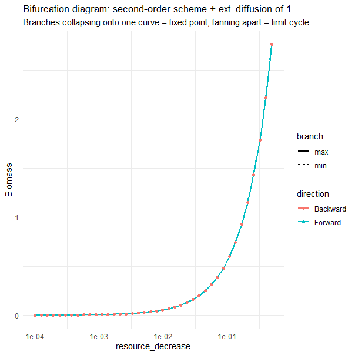
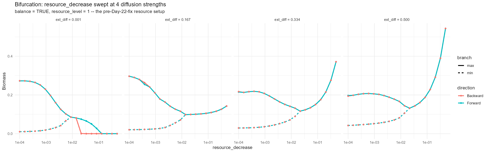
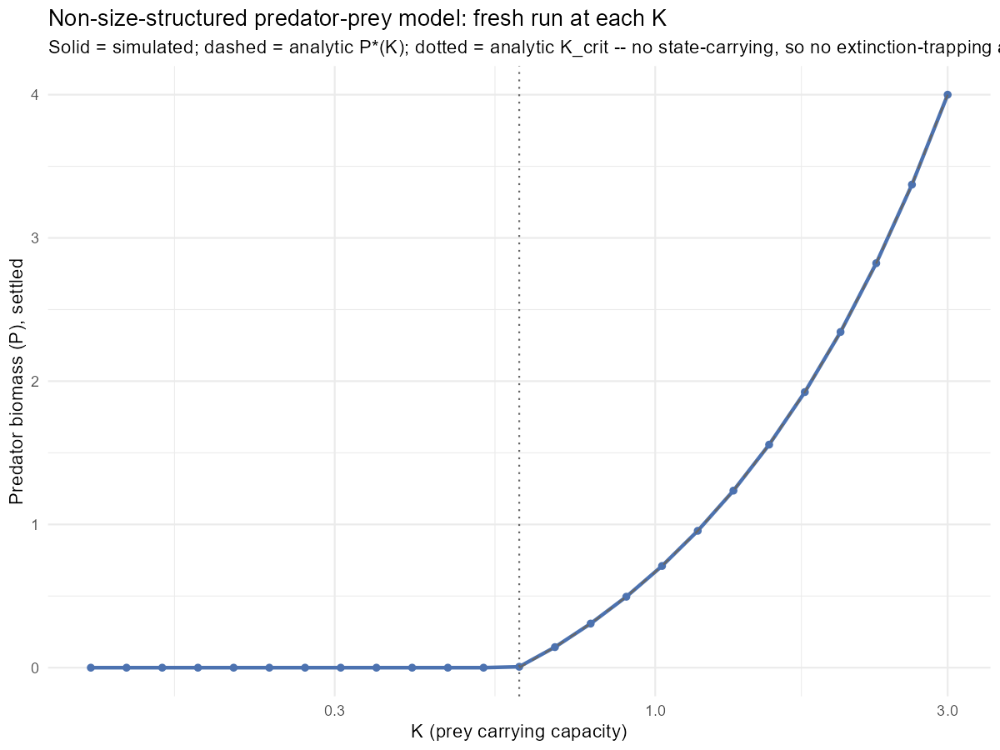
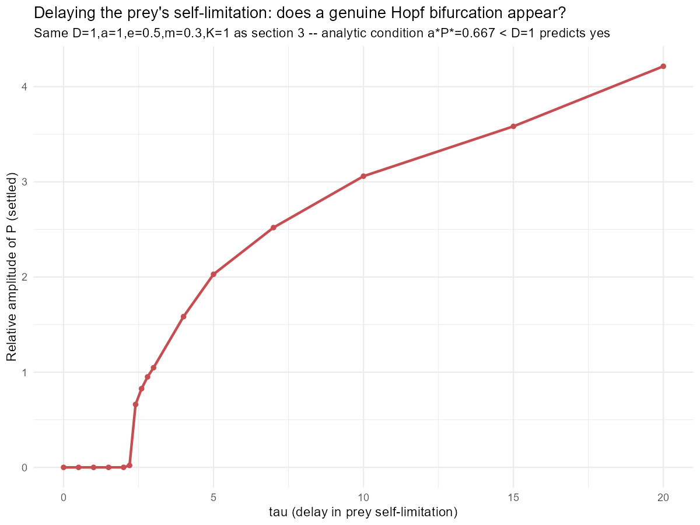
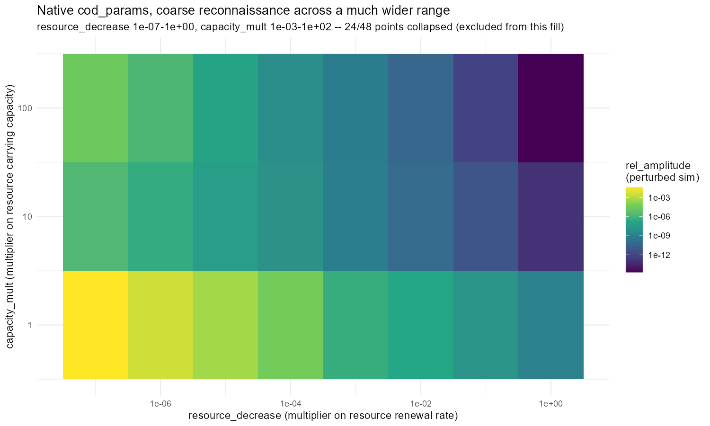
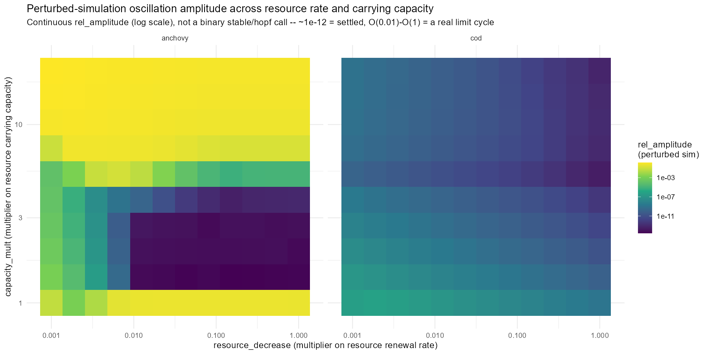
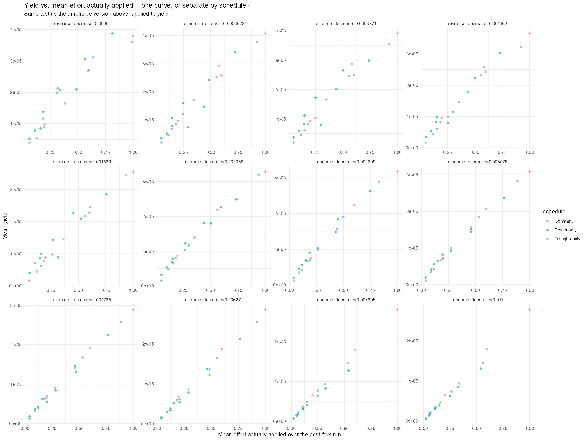
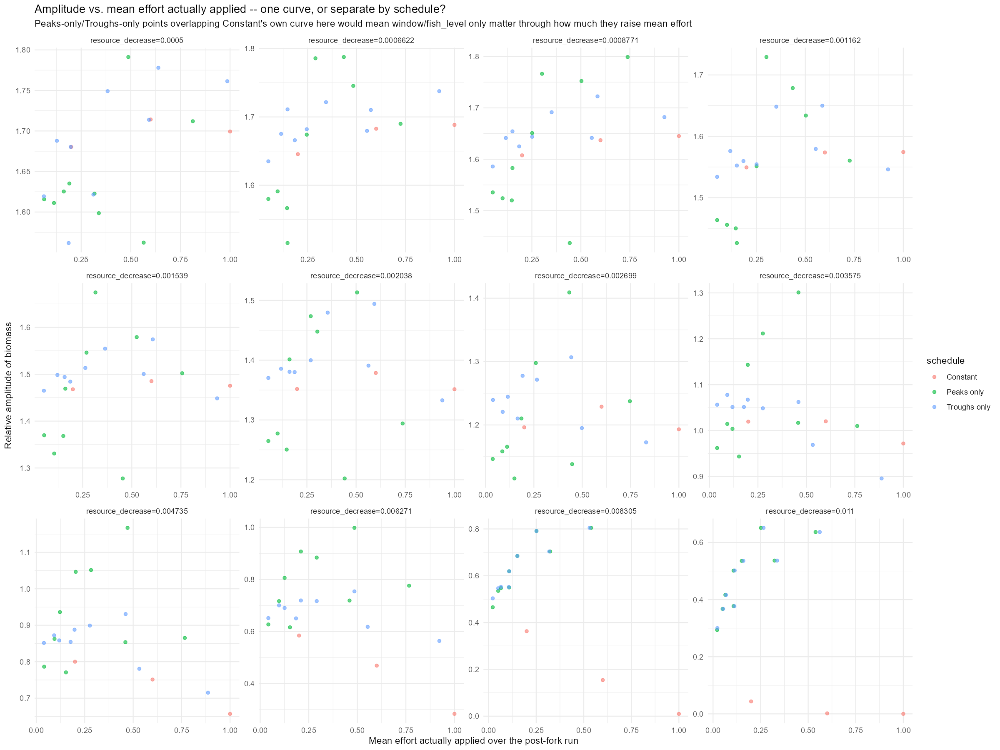
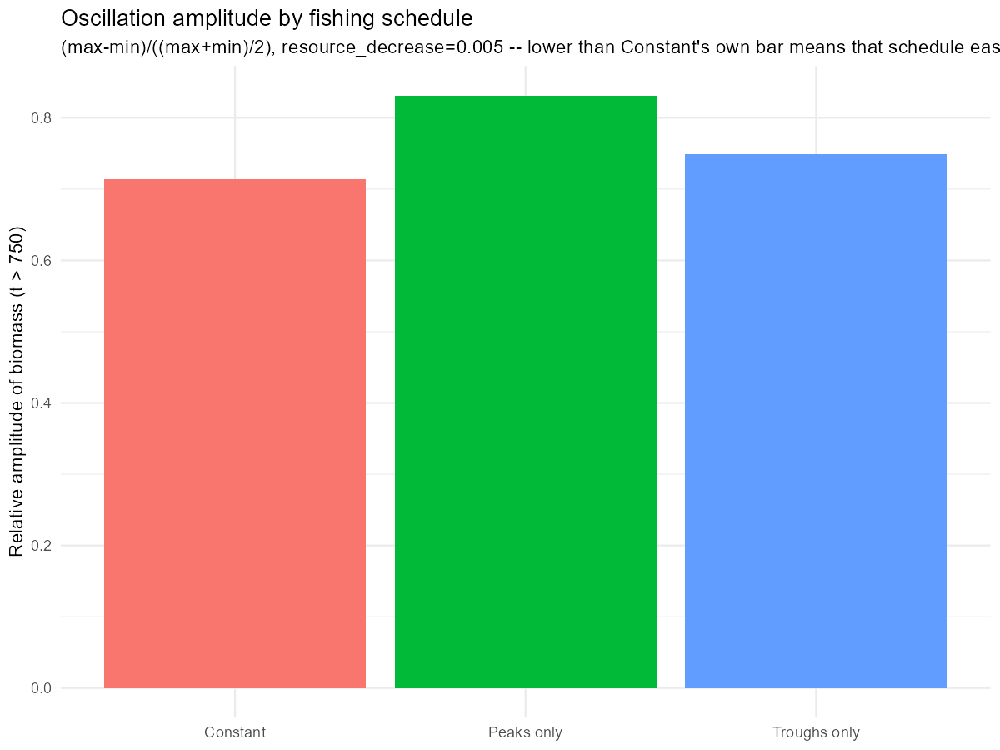

## Purpose

A reference document, not a narrative: what we actually established, grouped by topic, with the mathematics stated once rather than re-derived. The [Day 30 summary](2026-07-20-summary.qmd) has the chronological story with its wrong turns intact; this is the condensed version for jogging our own memory and for feeding directly into the final report. $w$ = body mass (g), $t$ = time (yr).

------------------------------------------------------------------------

## 1. The Model

`mizer`'s core dynamics are a first-order transport equation in $w$ (the size-spectrum analogue of the traffic conservation law that motivated the project):

$$\frac{\partial N(w,t)}{\partial t} + \frac{\partial}{\partial w}\Big[g(w,t)\,N(w,t)\Big] = -\mu(w,t)\,N(w,t),$$

with new individuals supplied at $w_{\min}$ by reproduction. $g(w,t)=dw/dt$ is individual growth rate; $\mu$ is total mortality. Growth depends on the **feeding level** $f(w,t)\in[0,1]$, the fraction of maximum intake achieved; every "food-limitation cycle" below is $f(w,t)$ oscillating at small $w$ while staying near 1 at large $w$.

The background resource follows semichemostat dynamics, $\partial_t R = r_R(w)[K_R(w)-R]-(\text{consumption})$, with unconsumed shape $K_R(w)\sim\kappa w^{-\lambda}$. `resource_decrease` scales $r_R$ (replenishment rate). A second lever, `capacity_mult`, scales $K_R$ (capacity) *independently* of the rate when `balance = FALSE` -- that's the mechanism behind every `capacity_mult` sweep in §3. With `balance = TRUE` instead (used throughout this document's own builder below), $K_R$ is never set directly at all: mizer derives it from whatever rate is passed in, so the community stays at its own calibrated steady state rather than the two drifting apart.

Because $g$ sits inside the derivative, the equation's characteristics are the growth trajectories $dw/dt=g(w,t)$. When $g$ depends only on $w$, age-at-size is $\tau(w)=\int_{w_{\min}}^w \frac{dw'}{g(w')}$ , the quantity behind both cohort-tracking and the phase-lag calculations ($d\phi/dw = \frac{k}{g(w)}$, Day 11). This only works as a *phase-velocity* argument when $g$ is fixed; once the resource itself oscillates, $g(w,t)$ genuinely varies, and phase- and group-velocity (a tracked cohort's real trajectory, Day 12) don't have to agree.

Every anchovy parameterisation in the project is one instance of the above equations, built the same way. This chunk actually runs: it defines the builder and instantiates `anchovy_params` at its native, undepleted resource rate, an object reused later in §5.1 (§2 calls the same builder again to make a separate, oscillating instance):

```{r}
#| message: false
#| warning: false
library(mizer)

make_params <- function(lambda = 2.05, resource_decrease = 0.001) {
  kappa  <- 100 * exp(-6.9 * (lambda - 1))
  params <- newSingleSpeciesParams(species_name = "Anchovy",
                                   w_min = 0.0003, w_max = 66.5, w_mat = 10,
                                   lambda = lambda, kappa = kappa, alpha = 0.1, gamma = 750)
  r <- getResourceRate(params) * resource_decrease
  setResource(params, resource_rate = r,
              resource_dynamics = "resource_semichemostat", balance = TRUE)
}

anchovy_params <- make_params(resource_decrease = 1)  # native, undepleted resource
```

Reading this against the resource equation: `kappa` *is* the constant in $K_R(w)\sim\kappa w^{-\lambda}$ (via an empirical fit to $\lambda$, not mizer's own classical scaling identity - the gap between the two is exactly what made the Day 30 `lambda` sweep an unreliable stand-in for a direct $q$ sweep); `resource_decrease` is literally the multiplier on $r_R$. `balance = TRUE` means $K_R$ is derived from that rate rather than set independently, which is why this builder has no `capacity_mult` argument at all - it isn't a lever here the way it is in §3's own sweeps, which use `balance = FALSE` specifically to keep rate and capacity independent.

------------------------------------------------------------------------

## 2. The Core Anchovy Oscillation

### 2.1 Where the calibration came from, and what each parameter is doing

This calibration was never fitted to real anchovy survey data. It was adapted (Day 6) from a two-species (anchovy-feeding-on-plankton) `mizer` worked example published on RPubs (`gustav/plankton-anchovy`), translated onto current `mizer` syntax. What turns a merely oscillation-*capable* calibration into a genuinely oscillating one is suppressing resource replenishment (`resource_decrease`) far enough that the steady state itself loses stability - the actual value used varies by experiment (from $10^{-3}$ down to $10^{-7}$ depending on the day), which is why it is a function argument rather than baked into the parameter table below.

| Parameter | Value | Role |
|------------------------|------------------------|------------------------|
| $w_{\min}$ | $0.0003$ g | size at birth |
| $w_{\max}$ | $66.5$ g | asymptotic adult mass |
| $w_{\mathrm{mat}}$ | $10$ g | maturation size ($\approx 15\%$ of $w_{\max}$) |
| $\lambda$ | $2.05$ | resource-spectrum exponent, just above the "balanced" community value $\lambda=2$ |
| $\kappa$ | $100\,e^{-6.9(\lambda-1)}$ | resource-spectrum coefficient, fit empirically to $\lambda$ (not derived from mizer's classical scaling identity) |
| $\alpha$ | $0.1$ | assimilation efficiency |
| $\gamma$ | $750$ | search-volume coefficient |
| $\beta$ | $100$ (`mizer` default) | preferred predator:prey mass ratio |
| $\sigma$ | $1.3$ (`mizer` default) | diet breadth |
| $k_s$ | $0$ | no separate standard-metabolic-rate term beyond activity cost |
| `resource_decrease` | varies, $10^{-7}$-$1$ | multiplies $r_R$; the actual bifurcation parameter |

Under suppressed resource replenishment, this calibration settles into a limit cycle (period $\approx$ 7-9yr) rather than steady state. This was confirmed real, not integrator ringing, by surviving the switch from Euler to predictor-corrector/`tr_bdf2` (Day 6). The two plots below (reusing Days 9-10's own `nice_biomass_plot()`/`nice_animation()` helpers) show what that cycle actually looks like, at `resource_decrease = 0.001`:

```{r}
#| message: false
#| warning: false
anchovy_osc <- make_params(resource_decrease = 0.005)
anchovy_osc@initial_n[]    <- 0.001 * anchovy_osc@w^(-1.8)
anchovy_osc@initial_n_pp[] <- anchovy_osc@cc_pp

sim     <- project(anchovy_osc, t_max = 300, dt = 0.1, t_save = 0.2,
                   effort = 0, progress_bar = FALSE, method = "predictor-corrector")
sim_600 <- project(sim, t_max = 300, dt = 0.1, t_save = 0.2,
                   effort = 0, progress_bar = FALSE, method = "predictor-corrector")
```

```{r}
#| message: false
#| warning: false
#| fig-cap: "Anchovy, small-Anchovy, and Plankton biomass over the settled cycle (t > 550), resource_decrease = 0.001."
library(reshape2); library(plotly); library(dplyr)

nice_biomass_plot <- function(sim, t) {
  abm  <- melt(getBiomass(sim)); abmr <- melt(getBiomass(sim, min_w = 0.01, max_w = 0.4))
  abmr$sp <- "small Anchovy"
  pbm <- sim@n_pp %*% (sim@params@w_full * sim@params@dw_full)
  pbm <- melt(pbm); names(pbm)[names(pbm) == "Var1"] <- "time"; pbm$Var2 <- NULL; pbm$sp <- "Plankton"
  bm  <- rbind(pbm, abm, abmr)
  plot_ly(bm) %>% filter(time >= t) %>%
    add_lines(x = ~time, y = ~value, color = ~sp) %>%
    layout(yaxis = list(type = "log", title = "biomass (g/m^3)", range = c(-7, 2)),
           xaxis = list(title = "time (year)"))
}
nice_biomass_plot(sim_600, 550)
```

```{r}
#| message: false
#| warning: false
#| fig-cap: "Animated size spectrum (biomass density vs. body mass) across one settled cycle, resource_decrease = 0.001."
nice_animation <- function(sim, t) {
  nf <- melt(sim@n); n_ppf <- melt(sim@n_pp); n_ppf$sp <- "Plankton"; nf <- rbind(nf, n_ppf)
  plot_ly(nf) %>% filter(w > 10^-5, time >= t) %>%
    mutate(b = value * w^2) %>%
    add_lines(x = ~w, y = ~b, color = ~sp, frame = ~time, line = list(simplify = FALSE)) %>%
    layout(xaxis = list(type = "log", title = "body mass (g)"),
           yaxis = list(type = "log", title = "biomass (g/m^3)", range = c(-8, 0)))
}
nice_animation(sim_600, 550)
```

### 2.2 Mechanism, scaling, and the unstable fixed point

**Mechanism** (Days 7-8): a synchronised (not travelling-wave) food-limitation cycle concentrated in juveniles. $f(w,t)$ crashes to $\approx0.24$ at small $w$ at the resource trough vs. $\approx0.9$-$1.0$ at the peak, closed through reproduction (this is exactly the pattern visible in the two plots above). One dominant FFT frequency with harmonics, not two competing timescales. Period scales as

$$\text{Period} \sim w_{\mathrm{mat}}^{0.2} \quad (R^2=0.9974),$$

matching juvenile growth $g(w)\sim w^{0.8}$ via $\tau(w_{\mathrm{mat}})\sim w_{\mathrm{mat}}^{1-0.8}$. Naive steady-state generation time gives $\approx2.4$ cycles/period; tracking real cohorts through the time-varying $g(w,t)$ pulls this to $\approx3.3$ (Days 11-12),which is closer to the original "three generations" guess.

The naive version is §1's $\tau(w)$ integral, done numerically by the trapezoid rule. This needs a *freshly built* params object rather than `anchovy_osc` itself: `anchovy_osc`'s own `initial_n`/`initial_n_pp` were overwritten above with the far-from-equilibrium spectrum the simulation demo needed, and `getEGrowth()` reads directly off whatever state is stored there. A clean instance of the same calibration, left at its default (near-equilibrium) initial condition, gives the steady-state $g(w)$ the integral actually needs:

```{r}
#| message: false
#| warning: false
anchovy_steady <- make_params(resource_decrease = 0.001)   # default near-equilibrium state, unperturbed

g   <- getEGrowth(anchovy_steady)["Anchovy", ]     # g(w) at anchovy_steady's own default (near-)steady state
w   <- anchovy_steady@w
dw  <- anchovy_steady@dw
integrand  <- 1 / g
age <- c(0, cumsum((integrand[-1] + integrand[-length(integrand)]) / 2 * dw[-length(dw)]))
age_at_mat <- approx(x = w, y = age, xout = anchovy_steady@species_params$w_mat)$y
age_at_mat
```

`integrand` is $1/g(w')$ at each grid point; the `cumsum` of trapezoid areas is a running numerical estimate of $\int_{w_{\min}}^{w} dw'/g(w')$, and reading it off at $w=w_{\mathrm{mat}}$ gives generation time directly (the number printed above). This is exactly where the $2.4$ came from and exactly why it was too low: $g(w)$ here is the *steady-state* growth rate, a single snapshot, whereas real cohorts grow through a food supply that is itself oscillating. Rerunning the same integral cohort-by-cohort against the model's actual time-varying $g(w,t)$, rather than one frozen snapshot of it, is what pulled the number up to $\approx3.3$.

**Unstable fixed point** (`steadyNewton()`, Day 16): the cycle's time-average biomass exceeds the unstable fixed point it orbits by 13-28% depending on $\lambda$ (vanishing at the Hopf point, $\lambda\approx2.08$), from the relaxation-oscillator's asymmetric shape (slow climb, sharp crash) rather than a uniform rescaling. The juveniles are net-depleted on average, large adults net-elevated( $\approx$ 1.5-1.6x).

**Fishing barely touches it, until it does.** Constant effort $F\in[0,0.5]$ drops mean biomass only $\sim$ 6% (fished adults ease resource competition, nearly offsetting removal). The cycle only dies via a second, effort-side Hopf bifurcation at $F\approx8$ (Day 17), a damped spiral rather than sudden collapse. Day 34 reproduces the same effort-side collapse directly, at $F\approx2.2$ for that setup.

------------------------------------------------------------------------

## 3. Bifurcation Structure and Hysteresis

**The `capacity_mult` paradox of enrichment** (Days 22-24, after several days chasing a Beverton-Holt bug and a `resource_level` parameterisation that wasn't actually independent of rate): a genuine bistable window at `capacity_mult` $\in(1.30,1.41)$ ($\approx$ 8% wide, at `resource_decrease = 0.001`). This shows how *raising* capacity past a threshold destabilises rather than helps. The window narrows and shifts left as resource rate rises, and reproduces (at $\approx$ 12% width) with mizer's own default species, so it's a feature of the model class, not a generalisable feature.


**Diffusion has two different effects, depending on what it sits on top of** (Days 20-23): mizer's external diffusion follows the allometric form from §1, $D_{\text{ext}}(w) = D_{\text{ext},i}\cdot w^{n+1}$, a size-dependent smoothing term added directly onto the transport equation's right-hand side (mathematically the same role a viscosity term plays in regularising a shock-forming PDE - it smooths out sharp gradients rather than letting them sharpen indefinitely). Under the *current* `capacity_mult`/`resource_decrease` mechanism (independent rate and capacity), diffusion strength only rescales how large biomass gets: settled biomass at `resource_decrease = 0.5` runs $0.65\to0.9\to2.9$ across `ext_diff = 0, 0.1, 1`, but the shape is identical at every strength, max and min branches coincide everywhere so there is no oscillation at any diffusion level (Day 22).



Under the *earlier* `balance = TRUE` mechanism, the one that first produced Day 20/21's own hysteresis gap, diffusion strength instead controls whether that gap is visible at all: at `ext_diff = 0.001` a large gap opens (e.g. at `resource_decrease = 0.049`, Forward sustains real biomass, $0.0537$, while Backward has already collapsed to $3.55\times10^{-35}$ at the identical parameter value); by `ext_diff = 0.167` the gap has closed (agreeing within 1-3% everywhere), and stays closed through `ext_diff = 0.5` (Day 23).



So diffusion isn't a fixed dial with one universal effect on stability - whether it smooths the hysteresis away entirely or just rescales the population depends on what the rest of the resource setup is doing underneath it, which is part of why the Days 18-24 hysteresis hunt took as long as it did to pin down.

**Why a bare predator-prey ODE gets the threshold but not the hysteresis** (Day 24): $\dot N=D(K-N)-aNP,\ \dot P=eaNP-mP$ gives a transcritical collapse threshold $K_{\text{crit}}=N^*=\frac{m}{ea}$ matching mizer's exactly, but *no* hysteresis, ever as chemostat-style prey growth keeps the Jacobian trace ($-D-aP^*$) negative regardless of the predation term's shape (Rosenzweig's paradox-of-enrichment argument). So the collapse threshold doesn't need size structure; the hysteresis around it apparently does.



**Juvenile biomass pileup** (Days 19, 24-26): anchovy's extreme skew (only 0.003-0.03% of biomass ever catchable) is calibration-specific, not general. Mizer's default species shows a much milder $\sim$ 7% catchable. A real $\alpha/\gamma/\kappa$ sweep found $\alpha$ (assimilation efficiency) dominant by far (27.5 orders of magnitude in catchable fraction vs. 2.6 for $\kappa$, 1.3 for $\gamma$), which is a viability threshold at $\alpha\in(0.105,0.178)$. The anchovy's own $\alpha=0.1$ sits right at its foot.

Every bifurcation/hysteresis claim above (and in §5-6) comes from the same numerical-continuation shape, run forward then backward over a parameter sequence:

```{r}
#| eval: false
run_one_direction <- function(param_seq, state = NULL) {
  for (i in seq_along(param_seq)) {
    p <- build_params(param_seq[i])
    if (!is.null(state)) p@initial_n[] <- state$n     # seed from the PREVIOUS point, not from scratch
    sim <- project(p, t_max = t_run, effort = 0)
    max_bm[i] <- max(late_window); min_bm[i] <- min(late_window)
    state <- list(n = sim@n[last, , ])
  }
}
fwd <- run_one_direction(param_seq)
bwd <- run_one_direction(rev(param_seq), state = fwd$final_state)
```

Seeding each point from the *previous* point's own settled state (rather than a fresh initial condition every time) is what turns a batch of independent simulations into a genuine continuation path. `max_bm`/`min_bm` per point is a numerical bifurcation diagram: at a fixed point the two coincide; on a limit cycle they don't. Running the same `param_seq` forward and then backward and comparing the two curves is the operational test for hysteresis used everywhere in §3, §5 and §6: if `fwd` and `bwd` agree at every point, there is one attractor per parameter value; where they disagree, the state depends on which direction the sweep arrived from. (Shown schematically rather than run: `build_params`/`t_run`/`late_window` are placeholders that differ per sweep. The `capacity_mult` figure above is a concrete, already-run instance of exactly this pattern; the predator-prey $K$-figure just above it deliberately is *not* - chaining a model with no immigration and an absorbing zero state means one harsh early point drags every later point down with it (§7), so that sweep runs each $K$ fresh instead.)

------------------------------------------------------------------------

## 4. Delay Differential Equations

Testing whether a lag (rather than size structure) could produce mizer's hysteresis, all four ways a single delay $\tau$ can sit inside the toy predator-prey model's intake term were checked (Days 25-27, reference params $D=1,a=1,e=0.5,m=0.3,K=1$):

| Delay placement | Hopf possible? | Onset |
|------------------------|------------------------|------------------------|
| Both $N,P$ delayed in predator's conversion term | Never (any params) | — |
| $N(t-\tau)$ in prey's self-limitation term | Yes, iff $aP^*<D$ (holds here) | $\tau\approx2.4$ |
| $P(t-\tau)$ only, in predator's intake term | Never - corrected from Day 26's wrong "conditional" verdict (checked only the root-sum condition, not the discriminant) | — |
| $N(t-\tau)$ only, in predator's intake term | Always (any params), via nondimensionalised $\delta=D/m,\ \kappa=aP^*/m$ | $\tau_c\approx12.5$ |

A clean 2-impossible/2-always-possible split. Both feasible cases were confirmed by simulation, but both also blow up unphysically (negative biomass / erratic blowup) well past onset, since the toy model has no saturating functional response, the bifurcations are real, but the model isn't trustworthy far past them. Neither has yet been mapped onto anything checkable in the actual size-spectrum model.



The always-possible $N(t-\tau)$-only placement is the cleanest to see in code, since `deSolve::dede()` makes the delay explicit rather than hiding it in a closure, and it is cheap enough (a 2-state ODE, not a full size-spectrum simulation) to actually run here rather than just describe:

```{r}
#| message: false
#| warning: false
library(deSolve)

predator_prey_rhs <- function(t, state, parms) {
  N <- max(state[1], 0); P <- max(state[2], 0)
  lag_N <- if (t <= parms$tau) parms$N0 else lagvalue(t - parms$tau, 1)   # N(t - tau)
  dN <- parms$D * (parms$K - N) - parms$a * N * P
  dP <- parms$e * parms$a * lag_N * P - parms$m * P
  list(c(dN, dP))
}

rel_amplitude_at_tau <- function(tau, t_max = 300) {
  parms <- list(D = 1, a = 1, e = 0.5, m = 0.3, K = 1, tau = tau, N0 = 1)
  out   <- as.data.frame(dede(y = c(N = 1, P = 0.1), times = seq(0, t_max, by = 0.1),
                              func = predator_prey_rhs, parms = parms))
  late  <- out[out$time > 0.7 * t_max, ]
  (max(late$P) - min(late$P)) / mean(late$P)
}

tau_seq       <- c(8, 10, 11, 12, 13, 15, 18, 20)
delay_scan_df <- data.frame(tau = tau_seq,
                            rel_amplitude_P = sapply(tau_seq, rel_amplitude_at_tau))
delay_scan_df
```

`lagvalue(t - tau, 1)` is the solver looking back into its own history to fetch $N(t-\tau)$ ; it's a direct, numerical stand-in for the delayed term in $\dot P = ea\,N(t-\tau)P(t) - mP(t)$. Everything else in the function (`dN`, and the instantaneous part of `dP`) is unchanged from the non-delayed model in §3; only the one substitution, $N(t)\to N(t-\tau)$ inside the intake term, distinguishes it. That single substitution is also why the algebra came out so clean: at equilibrium the instantaneous growth and death terms in $\dot P$ cancel exactly (since $eaN^*=m$), leaving nothing for $\tau$ to act against except the delayed term itself, which is what forces a Hopf crossing to exist for *any* $\delta,\kappa>0$ - here $\delta=D/m=3.33,\ \kappa=aP^*/m=2.22$, giving a closed-form critical delay $\tau_c\approx12.5$.

```{r}
#| message: false
#| warning: false
#| fig-cap: "Relative amplitude of P vs. tau, run live above. Near zero below tau_c ~= 12.5 (dashed), grows past it."
library(ggplot2)
ggplot(delay_scan_df, aes(tau, rel_amplitude_P)) +
  geom_line() + geom_point() +
  geom_vline(xintercept = 12.525, linetype = "dashed") +
  labs(x = expression(tau), y = "relative amplitude of P")
```

------------------------------------------------------------------------

## 5. The Calibrated Cod Model, and Why We Went Back to Anchovy

The point of testing cod directly was to see whether everything found on the anchovy calibration also shows up in the real, fitted model, or was specific to anchovy. Days 28-32 threw essentially every lever this project had built at cod, looking for a genuine limit cycle: resource rate and capacity (out to 500x native capacity), a body-size/intake-rate factorial against anchovy's own template, relaxing the reproduction cap, three selective-fishing patterns, and full bifurcation sweeps of $q$, $\alpha$, and resource rate under `balance=TRUE`. None of it produced a real, sustained cycle within a realistic range.

Two things kept this from being a clean "cod is just stable" verdict, though, and both are why the search kept going rather than stopping early. First, `getStability()` (Days 28-29) only linearises at the steady state and checks the spectral radius, which proves *local* stability, not the absence of a reachable limit cycle - and directly perturbing the simulation on the same grid showed the tool had a real blind spot: cod stayed settled everywhere either way, but **anchovy** turned out to be genuinely oscillating at 80/120 points `getStability()` had itself called stable. Second, a much wider, coarser reconnaissance scan (Day 30) did eventually turn up a real, if small, cod oscillation at native capacity and extreme resource starvation (`resource_decrease` $=10^{-7}$, rel. amplitude $=0.041$) - a ripple against cod's standing biomass, not a boom-bust cycle - with capacity shrunk *below* native baseline collapsing the population outright instead of oscillating. Chasing that one corner with a proper forward/backward continuation sweep (Days 31-32) came back flat, most likely because it was a damped transient decaying back to a resource-starved fixed point rather than a sustained cycle.



The two verdicts, side by side, are what exposed the blind spot. :

```{r}
#| eval: false
p_steady <- steadyNewton(params, stability = TRUE)
spectral_radius <- attr(p_steady, "stability")$spectral_radius   # < 1 => locally stable

sim  <- make_limit_cycle_sim(params)          # perturb: crash the resource, knock down mature stock
bm   <- rowSums(getBiomass(sim))[times > 0.6 * max(times)]
rel_amplitude <- (max(bm) - min(bm)) / mean(bm)                  # >> 0 => genuinely oscillating
```

`spectral_radius` is $\rho(J)$ from §5's linearisation, which is a statement about what happens to an *infinitesimal* perturbation at the fixed point. `rel_amplitude` asks a completely different question: what happens after a *large*, finite kick, actually integrated forward. For cod the two agree everywhere. For anchovy, `spectral_radius < 1` at a point where `rel_amplitude` was still $1.41$ shows a fixed point that is locally attracting but sits inside the basin of a much larger limit cycle. It's exactly the case the spectral radius alone cannot see.



Between the effort that went into cod and how little of it gave us anything to build on, the call at the end of that stretch (Day 32/33) was to stop trying to coax a cycle out of cod's own calibration and go back to the anchovy parameterisation that was already known to oscillate for real - both as a sanity check that the sweep machinery itself still worked correctly (it does: pointed back at anchovy, it immediately finds the same genuine bifurcation it always has, Day 34), and as the actual system to ask the fishing-timing question against, since cod never gave us a real cycle to ask it of in the first place.

One methodological by-product from this stretch is worth keeping regardless of the cod-vs-anchovy question: the competitiveness ratio used to classify the two species as juvenile- or adult-driven had two bugs along the way (a raw difference that silently mis-called both species "adult-driven," Day 28; fixed to a ratio, Day 29, which flipped both to juvenile-driven, cod more so; a further weighting issue flagged but not yet re-verified, Day 30) - so the direction of that result can be trusted, the exact numbers not yet.

### 5.1 Cod vs. anchovy: how different are the two calibrations, structurally?

`anchovy_params` (native, §1) and cod's own fitted `cod_params.rds` were never directly compared side by side as spectra, only through summary statistics. Their initial (unperturbed) size spectra, on the same axes:

```{r}
#| message: false
#| warning: false
cod_params <- readRDS("../cod_params.rds")

spectrum_df <- rbind(
  data.frame(w = anchovy_params@w,
            biomass_density = initialN(anchovy_params)[1, ] * anchovy_params@w,
            species = "Anchovy"),
  data.frame(w = cod_params@w,
            biomass_density = initialN(cod_params)[1, ] * cod_params@w,
            species = "Cod")
)
w_mat_df <- data.frame(
  w_mat   = c(anchovy_params@species_params$w_mat, cod_params@species_params$w_mat[1]),
  species = c("Anchovy", "Cod")
)
```

```{r}
#| message: false
#| warning: false
#| fig-cap: "Initial size spectra, cod vs. anchovy (native), log-log. Dashed lines mark each species' w_mat."
library(ggplot2)
ggplot(spectrum_df, aes(w, biomass_density, colour = species)) +
  geom_line(linewidth = 1) +
  geom_vline(data = w_mat_df, aes(xintercept = w_mat, colour = species), linetype = "dashed") +
  scale_x_log10() + scale_y_log10() +
  labs(x = "Body mass w (g)", y = "Biomass density N(w)*w",
      title = "Initial size spectra: cod vs. anchovy")
```

Two structural differences fall out immediately: cod's $w_{\max}$ is roughly two orders of magnitude larger than anchovy's $66.5$g, and cod's spectrum sits much closer to one straight power-law line across the whole range, with no sharp drop the way anchovy's spectrum shows right around its own $w_{\mathrm{mat}}$. That drop is the juvenile-pileup effect from §3, made visible directly here rather than only as a single catchable-fraction percentage.

------------------------------------------------------------------------

## 6. Fishing as an Intervention

The founding "traffic jam" question was whether fishing timed to biomass peaks could relieve congestion at the juvenile bottleneck. The first attempt did the opposite: it made juvenile congestion worse. The cause turned out to be **frequency, not selectivity** (Days 9-10) - restricting the catch to sub-adults only didn't fix it, but widening the fishing window around each peak did. A narrow window concentrates the same total removal into short, damaging bursts; spreading it out over more of the cycle removes the same fish more gently.

Every peaks/troughs/constant comparison from Day 9 through Day 34 builds its effort schedule the same way: detect local extrema in the unfished trajectory, then switch effort on only near them. This is a single-species model over a few hundred simulated years, not a multi-hour grid, so it's cheap enough to actually build below, at `resource_decrease = 0.005` (Day 34's own value, so the quoted numbers further down match; a fresh instance, not `anchovy_osc` or `anchovy_steady` from §2, since a fishing gear needs to be attached to the params object):

```{r}
#| message: false
#| warning: false
make_fishing_params <- function(resource_decrease = 0.005) {
  p  <- make_params(resource_decrease = resource_decrease)
  gp <- p@gear_params
  gp$sel_func <- "knife_edge"; gp$knife_edge_size <- p@species_params$w_mat; gp$catchability <- 1
  gear_params(p) <- gp
  p
}

make_limit_cycle_sim <- function(params, t_total, effort = 0, perturbation = 1e3) {
  params@initial_n_pp[] <- params@cc_pp * 0.1
  sim_init <- project(params, t_max = 10, dt = 0.1, t_save = 0.2, progress_bar = FALSE,
                      effort = 0, method = "tr_bdf2")
  idx  <- params@w >= 10 & params@w <= 100
  last <- dim(sim_init@n)[1]
  sim_init@n[last, , idx] <- sim_init@n[last, , idx] / perturbation
  project(sim_init, t_max = t_total - 10, dt = 0.1, t_save = 0.2, progress_bar = FALSE,
          effort = effort, method = "tr_bdf2")
}

# Shortened settle times relative to Day 34's own t_fork=500/post_fork=300 -- this is a
# fast, illustrative rerun of the same idea, not a replacement for that day's own numbers.
rd_focus  <- 0.005
t_fork    <- 100
post_fork <- 60
window    <- 3

p_focus  <- make_fishing_params(rd_focus)
sim_fork <- make_limit_cycle_sim(p_focus, t_total = t_fork, effort = 0)
sim_ref  <- project(sim_fork, t_max = post_fork, dt = 0.1, t_save = 0.2, progress_bar = FALSE,
                    effort = 0, method = "tr_bdf2")

all_times <- as.numeric(dimnames(sim_ref@n)[[1]])
t_p       <- all_times[all_times >= t_fork]
time_lbls <- dimnames(sim_ref@n)[[1]][all_times >= t_fork]

bm <- getBiomass(sim_ref)[, "Anchovy"][time_lbls]
n  <- length(bm)
is_peak   <- logical(n); is_trough <- logical(n)
is_peak[2:(n-1)]   <- bm[2:(n-1)] > bm[1:(n-2)] & bm[2:(n-1)] > bm[3:n]     # local maxima of biomass
is_trough[2:(n-1)] <- bm[2:(n-1)] < bm[1:(n-2)] & bm[2:(n-1)] < bm[3:n]
peak_times   <- t_p[is_peak]
trough_times <- t_p[is_trough]

gear_name <- gear_params(p_focus)$gear[gear_params(p_focus)$species == "Anchovy"][1]

build_schedule <- function(event_times, window, fish_level) {
  effort_t <- rep(0, length(t_p))
  for (et in event_times) effort_t[t_p >= et - window / 2 & t_p <= et + window / 2] <- fish_level
  matrix(effort_t, ncol = 1, dimnames = list(time_lbls, gear_name))
}
```

`effort_t` is a step function of time: `fish_level` inside a $\pm\texttt{window}/2$ band around each detected peak (or trough), zero elsewhere, which is literally the "narrow burst vs. spread out" choice being tested. `mean(effort_t)`, its time-average, is what the Day 34 diagnostic plots yield and amplitude against directly. Running Constant, Peaks-only, and Troughs-only at three effort levels each, and reading off `mean_effort` alongside settled yield and amplitude:

```{r}
#| message: false
#| warning: false
library(dplyr)

run_schedule <- function(effort_input, mean_effort_val, schedule_label) {
  sim <- project(sim_fork, t_max = post_fork, dt = 0.1, t_save = 0.2, progress_bar = FALSE,
                effort = effort_input, method = "tr_bdf2")
  t   <- as.numeric(dimnames(sim@n)[[1]])
  cut <- t_fork + post_fork - 20   # last 20 years = the settled window
  bm  <- getBiomass(sim)[, "Anchovy"][t > cut]
  yl  <- getYield(sim)[, "Anchovy"][t > cut]
  data.frame(schedule = schedule_label, mean_effort = mean_effort_val,
            rel_amplitude = (max(bm) - min(bm)) / ((max(bm) + min(bm)) / 2),
            mean_yield = mean(yl))
}

fish_levels <- c(0.2, 0.5, 0.8)

mean_effort_df <- bind_rows(lapply(fish_levels, function(fl) {
  e_peaks   <- build_schedule(peak_times,   window, fl)
  e_troughs <- build_schedule(trough_times, window, fl)
  bind_rows(
    run_schedule(fl,        fl,              "Constant"),
    run_schedule(e_peaks,   mean(e_peaks),   "Peaks only"),
    run_schedule(e_troughs, mean(e_troughs), "Troughs only")
  )
}))
mean_effort_df
```

```{r}
#| message: false
#| warning: false
#| fig-cap: "Live, reduced-scale reproduction of Day 34's mean_effort diagnostic: mean yield vs. mean_effort. All three schedules fall on one curve."
library(ggplot2)
ggplot(mean_effort_df, aes(mean_effort, mean_yield, colour = schedule)) +
  geom_point(size = 2.5) +
  labs(x = "mean_effort", y = "mean yield (settled window)")
```

```{r}
#| message: false
#| warning: false
#| fig-cap: "Same run: relative amplitude vs. mean_effort. Schedules do not collapse onto one curve here."
ggplot(mean_effort_df, aes(mean_effort, rel_amplitude, colour = schedule)) +
  geom_point(size = 2.5) +
  labs(x = "mean_effort", y = "relative amplitude of biomass (settled window)")
```

The full-scale version of this (Day 34's own 12-`resource_decrease` x 3x3-grid run, at the settle times actually used for the headline numbers below) is:





**Day 34** recreated the oscillation properly and tested timing directly. Against an unfished baseline (rel. amplitude 0.779, at `resource_decrease = 0.005`): Constant fishing eases it ($0.714$, $-8.3\%$), Troughs-only eases it slightly ($0.749$), Peaks-only *worsens* it ($0.831$, $+6.7\%$, a genuine resonance hot spot at moderate window/high effort). A window$\times$effort grid confirms constant fishing dominates outright on both amplitude and yield. A careful-methodology recheck reversed two of the coarse scan's own amplitude "wins", which is a repeat of the general lesson that a coarse scan can name the *wrong* winning strategy, not just misjudge the margin.



The puzzle in the amplitude-vs-yield scatter resolved via `mean_effort`: **yield collapses onto one curve regardless of schedule** (only *how much* fishing matters, not *when*); **amplitude does not** (timing matters, increasingly so near the bifurcation boundary). One sentence: yield is timing-indifferent, easing the oscillation is not.

Separately, Day 33 tested whether narrow-selectivity fishing (at maturity, or at the largest sizes) could destabilise cod on its own.They both showed critical slowing down at high effort but came back flat on a proper forward/backward sweep, consistent with cod's calibration having no oscillatory tendency for selective fishing to amplify (Rochet & Benoît's actual claim is amplification of an *existing* tendency, not creation from nothing).

------------------------------------------------------------------------

## 7. Standing Lessons

- Verify oscillations under a second, more accurate integrator before trusting them (Day 6).
- Scaling a power law $\ne$ replacing it with a constant (Day 3).
- Use *relative* amplitude, and recalibrate the "is it oscillating" threshold to the yield scale in play (Day 4; broke at small yields, Day 32).
- mizer's weight grid is log-spaced so an unweighted `mean()`/`sum()` misweights sizes; recurred 3x under different names (Days 19, 29, 30).
- Compare differently-calibrated systems with ratios, not differences (Day 28→29).
- A coarse grid can overestimate a hysteresis window's width *and* misidentify which strategy wins it (Days 23-24, 34).
- Local (linearised) stability can miss real, large-amplitude dynamics reachable by a large perturbation (`getStability()` on anchovy (Day 29)).
- State-carrying sweeps are essential for hysteresis but break models with no immigration and an absorbing zero (Day 23).
- A quadratic's roots summing positive isn't enough for a Hopf crossing so check the discriminant too (Day 26→27).
- Critical slowing down can look like a real (shrinking) effect or pure noise; only a longer settle or a real time series tells them apart (Days 18, 23-26).
- Read the actual documentation, not the plausible-sounding default (`projectToSteady()`'s Euler/1.5yr defaults, Day 31).

------------------------------------------------------------------------

## 8. Open Threads

1.  Recheck the one yield "win" for an event-triggered schedule (Day 34, `resource_decrease` $=0.0005$) under the careful methodology.
2.  Recalibrate the oscillation threshold so it isn't yield-scale-dependent.
3.  Write the mizer background section for the final report.

------------------------------------------------------------------------

## 9. Timetable for the Next Two Weeks

| Dates | Focus |
|------------------------------------|------------------------------------|
| 10/08 - 16/08 | Work on Item 1 and explore other methods to dampen the oscillations by reading other academic papers and begin work on first draft of the final report for project |
| 17/08 - 23/08 | Write up final report of the project |
