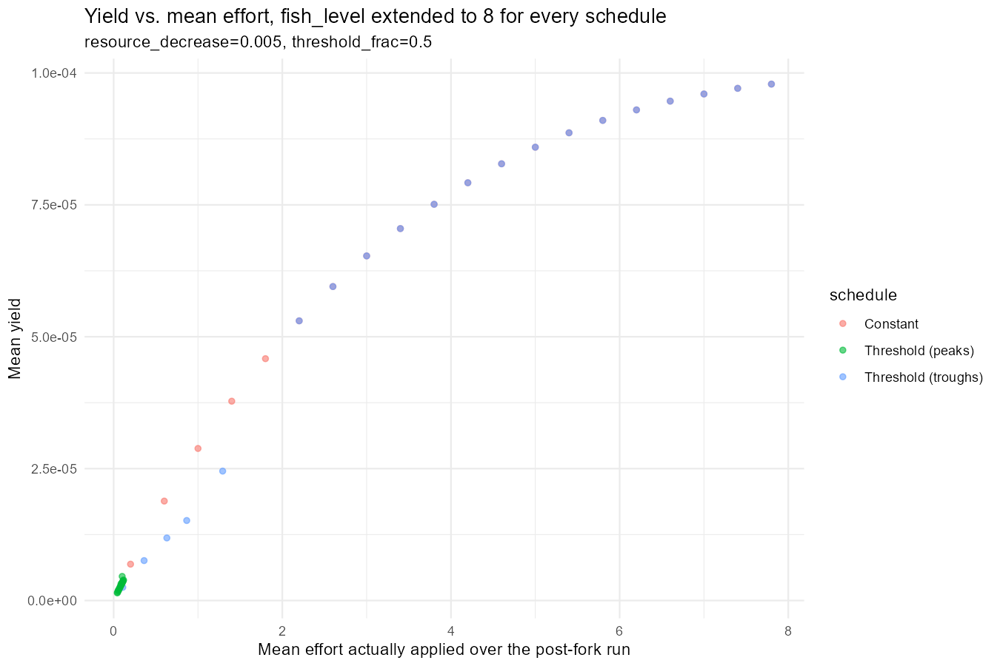
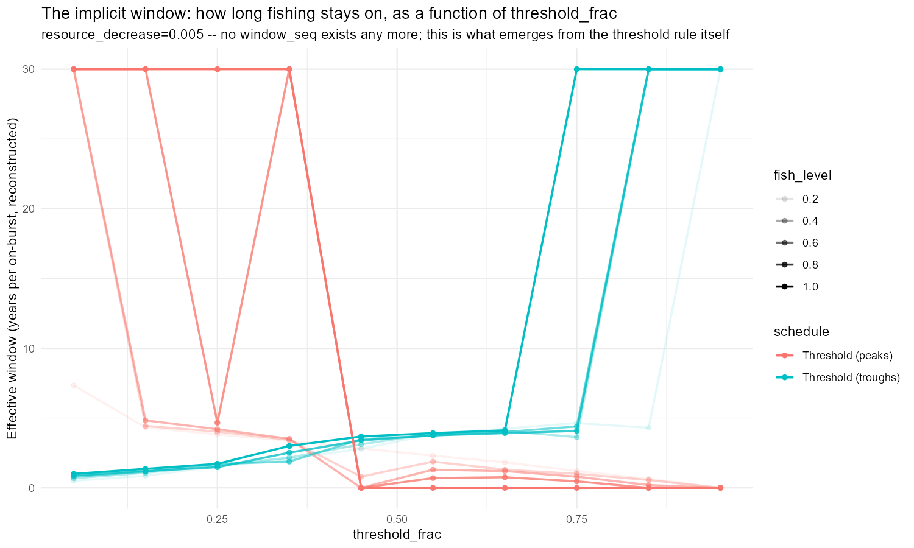

## Where Day 34 Left Us

Day 34's own window x fish_level scan (Section 4) found Constant fishing dominating Peaks-only/Troughs-only on both amplitude and yield at `resource_decrease=0.005`, and queued three follow-ups: recheck the one low-`resource_decrease` yield "win" for an event-triggered schedule under careful methodology, rerun the `mean_effort` diagnostic against calibrated cod params, and extend the constant-effort scan past `fish_level=4`. Day 35 was a topic-organised summary of Days 1-34, not a continuation -- none of those three threads got picked up. Today went somewhere else entirely: extending Day 34's own scan first, then rebuilding its whole mechanism.

------------------------------------------------------------------------

## First Pass: Extending the Window Scan

The initial plan mirrored Day 34's own habit of testing one lever at a time: fishing at greater efforts for the schedules that aren't fished constantly (Day 34 only ever extended `fish_level` past 1 for Constant), widening `window_seq` beyond its original 0.5-3 range, and replacing the hard 0 outside each window with a light background effort -- then stacking all three. This got as far as a working, generalised `run_window_effort_scan()` before a more basic objection surfaced: every event-triggered schedule since Day 9, this extension included, is **open-loop**. Peaks and troughs get detected off an *unfished* reference trajectory, and the resulting schedule is applied regardless of what the fishing itself does to the cycle's timing. It's asking "when would this population have peaked, had nobody fished it" and then fishing on that assumption -- not reacting to the population that's actually there.

------------------------------------------------------------------------

## From a Schedule to a Rule

mizer has an extension mechanism built for exactly this: `setRateFunction()` lets you replace how any of its internal rates are calculated, including fishing mortality itself. Instead of a precomputed effort matrix, `thresholdFMort()` is a genuine rate function -- mizer calls it fresh at every solver step, handing it the *current* trial abundance, and it decides fishing mortality from that:

```{r threshold-fmort}
#| message: false
#| warning: false
#| eval: false
thresholdFMort <- function(params, n, n_pp, n_other, t, effort, e_growth, pred_mort, ...) {
  p <- other_params(params)

  f_ref            <- mizerFMortGear(params, effort = 1)
  biomass_density  <- sweep(n, 2, params@w * params@dw, "*")
  selected_biomass <- sum(colSums(f_ref) * biomass_density)

  direction <- if (p$mode == "above") 1 else -1
  on_frac   <- plogis(direction * (selected_biomass - p$threshold) / max(p$sharpness, 1e-12))

  fmort_on  <- colSums(mizerFMortGear(params, effort = p$fish_level))
  fmort_off <- colSums(mizerFMortGear(params, effort = p$background_level))
  result <- on_frac * fmort_on + (1 - on_frac) * fmort_off
  dim(result)      <- dim(n)
  dimnames(result) <- dimnames(n)
  result
}
```

`mode="above"` fishes once selected biomass rises above a threshold (brackets peaks); `mode="below"` fishes once it drops below one (brackets troughs). There's no `window` parameter any more -- how long fishing actually stays on each time it triggers is an emergent property (`effective_window`, reconstructed after the fact), not something set directly. mizer looks up a registered rate function *by name*, not by value ("if they are defined within a function then mizer will not find them" -- mizer's own "Extending mizer" vignette), so `thresholdFMort()` can't be a closure returned from a factory; every grid point's configuration travels on the params object itself via `other_params()`.

This was, on paper, a strictly better design than the open-loop version. Getting it to actually produce trustworthy numbers took the rest of the day.

------------------------------------------------------------------------

## Bug 1: A Hard Switch, an Implicit Solver, and a Hypothesis That Didn't Hold Up

The first version compared `selected_biomass > threshold` directly -- a genuine 0/1 step. The results looked wrong: amplitude and yield came out roughly flat or degenerate across the threshold range instead of tracing any real trend. The working theory was numerical: `tr_bdf2` is an implicit solver, so it solves for `n` -- the population state -- via Newton iteration at every step. A hard switch makes fishing mortality a *discontinuous function of the very unknown being solved for*, which is a textbook way to make Newton iterations chatter between two states without settling, silently, with no error thrown. Day 34's own schedule never had this problem, because effort there was a function of time only and never fed back into the equation being solved.

The fix was a steep logistic transition (`on_frac`, controlled by a `sharpness` parameter) instead of a hard step -- continuous enough for the solver to converge, sharp enough to still behave like a real switch in practice.

This hypothesis never actually got tested against real data at the time. It's revisited properly near the end of today's work, once the real bug turned out to be somewhere else entirely.

------------------------------------------------------------------------

## Bug 2: Sharpness Scaled Off the Wrong Thing

`sharpness` first defaulted to `0.02 * abs(threshold)`. At low `threshold_frac`, the threshold sits near the cycle's own *minimum* selected biomass -- which for an oscillating stock can itself be very close to zero. `sharpness` collapsed toward zero right where it was most likely to be tested, silently turning the smoothed switch back into a near-hard step exactly in the region meant to be protected. Fixed by scaling `sharpness` off the cycle's own biomass *range* (`max - min` of an unfished reference trajectory), computed once per `resource_decrease` and shared across every grid point -- a quantity that's never near zero for a genuinely oscillating system.

------------------------------------------------------------------------

## Bug 3: Peaks and Troughs Were Calibrated to Be Invisible

Even with smoothing fixed, a real problem showed up on the actual plots: the legend listed `Threshold (peaks)`/`Threshold (troughs)`, but no points rendered for either.

::: callout-note
## Root cause: linear interpolation on a skewed cycle

`threshold_frac` was being turned into an actual threshold via `bp_min + frac * (bp_max - bp_min)` -- a straight line between the cycle's numeric minimum and maximum. Population cycles aren't symmetric: a slow decline and a sharp recovery (or the reverse) means the population spends very unequal amounts of time at different points in that range. At `threshold_frac=0.5`, the linear midpoint landed somewhere the population barely visits at all. `mode="above"` almost never triggered (mean effort near 0, squashed invisibly against the plot's own axis); `mode="below"` was satisfied almost the entire time (saturated at `fish_level`, landing exactly on top of -- and hidden behind -- Constant's own points).
:::

The fix: calibrate against the cycle's own **empirical quantile** instead -- `quantile(bp_ref, probs = frac)`. `threshold_frac=0.5` now means "the level the cycle is above exactly half the time" (the median), which by construction gives both `above` and `below` a genuine, non-degenerate mix of on and off. `frac=0`/`1` still recover the exact min/max, unchanged.

------------------------------------------------------------------------

## Bug 4: The Actual Culprit -- an Absolute-Time Mismatch

After the quantile fix, results were *still* wrong -- but this time not visibly absent, just `NA` everywhere, uniformly, across every `fish_level` and `threshold_frac` tested. That uniformity was the tell: an ecological or dynamical effect would vary with the actual scan parameters; this didn't, at all, which pointed at something structural rather than something about the population dynamics themselves.

Reading mizer's own installed source directly (not just the rendered docs) settled it:

```{r project-t-start}
#| eval: false
project.MizerParams <- function(object, effort, t_max = 100, dt = 0.1, t_save = 1, t_start = 0, ...)
project.MizerSim    <- function(object, effort, t_max = 100, dt = 0.1, t_save = 1, t_start = 0, ...) {
  t_start <- getTimes(object)[idxFinalT(object)]   # continues from the sim's own final time
  ...
}
```

`project()` on a fresh `MizerParams` object defaults to `t_start=0`; continuing from a `MizerSim` object carries the absolute time forward automatically. The scan's "Constant" branch continues from `sim_fork` (a `MizerSim`), so its saved times correctly run from `t_fork=500` onward. The threshold branch, though, builds a *fresh* `MizerParams` object per grid point (`p_peaks`/`p_troughs`, with `initial_n` set explicitly) and projects from *that* -- restarting its own time axis at 0. Every downstream filter (`t > scan_t_cut`, with `scan_t_cut = 570`) was therefore comparing against a simulation whose own saved times only ever reached 100. Filtering an empty range gives `-Inf`/`Inf` from `max()`/`min()` on nothing, `NaN` from the arithmetic, written out as `NA`.

Fixed with one keyword argument, `t_start = t_fork`, on the two `project()` calls that start from a fresh `MizerParams` object. This is the one fix in today's list that's confirmed against both the real mizer source and the actual CSV output, not just a plausible-sounding theory.

------------------------------------------------------------------------

## What the Real Numbers Actually Show

With Bug 4 fixed, Section 2's scan (`fish_level` extended to 8, `threshold_frac` held at the cycle's own median) produced real, differentiated results for the first time:



- **`Threshold (peaks)`** stays at very low realised effort throughout -- `mean_effort` moves only from about 0.10 to 0.12 as `fish_level` runs from 0.2 to 7.8 -- yet drives `rel_amplitude` from 0.60 down to essentially zero (8.8e-07) by `fish_level≈1`. Once triggered, it's enough to push the population below the calibration threshold, and it mostly stays there: a large amplitude reduction for very little actual realised fishing.
- **`Threshold (troughs)`** is genuinely different from Constant at low `fish_level` (`rel_amplitude` up to 1.36 -- *worse* than unfished), but above `fish_level≈2` it saturates completely: `mean_effort` locks onto `fish_level` exactly, a single continuous "on" burst spans the whole measurement window, and `rel_amplitude`/`mean_yield` become numerically indistinguishable from Constant fishing at the same `fish_level`.

------------------------------------------------------------------------

## Revisiting Bug 1: Does the Hard Step Actually Misbehave?

Bug 4 would have produced exactly the same "results are wrong" symptom regardless of whether the switch was hard or smooth -- it's a filtering bug, upstream of the FMort computation entirely. That raised the obvious question: was the smoothing in Bug 1 solving a real problem, or a problem that was never actually there? Rather than guess again, today added `hard_step` as an explicit toggle and reran Section 2's exact grid both ways.

At `fish_level=7.8`, the two mechanisms tell different ecological stories:

| Schedule            | Step     | `mean_effort` | `rel_amplitude` |
|---------------------|----------|---------------|-----------------|
| Threshold (peaks)   | Smooth   | 0.117         | 8.8e-07         |
| Threshold (peaks)   | **Hard** | **0**         | **0.201**       |
| Threshold (troughs) | Smooth   | 7.800         | 1.28e-05        |
| Threshold (troughs) | Hard     | 7.800         | 1.28e-05        |

No crash, no `NA`, no sign of Newton chatter in either case -- the hard step ran cleanly. But it isn't the *same* result as the smooth version: for `Threshold (peaks)`, the hard step's `mean_effort` is exactly 0 (it never crossed the 0.5 threshold even once in the observed window), so the population is left completely alone and just continues oscillating near its natural amplitude. The smooth version's small but never-quite-zero "leak" of mortality, in contrast, is enough to suppress the population almost entirely over the same window. The smoothing isn't just a numerical nicety here -- it changes which *ecological* regime the run lands in. Whether "hard, true zero when off" or "smooth, small persistent leak" is the more defensible model of real fishing behaviour is now an open question rather than a numerical-stability question.

------------------------------------------------------------------------

## Bug 5: `effective_window` Was Reporting the Observation Window as a Fake Period

A fresh complaint, and a legitimate one: plots of `effective_window` (years per on-burst, reconstructed) showed values up to 30 years -- multiple decades, when Day 34's own bifurcation work put the natural cycle period at roughly 2.9 years.



::: callout-note
## Root cause: censored boundary runs counted as complete bursts

`effective_window`/`n_bursts` were reconstructed from `rle(is_on)` -- runs of "on" and "off" across the 30-year observation window (`scan_summary_window`). The very first and last run in that sequence are **censored**: there's no way to know how long an "on" state had already been running before the window opened, or how much longer it would run after it closed. When a population gets pushed permanently to one side of the threshold (exactly the saturation behaviour found in Section 2), that shows up as a single run spanning the *entire* window -- and the old code reported that run's length, literally `scan_summary_window` itself, as if it were a measured period. 19 of the 100 rows in Section 3's own scan hit this precisely (`n_bursts=1`, `effective_window=30`, exactly).
:::

Fixed by excluding the first and last run from the burst-length calculation -- only *interior* runs, bounded by a transition on both sides, are genuine, timeable bursts. Boundary-touching runs (stuck "on" or stuck "off" for the whole window) now correctly report `effective_window = NA` rather than a fabricated number. Checked directly against the genuinely-oscillating rows (`n_bursts >= 2`): their `effective_window` sits in the 0.5-5 year range, consistent with Day 34's own \~2.9yr finding. The underlying dynamics were fine the whole time -- this was a reporting bug in how a real signal got summarised, not a new problem in `thresholdFMort()` itself.

A side effect worth flagging honestly: this fix landed *after* Section 3's own scan was last run, so the `effective_window` plot above still shows the pre-fix artifact. A rerun with the fix applied is the first item below.

------------------------------------------------------------------------

## What's Next

1.  **Check `thresholdFMort()` itself in detail, end to end.** Four of today's five bugs were in the scaffolding *around* the rate function (sharpness scaling, threshold calibration, `t_start`, burst-length reporting) rather than inside it -- which means the function itself has never actually been audited on its own terms, only indirectly cleared by process of elimination as its neighbours got fixed one at a time. Worth deliberately re-deriving `selected_biomass`, the `on_frac` blend, and the `dim`/`dimnames` forcing from scratch against a known-good hand-calculated case, rather than continuing to trust it by default.
2.  **Rerun Sections 3-5 with the `effective_window` censoring fix applied** and confirm the decades-scale points are actually gone, not just explained.
3.  **Settle the hard-vs-smooth question properly**, ideally across the full `threshold_frac`/`fish_level` grid rather than one comparison point -- today's single data point at `fish_level=7.8` shows they diverge, but not yet how that divergence behaves across the rest of the range, or which one is the better model of real fishing.
4.  **Day 34's own carried-over items are still outstanding**: the careful-methodology recheck of the `resource_decrease=0.0005` event-triggered yield "win," and the `mean_effort` diagnostic rerun against calibrated cod params rather than the anchovy template.
