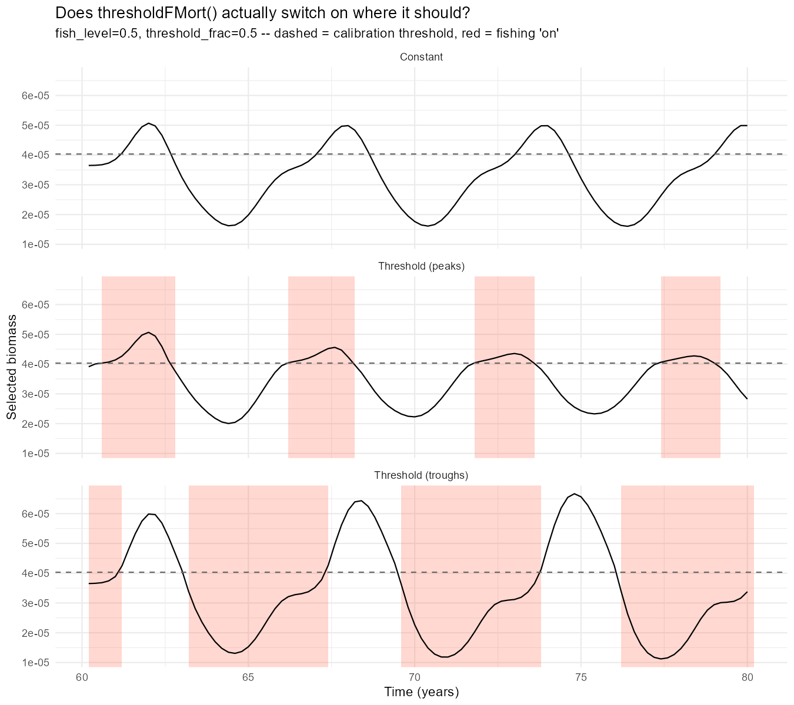
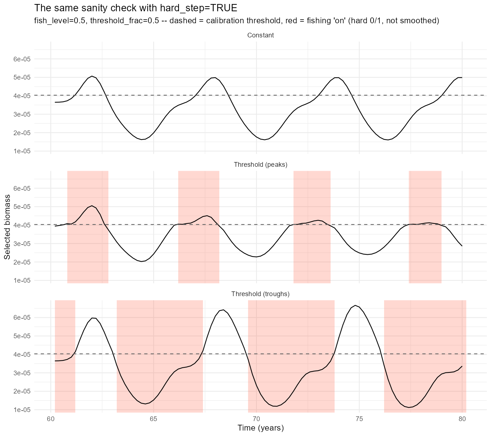
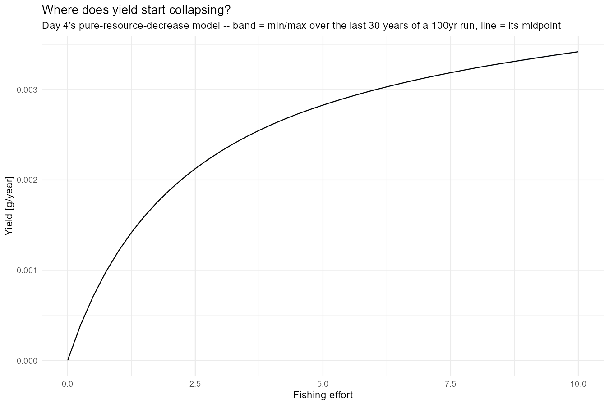
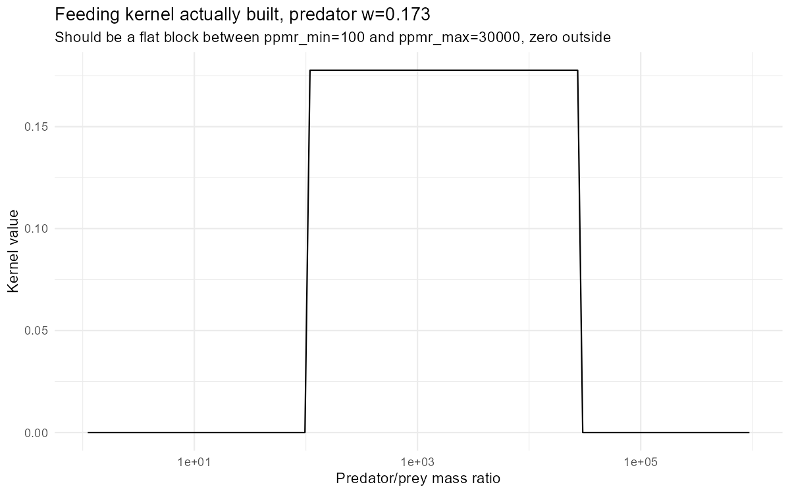
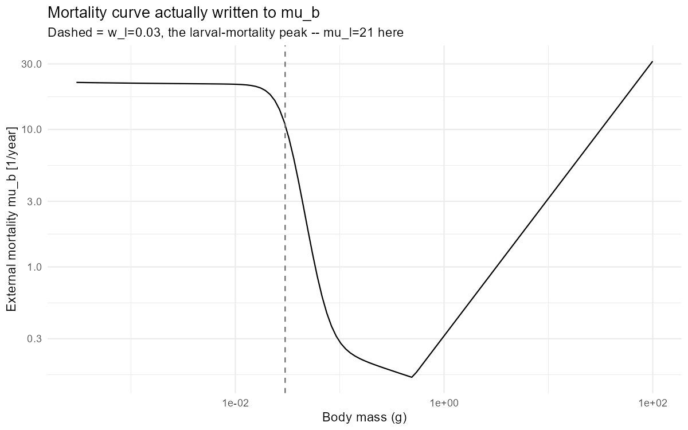
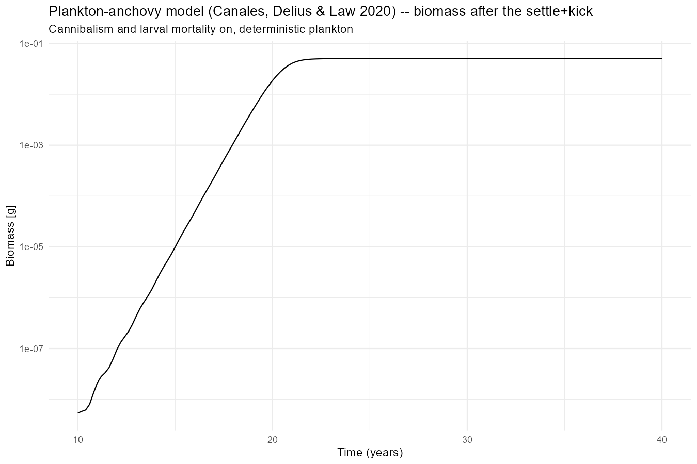
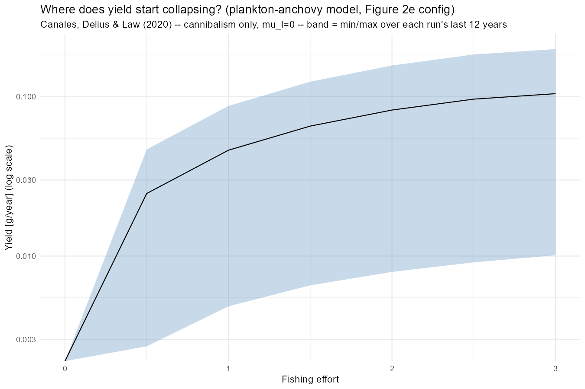

## Closing Out Hard vs. Smooth

Day 36 left one thing open: Section 2b found `hard_step=TRUE` and the smooth logistic switch tell different ecological stories, but only at a single grid point (`fish_level=7.8`). Item 3 on yesterday's list was to check whether that divergence holds everywhere, or just there. Today reused yesterday's exact sanity-check setup (same 60-year settle, same calibration, same `Constant` run) and reran just the two threshold cases with `hard_step=TRUE`, at the more modest `fish_level=0.5`, `threshold_frac=0.5` used throughout Day 34 Section 3.

::: {layout-ncol="2"}



:::

They're visually indistinguishable. Same shading windows, same shrinking peaks in `Threshold (peaks)`, same widening, diverging swings in `Threshold (troughs)`. Whatever separates hard from smooth, it isn't present at this point in the grid. The Section 2b divergence looks like something that specifically emerges at higher `fish_level`, not a difference baked into the two mechanisms everywhere. Worth keeping in mind before generalising from one comparison point, which is exactly what Day 36's own "What's Next" flagged.

That would ordinarily be the whole story for today. It isn't.

------------------------------------------------------------------------

## Then a Bigger Problem Turned Up

Wrapping up the hard-vs-smooth comparison meant looking closely at the params object again, and a routine check of `species_params$erepro` turned up something that makes today's comparison, and arguably everything built on this model since Day 18, beside the point.

`erepro` is a fraction. It has to sit between 0 and 1. mizer doesn't enforce that anywhere - it's just a number in `species_params`, set (or in some workflows solved for) alongside everything else, and nothing stops it landing outside a sane range if the rest of the energy budget doesn't balance.

```{r erepro-check}
#| message: false
#| warning: false
library(mizer)
library(mizerExperimental)

# The model this project has used since Day 18 -- custom w_min/w_max/w_mat,
# custom kappa/alpha/gamma, and ks=0 (no basal metabolic cost).
make_params_anchovy <- function(lambda = 2.05, resource_decrease = 0.001) {
  no_w <- round(log(66.5 / 0.0003) / 0.1)
  p <- newSingleSpeciesParams(species_name = "Anchovy", w_min = 0.0003, w_max = 66.5,
                              w_mat = 10, no_w = no_w, lambda = lambda,
                              kappa = 100 * exp(-6.9 * (lambda - 1)),
                              alpha = 0.1, gamma = 750, ks = 0)
  r <- resource_rate(p) * resource_decrease
  setResource(p, resource_rate = r, resource_dynamics = "resource_semichemostat")
}

# Day 4's model -- pure resource decrease, mizer's own defaults for
# everything else. No beta/sigma override either: just lambda and a scaled-
# down resource_rate.
make_params_day4 <- function(lambda = 2.05, resource_decrease = 0.001) {
  p <- newSingleSpeciesParams(lambda = lambda)
  r <- resource_rate(p) * resource_decrease
  setResource(p, resource_rate = r, resource_dynamics = "resource_semichemostat")
}

data.frame(
  model  = c("Anchovy (Days 18/34/36/this morning)", "Day 4 (mizer defaults)"),
  erepro = c(make_params_anchovy()@species_params$erepro,
            make_params_day4()@species_params$erepro)
)
```

The Anchovy model's `erepro` comes out at just under 80,000, which is roughly five orders of magnitude past the top of its valid range. Day 4's model doesn't have this problem - it does, however, have a very big one that we'll see shortly.

What this doesn't mean: the mechanisms built on top of the Anchovy model such as `thresholdFMort()`, the peaks/troughs comparisons, the hard-vs-smooth question closed out above, aren't necessarily *wrong* as code. They've been checked carefully, repeatedly, over several days. What it does mean is that every specific number those checks produced describes the internal dynamics of a model whose reproduction term is off by five orders of magnitude, not a biologically meaningful anchovy population. Comparisons *within* a given day's scan, run under the same broken model, may still say something about how the fishing rule behaves as a piece of mechanism, but nothing from Day 18 onward should be read as a claim about actual fish stocks.

------------------------------------------------------------------------

## Moving to Day 4's Model

Going forward, the fishing-rule work moves onto Day 4's model: `newSingleSpeciesParams(lambda = 2.05)`, mizer's own defaults for everything else, resource_rate scaled down by 0.001 under semichemostat dynamics: pure resource decrease, no custom species parameters at all. Per the table above, its `erepro` doesn't blow up.

------------------------------------------------------------------------

## Does the Cycle Survive the Switch?

Item 3 on yesterday's list was to check whether a limit cycle still exists under Day 4's model before redoing any of the threshold-fishing work on it. Reused the Day 34 effort sweep (`effort = 0` to `10` by `0.25`, 100-year run, band = min/max over the last 30 years) and looked at whether biomass actually varies over that window, rather than just plotting a mean.



It doesn't. At `effort=0`, biomass ranges from 0.0046217 to 0.0046218 over the sampled window -- a 0.002% spread. At `effort=10`, the top of the sweep, it's 0.003640 to 0.003653 -- 0.4%. That's floating-point settling noise around a fixed point, not a cycle. Day 4's model -- mizer's own defaults plus a scaled-down resource -- never had the oscillatory dynamics Days 18-36 were studying; there's nothing here to rebuild the threshold rule on top of. Patching the Day 18 Anchovy model's `erepro` isn't enough either -- what's needed is a model that actually cycles, which means going back to where the Anchovy parameterisation was supposed to come from in the first place.

------------------------------------------------------------------------

## Porting the Actual Paper

The Day 18 Anchovy setup was always a hand-assembled approximation of the plankton-anchovy model described in Canales, Delius & Law (2020) (custom `w_min`/`w_max`/`w_mat`, custom `kappa`/`alpha`/`gamma`, `ks=0`) not the paper's own parameterisation. Today's fix was to stop approximating and port the real thing: [the notebook at rpubs.com/gustav/plankton-anchovy](https://rpubs.com/gustav/plankton-anchovy) (source: `github.com/sizespectrum/plankton-anchovy`), onto the mizer version actually installed here. That means Appendix B's parameters verbatim, the paper's own size-dependent background/senescent/larval mortality (written straight to `mu_b`, bypassing mizer's default calculation), its own normalised box feeding kernel, and its own logistic plankton-with-immigration resource, dispatched by name the same way this project's other custom rate functions have been since Day 20.

Diagnostics before results: rebuilt the feeding kernel and the mortality curve and plotted what mizer actually constructed, rather than trusting that the port was faithful because it ran without erroring.

::: {layout-ncol="2"}



:::

Both match the paper: the kernel is a flat block between `ppmr_min=100` and `ppmr_max=30000`, zero outside; `mu_b` shows the larval-mortality bump at `w_l` sitting on top of the background/senescent curve, not a smooth generic allometric line. And `erepro` for this build comes out at exactly 0.1 (`epsilon_R` from Appendix B) - safely inside `[0,1]`. This parameterisation sets `erepro` directly from the paper rather than solving for it against the rest of the energy budget, so the Day 18-36 bug doesn't apply here regardless of what caused it.

------------------------------------------------------------------------

## Three Configurations, One That Actually Oscillates

Ran three variants from the same recipe - 10-year settle from a power-law abundance, knock the population down by 10\^7, project on:

1.  **Full/"realistic" config:** cannibalism on (`interaction=1`) and larval mortality on (`mu_l=21`).
2.  **Larval mortality only:** cannibalism off (`interaction=0`), `mu_l=21`.
3.  **The paper's own Figure 2e configuration:** cannibalism only, `mu_l=0`. This is the one the notebook itself uses to demonstrate a sustained cycle.

`report_oscillation()` ,the script's own objective readout, counting local maxima/minima rather than eyeballing a widget, finds plenty of turning points in all three over the first 20 post-kick years. That's misleading on its own: it mostly reflects the settle transient still ringing down, not a sustained cycle. Restricting to the last 5 years of each run (`t>=25`, well clear of the transient) separates the two:

| Configuration | Anchovy biomass, t≥25 (g/m³) | max/min ratio |
|------------------------|------------------------|------------------------|
| Full (cannibalism + larval mortality) | 0.05056 -- 0.05061 | 1.00 |
| Larval mortality only (no cannibalism) | 0.1823 -- 0.1873 | 1.03 |
| **Figure 2e (cannibalism only, mu_l=0)** | **0.0934 -- 0.543** | **5.82** |

Only the cannibalism-only configuration is still oscillating once the transient has cleared.It's a genuine, sustained, nearly six-fold swing in Anchovy biomass, matching the paper's own reported Figure 2e cycle. The other two settle to a fixed point: adding larval mortality on top of cannibalism, which is what the "full, realistic" label promised, actually kills the cycle rather than making the model more interesting. Cannibalism on its own is doing all the work.



The interactive version below puts plankton, total Anchovy, and small-Anchovy biomass together on one log axis, matching the paper's own Figure 2e -- the shape a static PNG on a fixed axis range can hide, since deep troughs get clipped and a real oscillation ends up looking flat.

```{r fig2e-widget}
#| message: false
#| warning: false
#| code-fold: true
library(mizer)
library(mizerExperimental)
library(reshape2)
library(plotly)
library(dplyr)

p2_fig2e <- list(
  dt = 0.001, dx = 0.1, w_min = 0.0003, w_inf = 66.5,
  ppmr_min = 100, ppmr_max = 30000, gamma = 750, alpha = 0.85, K = 0.1,
  mu_l = 0, w_l = 0.03, rho_l = 5,          # mu_l=0: Figure 2e's own config
  mu_0 = 1, rho_b = -0.25,
  w_s = 0.5, rho_s = 1,
  w_mat = 10, rho_m = 15, rho_inf = 0.2, epsilon_R = 0.1,
  w_pp_cutoff = 0.1, r0 = 10, a0 = 100, i0 = 100, rho = 0.85, lambda = 2
)

setAnchovyMort <- function(params, p) {
  mu_b <- rep(0, length(params@w))
  mu_b[params@w <= p$w_s] <-
    (p$mu_0 * (params@w / p$w_min)^p$rho_b)[params@w < p$w_s]
  mu_s <- if (p$mu_0 > 0) min(mu_b[params@w <= p$w_s]) else p$mu_s
  mu_b[params@w >= p$w_s] <-
    (mu_s * (params@w / p$w_s)^p$rho_s)[params@w >= p$w_s]
  mu_b <- mu_b + p$mu_l / (1 + (params@w / p$w_l)^p$rho_l)
  params@mu_b[] <- mu_b
  params
}

plankton_state <- new.env(parent = emptyenv())
plankton_state$time <- 0; plankton_state$factor <- 1; plankton_state$random <- FALSE

plankton_logistic <- function(params, n, n_pp, n_other, rates, dt = 0.1, ...) {
  plankton_state$time <- plankton_state$time + dt
  f <- params@rr_pp * n_pp * (1 - n_pp / params@cc_pp / plankton_state$factor) +
    anchovy_immigration - rates$resource_mort * n_pp
  f[is.na(f)] <- 0
  n_pp + dt * f
}

norm_box_pred_kernel <- function(ppmr, ppmr_min, ppmr_max) {
  phi <- rep(1, length(ppmr)); phi[ppmr > ppmr_max] <- 0; phi[ppmr < ppmr_min] <- 0; phi[1] <- 0
  logppmr <- log(ppmr); dl <- logppmr[2] - logppmr[1]
  phi / (sum(phi) * dl)
}

setAnchovyModel <- function(p) {
  kappa <- p$a0 * exp(-6.9 * (p$lambda - 1))
  species_params <- data.frame(
    species = "Anchovy", w_min = p$w_min, w_mat = p$w_mat, m = p$rho_inf + 2 / 3,
    w_inf = p$w_inf, erepro = p$epsilon_R, alpha = p$K, ks = 0, gamma = p$gamma,
    q = p$alpha, ppmr_min = p$ppmr_min, ppmr_max = p$ppmr_max,
    pred_kernel_type = "norm_box", h = Inf, R_max = Inf, linecolour = "brown",
    stringsAsFactors = FALSE
  )
  no_w <- round(log(p$w_inf / p$w_min) / p$dx)
  params <- newMultispeciesParams(species_params, no_w = no_w, lambda = p$lambda,
                                  kappa = kappa, w_pp_cutoff = p$w_pp_cutoff,
                                  resource_dynamics = "plankton_logistic")
  params@rr_pp[] <- p$r0 * params@w_full^(p$rho - 1)
  params
}

anchovy_params_fig2e <- setAnchovyModel(p2_fig2e)
anchovy_immigration <- p2_fig2e$i0 * anchovy_params_fig2e@w_full^(-p2_fig2e$lambda) *
  exp(-6.9 * (p2_fig2e$lambda - 1))
anchovy_params_fig2e <- setAnchovyMort(anchovy_params_fig2e, p2_fig2e)
anchovy_params_fig2e@interaction[] <- 1

# Settle + kick, as Day 37: 10yr settle from a power-law abundance, knock the
# population down by 10^7, run 30yr more.
anchovy_params_fig2e@initial_n[]    <- 0.001 * anchovy_params_fig2e@w^(-1.8)
anchovy_params_fig2e@initial_n_pp[] <- anchovy_params_fig2e@cc_pp
sim_fig2e <- project(anchovy_params_fig2e, t_max = 10, dt = p2_fig2e$dt, progress_bar = FALSE)
sim_fig2e@n[11, , ] <- sim_fig2e@n[11, , ] / 10^7
sim_fig2e <- project(sim_fig2e, t_max = 30, dt = p2_fig2e$dt, t_save = 0.2, progress_bar = FALSE)

abm  <- melt(getBiomass(sim_fig2e))
abmr <- melt(getBiomass(sim_fig2e, min_w = 0.01, max_w = 0.4)); abmr$sp <- "small Anchovy"
pbm  <- sim_fig2e@n_pp %*% (anchovy_params_fig2e@w_full * anchovy_params_fig2e@dw_full)
pbm  <- melt(pbm); pbm$Var2 <- NULL; pbm$sp <- "Plankton"
bm_fig2e_widget <- rbind(pbm, abm, abmr)

fig2e_widget <- plot_ly(bm_fig2e_widget) %>%
  filter(time >= 10) %>%
  add_lines(x = ~time, y = ~value, color = ~sp) %>%
  layout(yaxis = list(type = "log", exponentformat = "power", title_text = "biomass (g/m^3)"),
        xaxis = list(title_text = "time (year)"))
fig2e_widget
```

The same widget is also written to `interesting_plots/day37_anchovy_fig2e_reproduction.html` as a standalone file, for reuse outside this post.

------------------------------------------------------------------------

## Fishing Effort on the Real Cycle

Reran the effort sweep from the "Does the Cycle Survive the Switch?" section above, this time on the Figure 2e configuration, since it's the one already checked against the paper's own text.



The band tells the whole story. Day 4's model above showed a ribbon too thin to see -- min and max effectively equal at every effort. This one doesn't: at `effort=3`, yield ranges from 0.0101 to 0.199 g/year over the sampled window, nearly a twenty-fold spread, and the ribbon is wide like that across the entire swept range. The cycle survives fishing, at least up to `effort=3`. Yield is also still rising at that point -- the sweep's own upper bound -- so this hasn't found where it actually collapses yet.

------------------------------------------------------------------------

## Also Today: Wiring Claude Up to Mizer Properly

Separately from the modelling, set up `mizerAgents::setup_mizer_agent()` and `connect_mizer_agent()` for this project. The former generates `MIZER-AGENTS.md` plus per-tool skill files describing how to call mizer correctly; the latter connects an assistant to this live R session over MCP, so it can read the installed package's actual help pages and run code in-session instead of guessing and working in a disconnected scratch script.

The motivation is the same failure mode this whole entry has been chasing: a value that's quietly wrong because nothing checked it against the real, current definition. Mizer's API has moved on since any LLM's training data, so code written from memory -- an assistant's, not just a person's -- can call a function that no longer takes those arguments, run without erroring, and hand back a plausible-looking wrong number. Worth watching for, going forward, in exactly the same way the `erepro` bug above needed watching for.

------------------------------------------------------------------------

## What's Next

Day 4's model is dropped as of today, not just deprioritised -- the effort sweep above shows it never had a cycle to lose, so there's nothing left to audit or rebuild on it.

1.  **Find where the Figure 2e configuration's yield actually collapses.** Today's sweep only went to `effort=3`, and yield was still rising at that boundary -- extend `anchovy_effort_seq` further to find the real peak, not just the edge of the range tested.
2.  **Rebuild the threshold-triggered fishing rule on the Figure 2e configuration** -- cannibalism only, `mu_l=0` -- since that's the one that actually cycles. See whether the Days 18-36 peaks/troughs finding (`Threshold (peaks)` cheaply damping the cycle, `Threshold (troughs)` failing to help) holds up on a model that both isn't broken and genuinely oscillates.

Auditing the port's other parameters and working out why larval mortality kills the cycle are both real open questions, but not this project's priority right now -- the port's parameters come straight from a published paper rather than a derived/calibrated value like the broken `erepro` was, and the cycle's mechanism is a side curiosity next to actually using it.
