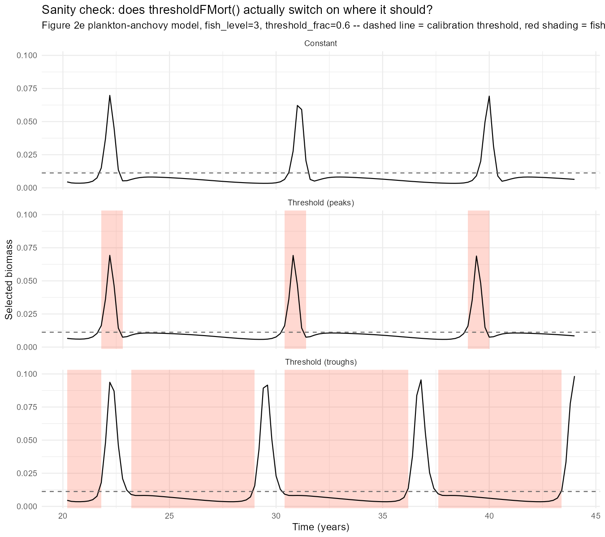
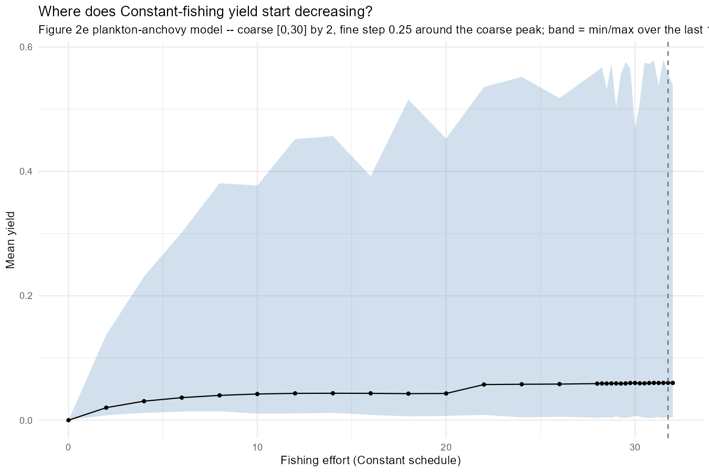
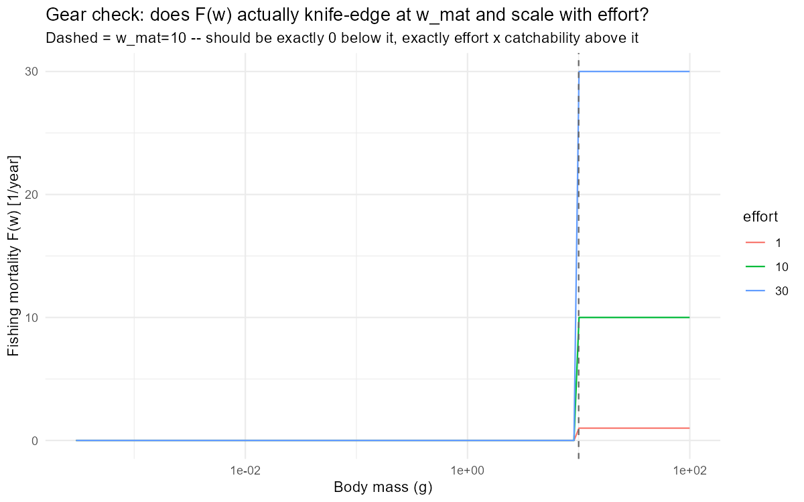
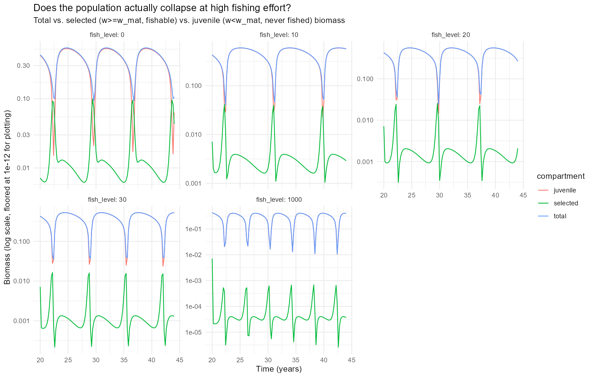
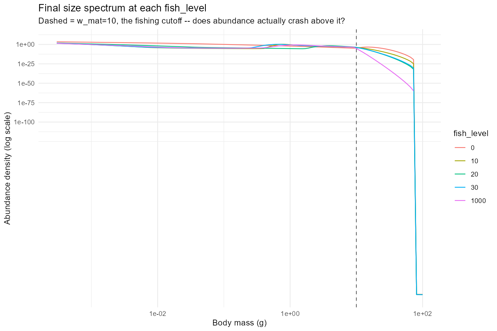
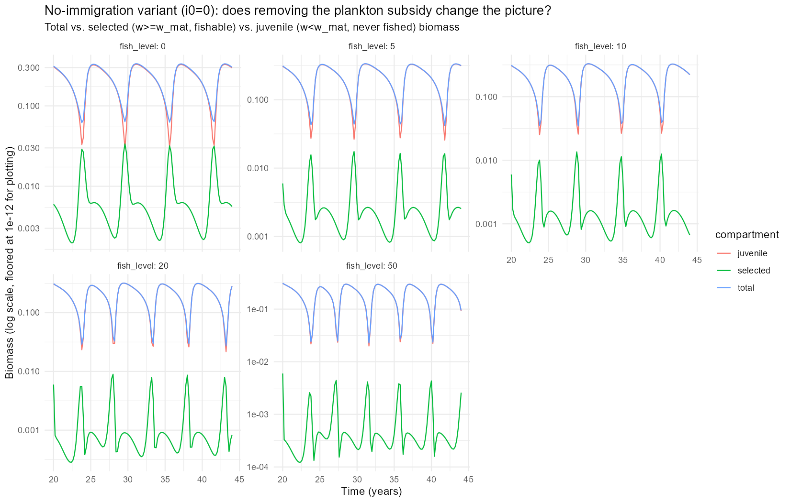
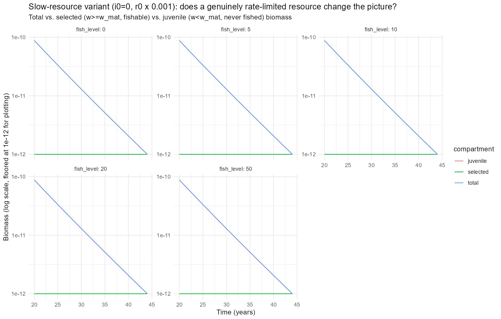
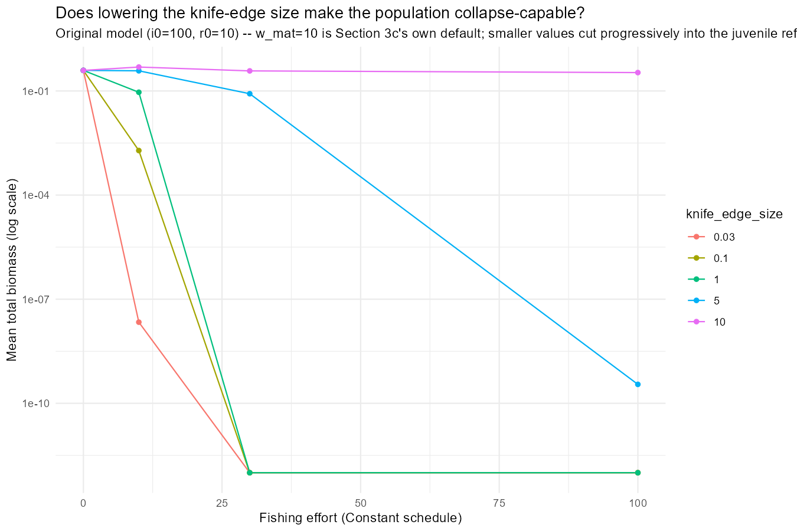
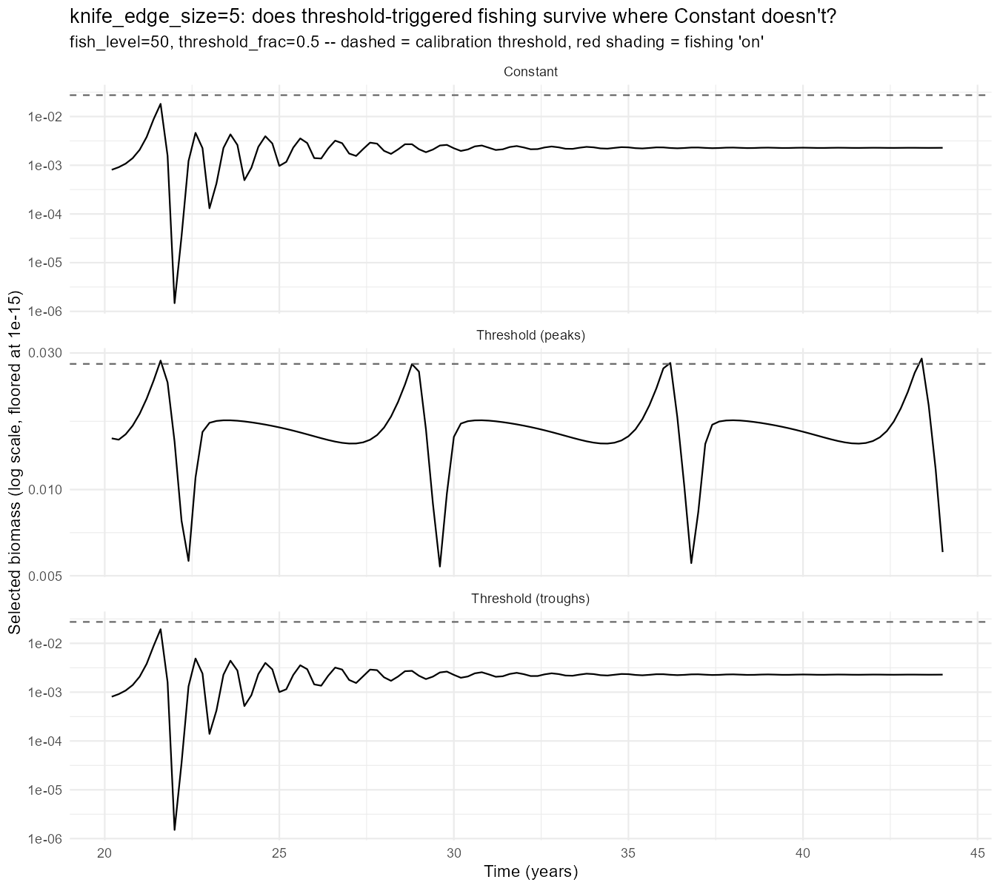
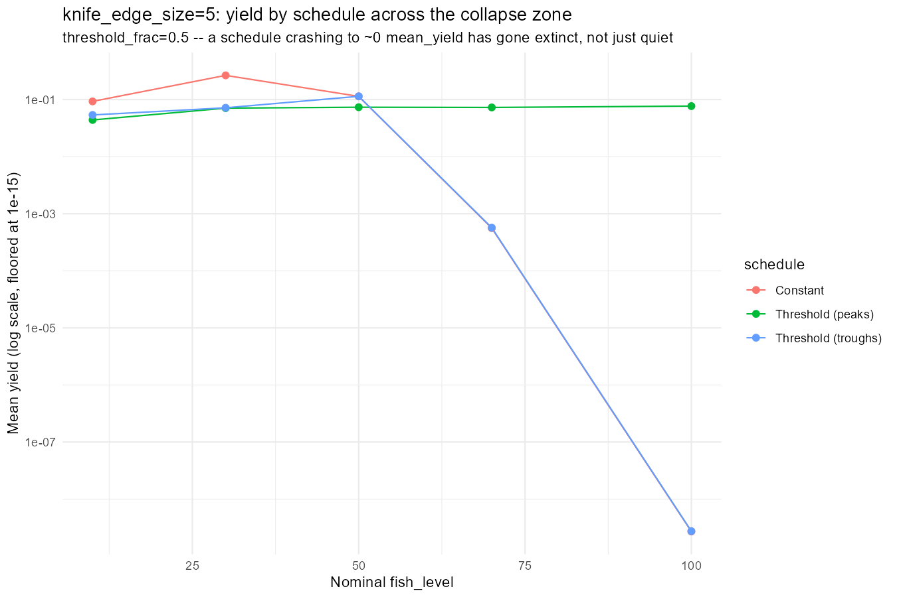

## Rebuilding on a Model That Actually Cycles

Day 37 closed with two live problems: the Anchovy model this project used from Day 18 onward had an `erepro` five orders of magnitude outside `[0,1]`, and its simplest replacement (Day 4's pure resource-decrease model) turned out never to oscillate at all. The fix was porting the actual published plankton-anchovy model (Canales, Delius & Law 2020) and finding that cannibalism *alone* (not the "full, realistic" configuration with larval mortality added back in) is what sustains a genuine limit cycle.

Today's task was mechanical on its face: take Day 36's threshold-triggered-fishing machinery (`thresholdFMort()`, `attach_threshold_rule()`, the effort/threshold scans) and rebuild it on that model instead. `finding_jams/38_experiments.R` does exactly that - the rate-function machinery itself is generic in `params`/`sim` and ports over unchanged. What actually happened today was less mechanical: the rebuilt model refused to do the one thing a fishing-rule study needs it to do, which took most of the day to run down.

------------------------------------------------------------------------

## Sanity Check: Getting the Threshold Right

Same pattern Day 36 established: before spending time on grid scans, one representative `fish_level`/`threshold_frac`, all three schedules, selected biomass plotted against the calibration threshold with fishing "on" periods shaded.

The first pass, at `threshold_frac=0.5` (the cycle's own median), showed `Threshold (peaks)` firing twice per cycle, once on the real peak, once on a smaller secondary crossing, cutting into the peak more than the rule was meant to. Raising `threshold_frac` to 0.6 fixed it: one clean firing window per cycle, right at the true peak, barely touching the peak's own height.

------------------------------------------------------------------------

## The Effort Scan, and a Suspiciously Flat Constant-Fishing Curve

The first real scan (`fish_level=[1,3,5,7,9]`, mirroring Day 36's own range) didn't show much as this model needed far more effort to register anything.This lead to a dedicated Constant-only scan: a coarse pass over `fish_level=[0,30]` by 2, then a fine pass zoomed on the coarse peak.

Mean yield rises from 0 and then just... sits there, wobbling around 0.05-0.06 from `fish_level≈10` all the way to `30`, never turning over. That's not what heavy sustained fishing is supposed to do to a population.

------------------------------------------------------------------------

## Diagnosing the Flat Curve: A Cultivation Effect, Not a Bug

Rather than trust the plot blind or assume it was wrong, three separate checks:

**Gear check.** Does `F(w)` actually knife-edge at `w_mat` and scale linearly with effort, as intended?

**Population structure**, at `fish_level=0,10,20,30,1000` (the last one a deliberate stress test) - total vs. *selected* (`w≥w_mat`, fishable) vs. *juvenile* (`w<w_mat`, never fished) biomass:

::: {layout-ncol="2"}

:::

`mean_selected` collapses as expected - over 200x down from unfished to the `fish_level=1000` stress test (0.0178 → 0.0000836). But `mean_juvenile`, which is over 95% of total biomass throughout, never follows it down. It's actually *higher* at `fish_level=10` (0.485) than unfished (0.374), and still 78% of the unfished level even at the stress test. **The gear is knife-edge at `w_mat` and structurally can never touch anything smaller, and cannibalism (Day 37's whole finding) is what normally suppresses the juvenile compartment. Fishing out the cannibalistic adults doesn't just remove biomass; it removes the juveniles' main predator.** A real, published phenomenon in cannibalistic size-spectrum models (de Roos & Persson 2002, *PNAS*; the "cultivation effect" literature going back further than that), not an artefact of this port.

**Transient-length check**, in case 24 years just wasn't long enough to see a real decline: `fish_level=30` run out to 100 years instead. Mean biomass over the last 12 years: 0.379 (Section 3b's own 24yr window) vs. 0.415 (100yr run) so its consistent, not a truncated transient.

All three checks agree: the flat yield curve is real model behaviour, not a bug.

------------------------------------------------------------------------

## Trying to Make the Resource the Bottleneck

First attempt: the plankton resource is topped up every year by a constant external immigration term (`i0=100`) regardless of grazing pressure, so juveniles are never actually resource-limited once cannibalism eases. Removing it (`i0=0`) was the most surgical change available.

A weak, non-monotonic probe. `mean_juvenile` dips at `fish_level=20` then partly recovers at `50`. The subsidy wasn't the load-bearing piece. Next lever: the resource's own regrowth *rate*, not just the top-up - the same `resource_decrease` trick Day 4/18 used on a `resource_semichemostat` resource, applied here to `r0` (`rr_pp = r0 * w_full^(rho-1)`). Reusing Day 4/18's own convention, `resource_decrease=0.001`:

Too severe - `min_total=1e-12` even unfished. The standard settle+kick recipe knocks the population down by 10\^7 right after the 10-year settle; with the resource regrowing 1000x slower, there's no recovering from that combined with the kick, fished or not. A calibration sweep followed, `resource_decrease` from 1 down to 0.005, unfished only:

------------------------------------------------------------------------

## The Key: The Gear's Own Blind Spot

The resource-scarcity approach was fighting the wrong mechanism. Section 3c's own diagnosis was structural, not resource-driven: the gear is knife-edge at `w_mat=10` and *never* touches anything smaller. Lowering `knife_edge_size` below `w_mat`, on the **original** model (`i0=100`, `r0=10` -- full subsidy restored), removes that blind spot directly instead of trying to starve the whole system.

At the original `knife_edge_size=10`, the population barely notices fishing even at `effort=100` -- no genuine collapse risk. Drop it to `5`, and there's a real, graduated dose-response for the first time: healthy at `effort=10`, visibly stressed at `30` (\~5x down), genuinely collapsed by `100` (9+ orders of magnitude down -- actual extinction, not suppression). Go lower still (`1`, `0.1`, `0.03`) and it collapses almost immediately even at modest effort it's too fragile to leave any working range.

`knife_edge_size=5` was the one candidate with everything needed: real collapse risk at high sustained effort, and a genuine safe operating range at moderate effort.

------------------------------------------------------------------------

## The Headline Result: Rebuilding the Rule Comparison on a Model That Can Actually Collapse

Threshold-rule machinery rebuilt on `knife_edge_size=5` - sanity check at `fish_level=50`, deliberately in the "at risk" zone, then an effort scan across `fish_level=[10,30,50,70,100]`.

At `fish_level=50`, none of the three schedules have collapsed yet, but Constant and Threshold (troughs) both ring down hard right after the fork and settle into a **flat, damped equilibrium**, while Threshold (peaks) is the only one still showing a genuine sustained cycle, clean repeating peaks and troughs, never damping out. Threshold (troughs) behaves almost identically to Constant throughout. Its realised effort tracks the nominal `fish_level` almost exactly (mean_effort=49.97 at nominal 50), so it's functionally the same schedule with a different name.

Constant traces a textbook overfishing curve: yield *peaks* at `fish_level=30` (0.265, higher than at 10), then craters by `70` (0.00056, a 500x drop) and is functionally extinct by `100` (2.7e-9). Threshold (peaks) does something structurally different: its `mean_effort` **saturates around 3-4 regardless of nominal fish_level** (1.47 at nominal 10, only 3.90 even at nominal 100) because the burst itself gets *shorter* as the nominal intensity rises (`effective_window` shrinks from 0.8 years to 0.2 as nominal effort climbs). It isn't fishing less because it was told to; it's fishing less because a more intense burst depletes the peak back below threshold faster. `mean_yield` stays positive and roughly flat (0.044-0.077) across the whole tested range and never collapses, even at nominal `fish_level=100`.

That's the result Day 36's whole apparatus was built to find: on a model that can genuinely collapse, **threshold-triggered fishing timed to peaks is structurally protected from the collapse that both Constant and badly-timed (troughs) fishing suffer at the same nominal effort**. This is not because it happens to fish less, but because it can't help but fish less once the peak it's chasing gets thinner.

------------------------------------------------------------------------

## Two Issues With This Result That Need Addressing, Not Just Noting

Sitting with today's headline result longer turns up two problems with it, both worth being explicit about rather than filing away as minor caveats.

**The schedule comparison itself is flawed.** "Constant" and "Threshold (peaks)" above are not a comparison of *when* to fish at a fixed average intensity - they're two regimes with completely different floors. Constant fishes the full nominal `fish_level` all the time. Threshold (peaks/troughs) fishes *nothing at all* (`background_level=0`) except during its own firing window. So when Threshold (peaks) comes out ahead, part of that gap is genuinely about timing but part of it is just "fishing less overall," dressed up as a schedule question. A fair test of whether timing matters has to hold the floor constant: run a baseline fishery all the time, and ask whether *topping it up* at peaks beats topping it up at troughs, or not topping it up at all.

**The effort levels involved are not remotely realistic.** Getting `knife_edge_size=5` to show any dose-response at all needed `fish_level` from 10 up to 100 and the stress test in Section 3c pushed to `fish_level=1000`. Real fishing mortality `F` for actual exploited stocks is typically `O(0.1-1)`/year; effort in the tens-to-hundreds here isn't "heavy fishing," it's several orders of magnitude past anything a real fishery could sustain or would be permitted to apply. That doesn't make the qualitative mechanism (cultivation effect, gear-driven refuge, self-limiting peak-timed effort) fake but it does mean none of today's specific numbers (which `fish_level` stresses vs. collapses the population, where yield peaks) can be read as calibrated to a real fishery. Worth understanding *why* this model needs such extreme effort before trusting any number that comes out of it at a more modest, realistic scale.

Both are being addressed directly: the schedule comparison is being rebuilt so every regime shares the same Constant floor and only the *boost* is targeted at peaks or troughs, and the unrealistic-effort question is being tracked rather than quietly assumed away. See item 1 below.

------------------------------------------------------------------------

## What's Next

1.  **Rework the schedule comparison itself.** As flagged above, "Constant" and "Threshold (peaks)" are two independent, mutually exclusive fishing regimes with different floors, not a fair timing comparison. The fix: every schedule shares the same Constant floor (`background_level`), and "Threshold (peaks)"/"Threshold (troughs)" only layer an *extra* boost on top of it near cycle peaks/troughs so the question becomes whether topping up an existing fishery during good (or bad) years beats fishing that same floor flat, not whether an intermittent fishery beats a continuous one from a standing start. Also carries forward the unresolved effort-realism problem: the floor and boost needed to see anything at all are still in the same unrealistic tens-to-hundreds range as today's own numbers.
2.  **Test whether reducing cannibalism increases instability.** Cannibalism is what's driving the cycle in the first place (Day 37) and what's protecting the juvenile refuge from collapse (today). Turning it down, rather than removing it outright as Day 37 already did, is the natural next probe: does a weaker cannibalism signal make the population *more* prone to instability, consistent with it acting as a stabilising feedback, or does it just shrink the cycle's amplitude without changing collapse risk?
