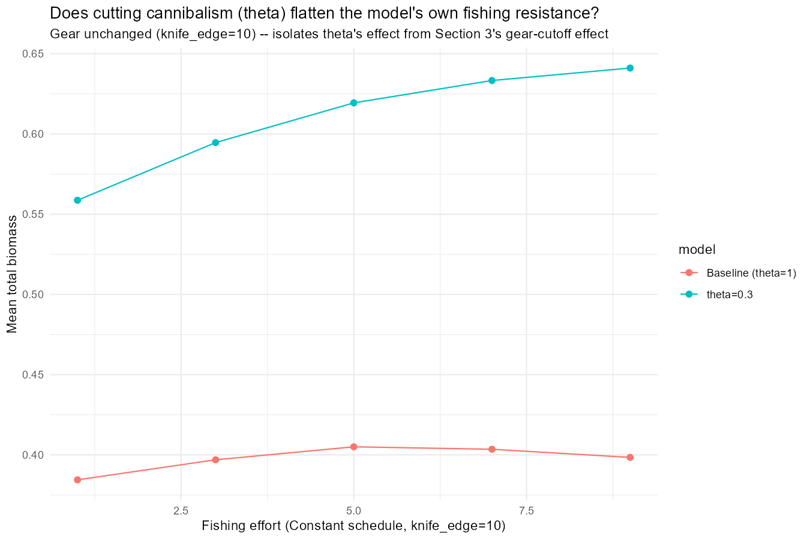
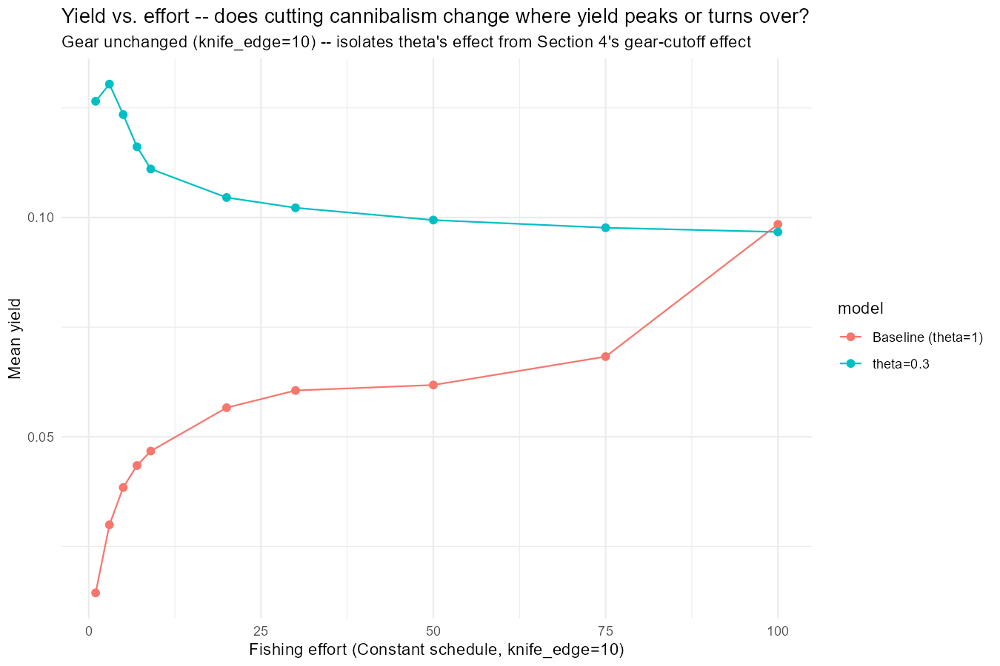
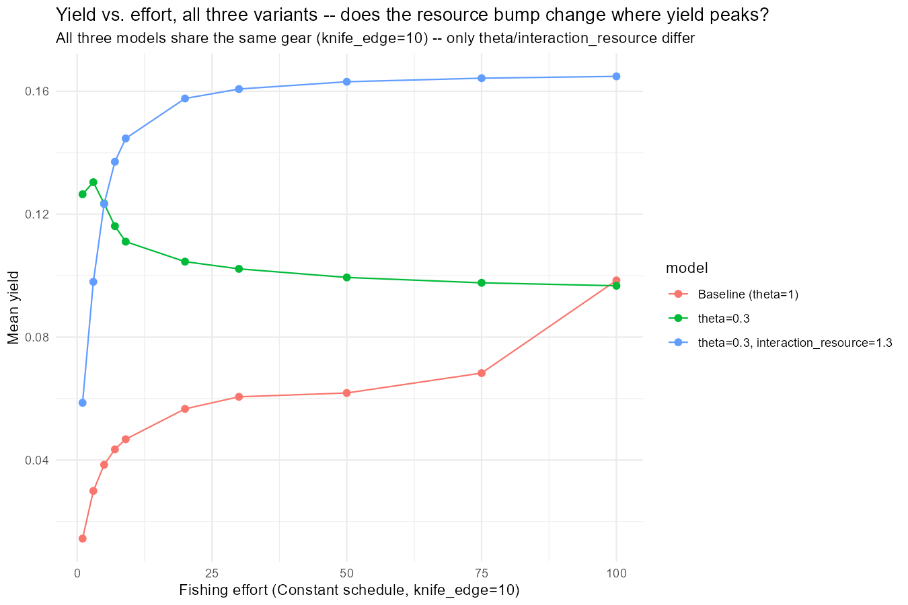
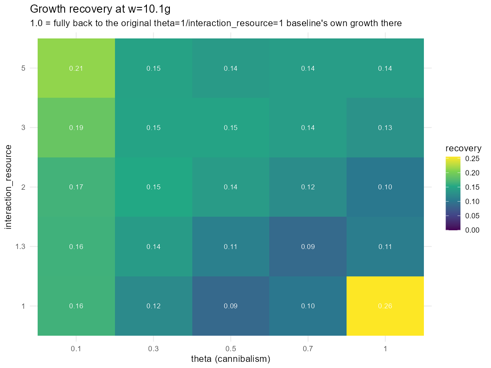
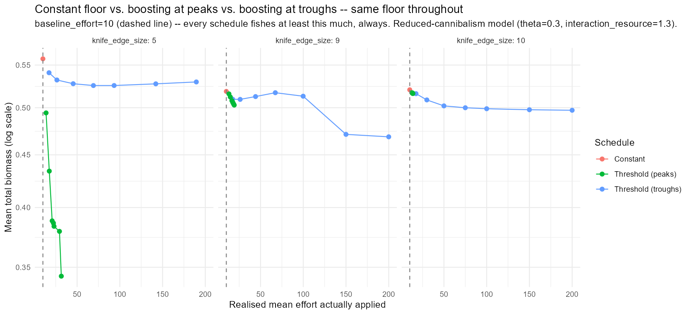
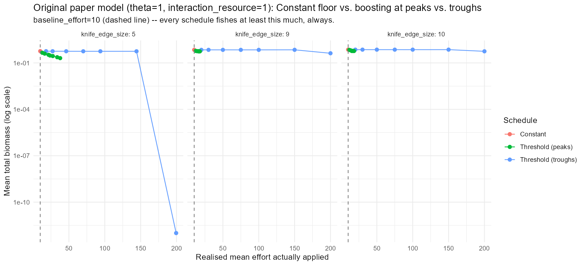
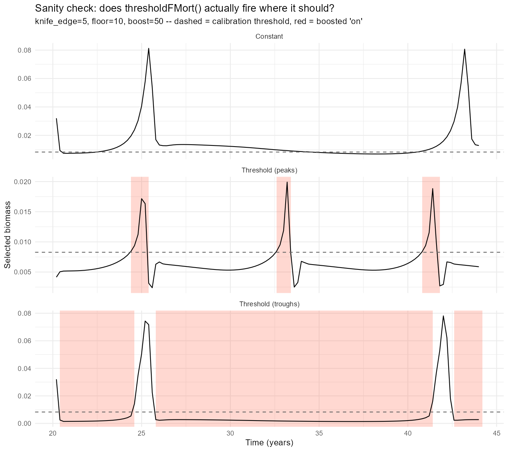
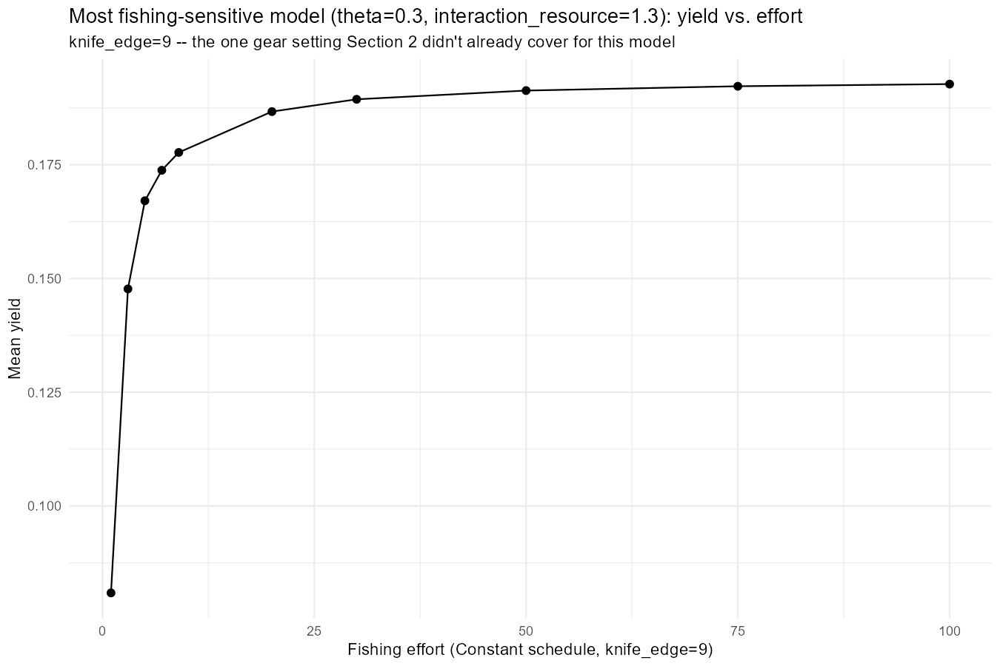
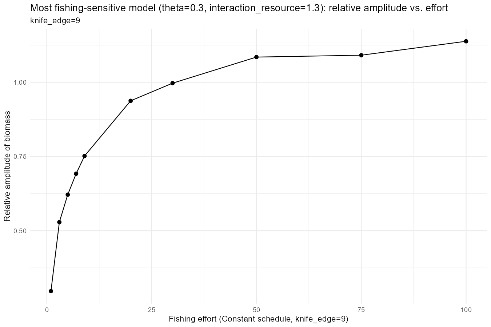

## The Brief

Day 38 closed with two open items: cannibalism was both the thing driving this model's cycle and the thing making it fishing-resistant, and the Constant-vs-Threshold schedule comparison itself was flawed (different average effort, not just different timing). Today's `finding_jams/39_experiments.R` takes on both, plus a third thing that came out of actually reading the results back rather than trusting the plan: does cutting cannibalism even work the way it's supposed to, and is the "peaks" fishing rule actually firing where it should?

------------------------------------------------------------------------

## Section 1: Cutting Cannibalism - Growth Crashes Somewhere It Shouldn't

`theta` (the species interaction matrix, `@interaction`) is the cannibalism knob for this single-species model; `interaction_resource` is a separate knob for the resource. Cutting `theta` to 0.3 was meant to weaken the "cultivation effect" (fishing adults relieves predation on juveniles) that made Day 38's model fishing-resistant.

A quick interactive check, done before writing any code, held the population fixed and only perturbed `theta` and found cannibalism is under 0.1% of an Anchovy's direct diet at every size, so growth "barely moves with theta". That check was misleading. Once the actual script ran and let the population re-settle on its own:

| w (g) | growth, theta=1 | growth, theta=0.3 | change   |
|-------|-----------------|-------------------|----------|
| 0.01  | 0.151           | 0.166             | +10%     |
| 0.10  | 0.614           | 0.729             | +19%     |
| 1.02  | 1.068           | 1.815             | +70%     |
| 10.07 | 10.266          | 1.245             | **-88%** |
| 28.56 | 5.834           | 0.654             | **-89%** |

Small fish grow *better*. Large fish, exactly the sizes at and above `w_mat` that this whole project's fishing analysis is built around, have their growth crushed. The mechanism is indirect: cutting cannibalism removes the mortality that normally caps the juvenile population, that population booms, and it grazes down the same shared ressource spectrum large fish depend on for nearly all their food. Resource competition between size classes, mediated through the plankton, not a direct cannibalism/growth link -- invisible to a check that holds the population fixed.

Predation mortality doesn't scale cleanly with `theta` either: at w=0.01g it roughly halves (52 → 27/yr, not the \~3x drop naive scaling predicts, because the bigger population partly offsets the lower per-capita rate). At w=0.1g it goes the *other* way -- up \~9x (0.49 → 4.5/yr) -- the population-size effect dominates the per-capita cut entirely at that size.

Extending the effort probe from this project's usual `[1,9]` out to 100 turned up something else worth having: at `theta=1`, yield never peaks in that whole range. At `theta=0.3` alone, yield **does** peak -- around `fish_level≈3` -- and then gently declines. A real, sustainable-looking yield curve, for the first time.

------------------------------------------------------------------------

## Section 2: The Resource Fix That Doesn't Fix It

Worth being clear about where this section came from before getting into why it didn't work: it wasn't a requirement, just a hypothesis -- mine and Gustav's -- that dropping cannibalism this much would starve the species, and that raising `interaction_resource` alongside it would compensate. Section 1's own growth numbers were the test of that hypothesis, and it came back wrong on both counts: the starvation risk was real only at large sizes and for indirect reasons neither of us had in mind (resource competition from a booming juvenile population, not a lost food source), and the fix aimed at a directly-lost-food-source problem couldn't touch it. The growth deficit doesn't necessarily need compensating for at all -- that was an assumption to check, not a given.

`interaction_resource=1.3` -- 30% more resource food, meant to offset the growth lost to cutting cannibalism -- was a hand-picked guess. Checked against the real numbers:

| w (g) | vs. baseline, theta=0.3 alone | vs. baseline, +interaction_resource=1.3 |
|------------------------|------------------------|------------------------|
| 0.01 | +10% | **+31%** |
| 0.10 | +19% | **+28%** |
| 1.02 | +70% | **+15%** |
| 10.07 | -88% | **-86%** |
| 28.56 | -89% | **-87%** |

It over-corrects the sizes that were already fine, and barely moves the sizes that actually needed rescuing. A 30% resource boost was never going to close an 88% deficit, and it doesn't.

It also undoes Section 1's one clean win: the resource-boosted model's yield climbs monotonically again (0.059 → 0.165 across `[1,100]`), same never-peaking shape as the original `theta=1` baseline, just at a different level. And its total biomass declines the most cleanly of the three variants (0.71 → 0.48),which is simultaneously the most fishing-sensitive on biomass and the least sustainable-looking on yield, an odd combination.

------------------------------------------------------------------------

## Section 3: An Actual Grid Sweep -- and a Methodological Trap

Rather than hand-pick another `(theta, interaction_resource)` pair, a 5×5 grid, reading off growth recovery at w=10.1g and fishing sensitivity per cell.

`day39_grid_candidates.csv` came back **empty** -- no combination beat the baseline's own fishing sensitivity while recovering even half its growth at w=10.1g, across the whole tested range including `interaction_resource=5`.

That number needs a caveat, though. The grid's own `(theta=1, interaction_resource=1)` cell -- which should exactly reproduce the original baseline -- doesn't: `growth_recovery_w10` for that cell comes out at 0.255, not 1.0. Each grid cell gets its own independent 20-year settle-and-kick fork, and growth at w=10-30g is a single instantaneous snapshot during an actively-oscillating population; it depends heavily on *where in the \~5-6yr cycle* that particular fork happened to land, uncontrolled across cells. The smallest-size column (`growth_recovery_w0.01`) is clean and monotonic in `interaction_resource`, consistent with fast-equilibrating larval sizes not caring about cycle phase -- so the *direction* of the large-size result (nothing on this grid meaningfully restores growth there) is probably right, but the exact per-cell numbers at w=10/30 shouldn't be trusted closely. Fixable by time-averaging growth over the fork's own cycle, the way the effort probes already average over `scan_summary_window` -- not done today.

------------------------------------------------------------------------

## Sections 4-5: Rebuilding the Schedule Comparison on a Fair Footing

Day 38's own comparison compared "Constant" (fishing the full nominal level, always) against "Threshold" schedules that fished *nothing at all* otherwise (`background_level=0`) -- not a comparison of *when* to fish, just of *how much*, dressed up as a schedule question.

Fixed here: every schedule -- Constant, Threshold (peaks), Threshold (troughs) -- shares the same Constant floor (`background_level=10`). "Constant" is just the degenerate case that never switches; peaks/troughs only add a boost on top of that floor near cycle peaks or troughs. Run on both Section 2's model (theta=0.3, interaction_resource=1.3) and, since Sections 1-3 all found theta/interaction_resource change the fishing response substantially, on the original paper model too.

On the reduced-cannibalism model at `knife_edge=5`, "Threshold (peaks)" is the one that damages the population -- mean total biomass falls from 0.558 (Constant) to 0.343 at the highest boost -- while "Threshold (troughs)" barely moves (0.558 → 0.530) despite absorbing a realised effort of nearly 190. First read on this looked like a clean reversal of Day 38's own finding (there, peaks-fishing was the *protected* schedule).

Re-running the same fair comparison on the **original** model complicates that story:

At `knife_edge=5` on the original model, "peaks" *also* erodes biomass steadily (0.454 → 0.204 as boost goes from 20 to 200) - not the "structurally protected, never collapses" result Day 38 reported. "Troughs" stays flat through boost=150 (\~0.57) and then collapses sharply and specifically at boost=200 (down to \~2×10⁻¹³, total extinction).

So the honest read: Day 38's "peaks is protected" result looks like it was at least partly an artefact of the unfair floor=0 comparison, not a robust property of the original model. Under the fair comparison, both models show peaks eroding biomass gradually and troughs holding up better (with one sharp exception at the very top of the original model's own range). This is a different, more nuanced picture than either day's own headline claimed on its own.

Rerunning Section 5 with the relative-amplitude metric added puts a number on that one exception. For the original model's "Threshold (troughs)" at `knife_edge=5`, `rel_amplitude` sits at 1.83-1.89 for boost 20-150, then jumps to **1.99999999...** -- the literal ceiling of `(max-min)/mean` -- exactly at `boost=200`, matching the near-total extinction already seen there. A genuine cliff edge, not a slide. The reduced-cannibalism model's own "troughs" never approaches it: `rel_amplitude` stays in 1.65-1.77 across the *entire* range including boost=200. Cutting cannibalism doesn't just shift the average outcome -- it removes a specific catastrophic failure mode that the original model has and the reduced-cannibalism model doesn't. "Peaks" fishing pushes amplitude up toward \~1.95-1.98 in *both* models regardless of boost -- that risk doesn't go away either way.

------------------------------------------------------------------------

## Is "Peaks" Actually Firing Where It Should?

It is worth checking directly rather than trusting the summary statistics.The code uses Day 36/38's own sanity-check convention, missing from this file until now: one representative case (`knife_edge=5`, `boost=50`), all three schedules, selected biomass plotted against the calibration threshold with the boosted "on" periods shaded.

Read directly off the underlying series: `on_frac` for "Threshold (peaks)" sits near 0 for most of each cycle and spikes to 0.92-0.9996 in a narrow window of a few tenths of a year, and that window lands *exactly* on the local maxima of `selected_biomass` -- e.g. at t=25.0 (biomass 0.0172, the peak of that cycle) `on_frac=0.998`; at t=33.2 (biomass 0.0199, another peak) `on_frac=0.9996`. It is finding and firing on the real peaks. "Threshold (troughs)" for the same case sits at `on_frac≈0.99` almost continuously from shortly after the fork onward. The population drops below the calibration threshold once boosted fishing starts and never climbs back above it within the window, so "troughs" ends up functionally indistinguishable from Constant fishing at the boost level. Both are working exactly as designed; the self-limiting realised effort seen in the summary statistics is a genuine consequence of the mechanism (a bigger boost truncates the peak faster), not a code defect.

------------------------------------------------------------------------

## Section 6: Zooming Into the Actually-Promising Region

Everything above tests effort in the tens-to-hundreds, chasing collapse. `theta=0.3` alone (not the resource-boosted variant) at `knife_edge=5` was the one combination that showed a genuinely sustainable-looking yield curve in Section 1. It's worth a proper 3-schedule sweep in the effort range that curve actually lives in, `[0,7]`, rather than the collapse-hunting range. `run_layered_ke_case()` was generalised to take the floor and boost sequence as parameters rather than hardcoded globals, so this reuses Sections 4/5's own machinery with `baseline_effort=1`, `boost_seq=c(2,3,4,5,6,7)`.

First attempt to run it threw `unused arguments (baseline_effort = ..., boost_seq = ...)` -- not a bug in the file. `run_layered_ke_case()` was generalised to take those as parameters *after* an earlier version had already been defined in the live session, and Section 6 was the first call to actually use the new arguments -- everywhere else, the defaults matched what the old hardcoded version did, so nothing surfaced the mismatch until now. Fixed by re-sourcing the file so the session picks up the current signature.

![theta=0.3, knife_edge=5, effort in \[0,7\]: biomass vs. realised effort.](../interesting_plots/day39_zoom_ke5_collapse.png)

Rerun, and it complicates the "peaks is the dangerous schedule" story from Sections 4/5 rather than confirming it at this scale. Down here, "Threshold (peaks)" doesn't damage the population at all: mean total biomass climbs from Constant's own 0.524 up to a plateau around 0.643 as boost rises from 2 to 7, staying self-limited (`mean_effort` only 1.19-1.36, barely above the floor of 1) the whole way -- same self-limiting mechanism as the high-effort tests, but at this scale it reads as protective, not damaging. Its yield sits modestly *below* Constant's own (0.135-0.138 vs. 0.159), the price of that self-limiting.

"Threshold (troughs)" does something more interesting: biomass climbs gently with boost through `boost=6` (0.518 → 0.585), consistent with `mean_effort` staying well below the nominal boost (5.42 at boost=6, not 6). Then at `boost=7` there's a sudden regime change, not a continuation of the trend -- `mean_effort` jumps to exactly 7.0 (troughs finally saturates to fully-on), `mean_selected` collapses from \~0.02 to 0.0016, and `rel_amplitude` *crashes* from \~1.0 down to 0.12. The population stops cycling and settles into a new, much higher (0.725), almost-flat, nearly-all-juvenile steady state. Reads as the cultivation effect again, in miniature: enough sustained pressure on the adult compartment relieves whatever residual predation `theta=0.3` still provides, and the juvenile population booms into the space that opens up.

Net effect: the "peaks is risky" finding from Sections 4/5 is a high-effort phenomenon. Within a plausible `[0,7]` range, neither schedule collapses the population -- if anything, both schedules end up with *more* total biomass than plain Constant fishing at the same floor.

------------------------------------------------------------------------

## Section 7: Quantifying "Most Sensitive" -- and a Warning Sign Yield Doesn't Show

Section 2 named theta=0.3+interaction_resource=1.3 the most fishing-sensitive model built so far -- the only one whose total biomass declined monotonically across the whole `[1,100]` effort range rather than plateauing. That check was only ever done at `knife_edge=10` and `5`; `knife_edge=9` was the one gap.

It holds up: total biomass runs 0.684 → 0.427 across `[1,100]`, no rise phase at all -- unlike every other model/gear combination tested this project, which all show at least some initial climb before flattening or declining. Mean yield climbs the whole way too, 0.081 → 0.193, never peaking, so a yield-only read would say this model is fine at any effort tested here.

Relative amplitude tells a different story: it climbs from 0.30 at `fish_level=1` past **1.0** by `fish_level=50`, up to 1.14 at `fish_level=100`. The population isn't just shrinking on average -- its cycle is getting proportionally more violent, swinging closer to zero at every trough even while the mean holds up. A leading indicator this model is living closer to collapse than the mean-biomass or yield numbers alone would suggest, and exactly the kind of thing a yield-only assessment misses.

------------------------------------------------------------------------

## What's Next

1.  **Pin down Section 6's troughs transition.** Something changes between `boost=6` and `boost=7` that flips the population into a new, flatter, juvenile-dominated state -- worth a finer sweep across that gap rather than leaving it bracketed at two points.
2.  **Time-average Section 3's grid**, the way the effort probes already do, before trusting its per-cell growth-recovery numbers at large sizes.
3.  **Validate a grid candidate** (once the averaging fix makes the grid trustworthy) against Sections 4/5's own knife-edge sweep, rather than continuing to test theta=0.3/interaction_resource=1.3 by default.
4.  Section 6 shows the "peaks is risky" finding from Sections 4/5 is a high-effort phenomenon that doesn't show up in `[0,7]` -- worth checking where between there and Sections 4/5's own floor=10 baseline that risk actually starts appearing, rather than leaving the two ranges as disconnected data points.
5.  Relative amplitude turned up several real, separate findings today (the original model's troughs cliff-edge, knife_edge=9's rising-amplitude warning, and Section 6's own sudden amplitude collapse at boost=7) that mean_total/mean_yield alone missed -- worth checking as a matter of course everywhere effort gets scanned, not just where it happened to get added.
6.  **Find the actual yield peak in Section 6's range.** Section 6 only has one Constant point (the floor=1) -- there's no swept Constant curve to show whether yield peaks within `[0,7]` the way Section 1 found one at `fish_level≈3` over `[1,100]`. Needs a proper Constant sweep across `[0,7]` at `knife_edge=5` before that question has an answer.
