## The Brief

Day 39 closed with a candidate the project's aim had been chasing since Day 38: `theta=0.3` (cannibalism cut to 30% of the baseline), `interaction_resource` left alone, gear at `knife_edge=10` -- the one configuration whose yield genuinely peaked and then declined with Constant fishing effort, rather than climbing forever the way the `theta=1` baseline does out to `fish_level=100`. That result came from a coarse grid (`1,3,5,7,9,20,...`), and it had never been tested against a peaks/troughs fishing schedule at all -- Day 39's own layered-schedule comparisons (Sections 4/5) ran only on the resource-boosted variant and the original model. Today's `finding_jams/40_experiments.R` does three things: pin the peak down properly, build the three-schedule comparison Day 39 skipped, and then redo it with the floor set to the number that comparison should have used from the start -- the model's own MSY effort, not an arbitrary constant.

------------------------------------------------------------------------

## Section 1: Sharpening the Peak

Day 39's own grid placed the turnover "around `fish_level=3`" -- the coarseness of `1,3,5,7,9,...` couldn't say much more than that. A finer grid concentrated near that region (`0.5,1,2,3,4,5,7,9,15,20,30,50,75,100`) pins it down properly.

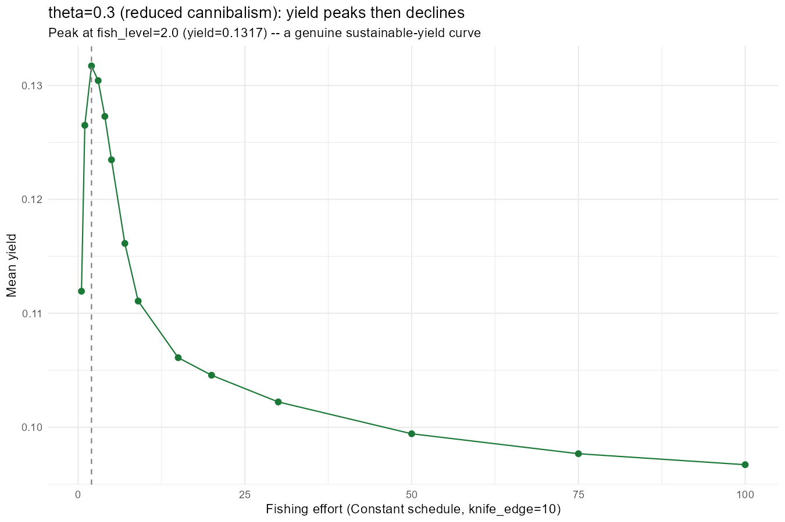

The peak sits at `fish_level=2` (`mean_yield=0.1317`), not 3 -- Day 39's grid happened to sample close enough to look right without actually landing on it. From there yield declines smoothly and monotonically all the way to `0.0967` by `fish_level=100`: a clean, single-peaked sustainable-yield curve, the thing this project's aim has been asking for since Day 38.

------------------------------------------------------------------------

## Section 2: Does a Peaks/Troughs Schedule Change the Picture?

Day 39's threshold-schedule machinery (`thresholdFMort()`, Day 36/38's own rate-function rule: a Constant floor everywhere, boosted fishing layered on top only when selected biomass crosses a calibration threshold, "above" for peaks or "below" for troughs) had never been run on the plain `theta=0.3` model -- only on the resource-boosted variant and the original. First pass: floor (`baseline_effort`) `=1`, boosts `c(2,3,5,7,9,15,20,30)`, `knife_edge=10` -- the same gear as Section 1's own peak.

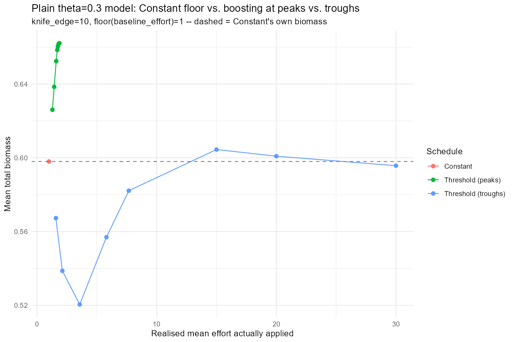

Neither schedule damages the population anywhere in this range. Mean total biomass for "Threshold (peaks)" sits at or above Constant's own `0.598` throughout (`0.626`-`0.662`); "Threshold (troughs)" dips as low as `0.521` at low boost but climbs back to `0.596`-`0.603` by boost 15-20, still close to Constant. Relative amplitude tops out around `1.28` (troughs, boost=30) -- nowhere near the `~2.0` near-extinction ceiling Day 39 found in the *original* model's own troughs cliff-edge.

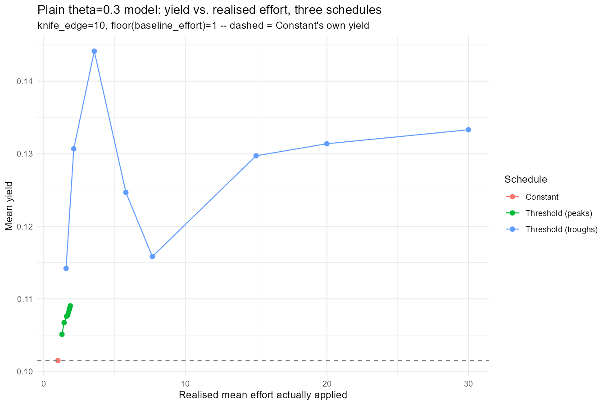

The yield picture has a genuine surprise in it: "Threshold (troughs)" at boost=5 (realised `mean_effort=3.57`) hits `mean_yield=0.1441` -- the single best point in the whole table, beating every "peaks" value and every other "troughs" value including the higher-boost ones. Not a monotonic climb-then-plateau; a real local optimum in the middle of the range.

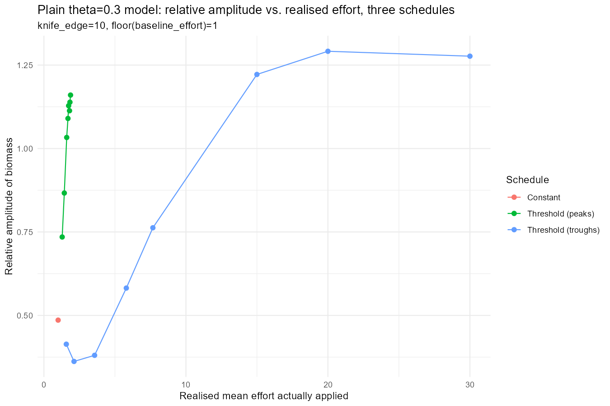

The amplitude picture is where the two schedules actually diverge. "Peaks" amplitude rises smoothly from `0.74` at boost=2 to a plateau around `1.1`-`1.16` by boost=9 and stays there -- consistent with the sanity check above: the cycle shape is basically fixed, only the on-window narrows. "Troughs" is flat and low through boost=9 (`0.41`-`0.76`, close to or below Constant's own `0.49`), then jumps sharply to `1.22`-`1.29` between boost=9 and boost=15 -- a late, sudden rise rather than a gradual climb, the same shape of warning sign Day 39 found before the original model's own troughs cliff-edge, just at a far lower ceiling here.

### Sanity Check: Is It Actually Firing Correctly?

Same convention as every threshold-schedule day since Day 36: one representative case (`boost=9`), all three schedules, selected biomass plotted with the boosted "on" periods shaded.

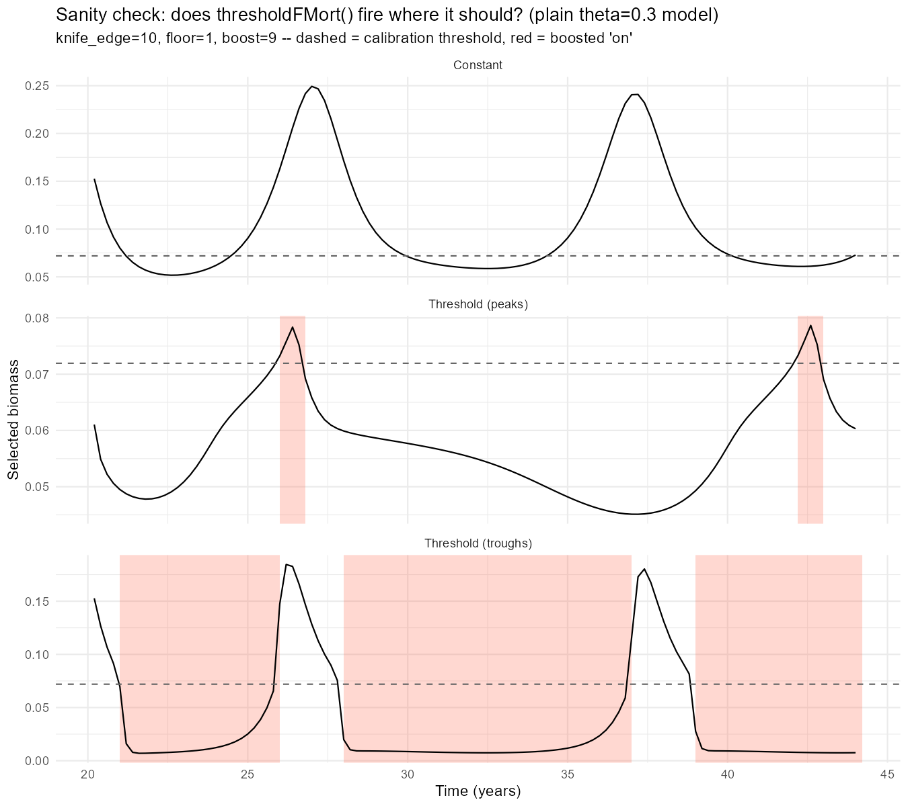

Both fire exactly as designed. "Peaks" shading lands precisely on the narrow local maxima of the Constant-schedule cycle. "Troughs" shading covers the broader sub-threshold stretches but -- unlike Day 39's finding on the resource-boosted model, where troughs got stuck functionally-always-on because the population never recovered above threshold once boosted fishing started -- here it genuinely cycles on and off multiple times across the run. The plain `theta=0.3` model's own dynamics recover fast enough that troughs fishing doesn't just collapse into Constant-at-boost.

`rel_amplitude` is computed from *total* biomass over the summary window, not the *selected* biomass the rule triggers on -- worth checking separately rather than assuming the same story holds.

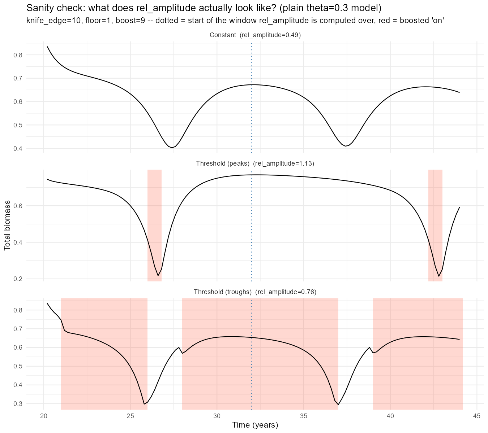

At boost=9: Constant's own regular cycle gives `rel_amplitude=0.49`; troughs, spreading pressure out over a longer stretch, gives a shallower dip at `0.76`; peaks gives the highest, `1.13` -- not because its mean biomass is low (it isn't), but because the brief boosted window lands exactly at the cycle's peak and produces a sharp crash-and-recover right after it, visible directly in the total-biomass trace.

------------------------------------------------------------------------

## Section 3: Redone at the Model's Own MSY Floor

Section 2's floor of 1 was arbitrary -- picked to match Day 39 Section 6's own convention, not because it means anything for this model. Section 1 above already found the number that does: `fish_level=2`, this model's own yield-maximising Constant effort. Re-running Section 2's comparison with `baseline_effort` pinned to that value, rather than an arbitrary floor, is the fairer test of what a threshold schedule buys *on top of* already-optimal constant fishing.

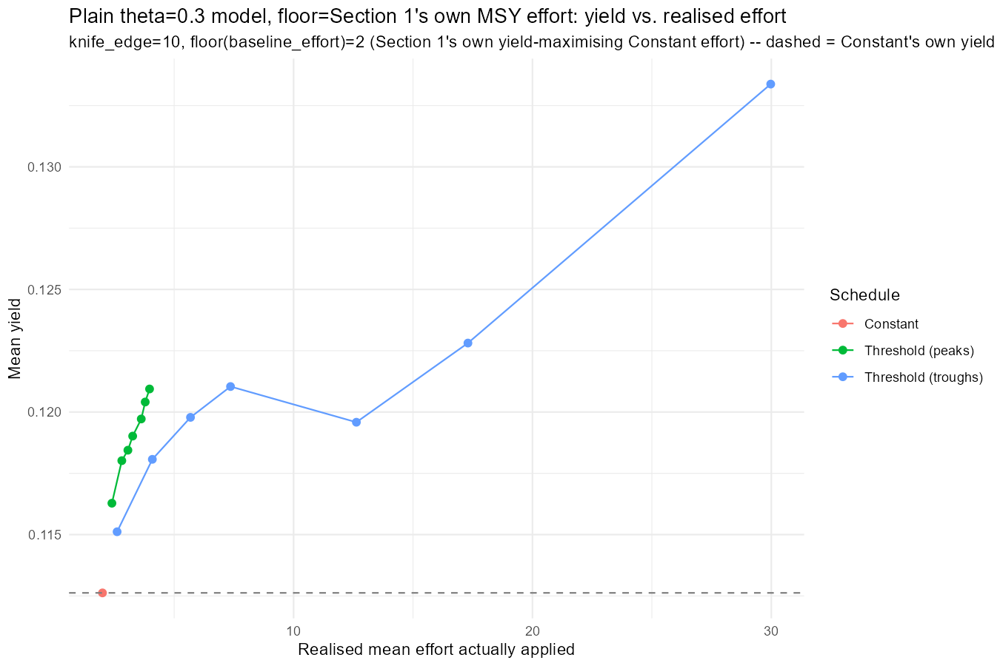

Both schedules beat Constant-at-MSY on yield across the *entire* boost range tested (`3` to `30`): Constant's own `0.1126`, against peaks' `0.1163`-`0.1209` and troughs' `0.1151`-`0.1334`. Layering a threshold boost on top of the model's own best constant effort is not wasted pressure -- it recovers additional yield rather than just adding variance around the same mean.

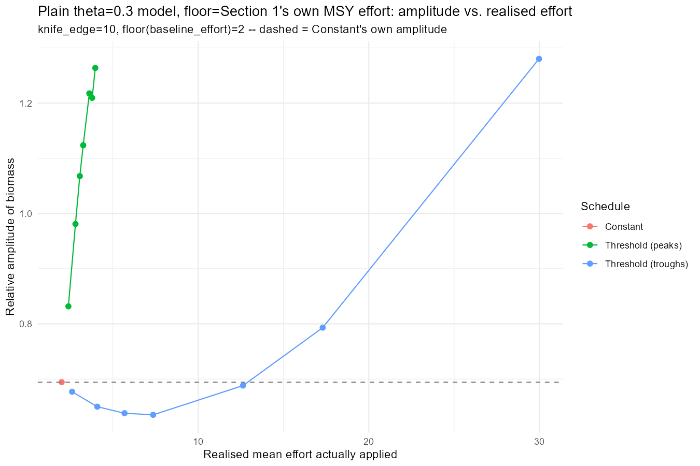

Amplitude repeats Section 2's own pattern almost exactly, just shifted onto the higher floor: "peaks" climbs smoothly from `0.83` at boost=3 to `1.26` by boost=30, no sudden jumps. "Troughs" stays essentially flat and close to Constant's own `0.69` all the way through boost=15 (`0.68`-`0.69`), ticks up to `0.79` at boost=20, then jumps sharply to `1.28` at boost=30 -- and that jump lands on exactly the same boost level where the sweep sanity check below shows the compositional shift. The amplitude-vs-effort plot alone would have flagged boost=30 as the point where something changes; the boost-swept sanity check is what explains *what* changes there.

### Sanity Check, Swept Across Every Boost Level

Section 2's sanity check only ever looked at one representative boost. `run_layered_ke_case()` was extended into `run_layered_ke_case_with_series()` so the same simulations that build the summary table also capture the full selected/total biomass and `on_frac` time series for *every* boost level -- no separate re-run needed to sweep the sanity check across the whole range.

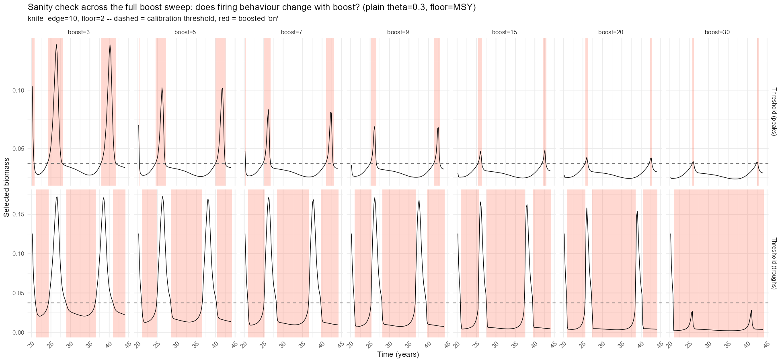

Reading the selected-biomass grid left to right: "peaks" (top row) stays essentially the same cycle shape throughout, just with an increasingly brief, increasingly self-limited firing window as boost climbs from 3 to 30. "Troughs" (bottom row) tells a different story -- as boost approaches 30, the selected-biomass panel crashes toward zero and stays there for most of the run, a visibly different regime from the lower-boost panels next to it.

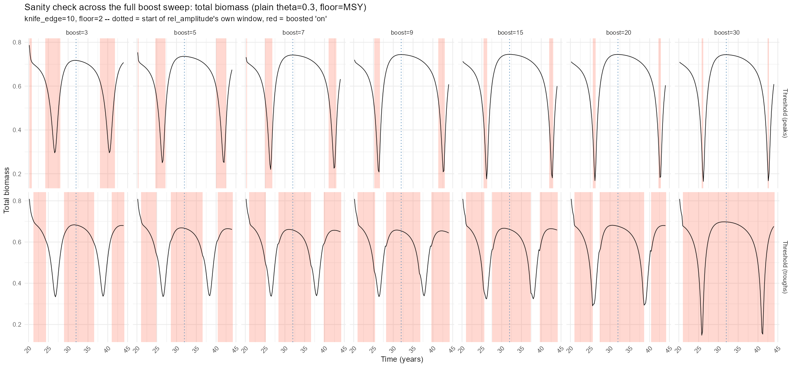

The total-biomass version of the same grid resolves what that crash actually is. Every panel -- including troughs at boost=30, where the selected-biomass panel looked collapsed -- keeps cycling at a comparable range to every other boost level. Nothing here is a population collapse. It's a compositional shift: sustained pressure on the harvestable-size compartment relieves whatever residual predation `theta=0.3` still provides on juveniles, and the juvenile population booms into the space that opens up -- the same cultivation-effect-in-miniature mechanism Day 39 Section 6 found at `knife_edge=5`, confirmed here at `knife_edge=10` and this model's own MSY floor. Total biomass, mean yield, and mean selected-biomass numbers alone (Section 3's own summary table) would never have shown this distinction; only looking at the actual time series, swept across the boost range rather than sampled at one point, makes it visible.

### A Caveat Worth Flagging

Section 3's own Constant-at-MSY row reports `mean_yield=0.1126` at `fish_level=2` -- noticeably below Section 1's own peak value of `0.1317` at the *same* effort. The two sections sample different, non-overlapping stretches of the same roughly 5-6 year cycle: Section 1 projects 12 years from the fork and keeps the last 6; Section 3 (reusing Day 39's own `run_layered_ke_case()` convention) projects 24 years and keeps the last 12. Neither window is wrong on its own, but they land on different phases of a population that isn't exactly periodic, and the two numbers aren't directly comparable as a result. The schedule comparisons *within* Section 3 are still apples-to-apples -- every row in that table shares the same window -- so the qualitative findings above (both schedules beat Constant, troughs shows a compositional shift not a collapse) aren't affected. But the absolute "Constant-at-MSY" yield number quoted in Section 3 shouldn't be read as a precise readout of Section 1's own peak.

------------------------------------------------------------------------

## Section 6: The Ground Shifts -- Sections 1-3 Were Built on the Wrong Mortality

Everything above ran through `make_anchovy_fishing_params_theta()`, which calls `setAnchovyMort()` to write the paper's own senescence/background mortality curve, then calls `species_params(params) <- sp` afterward to set `interaction_resource`. That second call runs `setParams()` internally, which -- unless mortality was set through `ext_mort<-()` rather than a direct `@mu_b` write -- silently recomputes background mortality from mizer's own `z0` defaults, discarding whatever `setAnchovyMort()` had just written.

| w (g) | mu_b, OLD (buggy) | mu_b, NEW (fixed) |
|-------|-------------------|--------------------|
| 0.0003 | 0.148 | 1.000 |
| 0.10 | 0.148 | 0.232 |
| 1.02 | 0.148 | 0.320 |
| 10.1 | 0.148 | 3.168 |
| 65.7 | 0.148 | 20.679 |

Every model in Sections 1-3 -- baseline and every `theta` variant alike -- had a **flat 0.148 background mortality at every size**, not the paper's own U-shaped curve (high for larvae, a minimum around `w=0.5g`, rising steeply again toward `w_inf`). Confirmed directly, not inferred: `finding_jams/40_changed_mort_experiments.R` builds both versions from identical parameters and reads `ext_mort()`/`@mu_b` straight off them.

Before trusting what that changes, the fix's own cycle period needed checking rather than assumed -- an early, under-sampled look at the corrected model's unfished trajectory (peaks read off only every 4th year) suggested a wildly different ~16-year cycle, which would have meant every timing constant this project uses (`t_fork=20`, `scan_summary_window=12`) was wrong too. Re-checked at proper resolution, that was a sampling aliasing artefact, not a real effect: peak spacing over a 60-year unfished run comes out at 5.0-6.0 years, consistent with the original ~5-6yr figure. `t_fork=20`/`scan_summary_window=12` survive the fix unchanged.

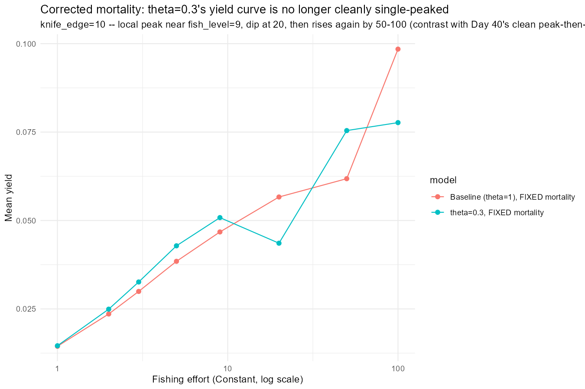

What doesn't survive is Section 1's own headline shape. A first-pass, 8-point redo (`fish_level` = 1,2,3,5,9,20,50,100) at `knife_edge=10` finds the `theta=1` baseline almost unchanged from Day 39's own buggy-mortality numbers (`mean_yield=0.0985` vs. `0.09846` at `fish_level=100` -- cannibalism-driven predation mortality dominates there, so the background-mortality error barely mattered for that case). `theta=0.3` is a different story: `mean_total` drops from the buggy version's own `0.56`-`0.65` range to `0.36`-`0.43`, and the clean peak-at-`fish_level=2`-then-decline shape Section 1 above reports does not hold. The corrected yield curve rises to a local peak near `fish_level=9`, dips at 20, then rises *again* by 50-100 -- ending higher than the local peak. Not a clean sustainable-yield shape.

This is only a coarse, first-pass grid -- not a finished replacement for Section 1's own fine sweep -- and it doesn't retroactively invalidate Sections 1-3's own internal logic (the schedule comparisons, the compositional-shift finding) so much as it puts a question mark over whether `theta=0.3`/`interaction_resource=1` was ever the right point to be studying in the first place. That question -- redoing Day 39 Section 3's own `theta x interaction_resource` grid under the corrected mortality, to see whether a different combination would have served this project's aim better -- is queued as an overnight batch job (see What's Next) rather than answered here.

One smaller piece of housekeeping alongside the mortality fix: an exact analytic solution for the logistic-plus-immigration resource step (replacing the old explicit-Euler `plankton_logistic()`) has been adopted in both `40_experiments.R` and `40_changed_mort_experiments.R` -- a correctness improvement at the same `dt`, not yet tested as a route to a larger, faster `dt`.

------------------------------------------------------------------------

## Section 7: The Threshold x Boost Heatmap

Every threshold schedule in Sections 2-3 calibrated `threshold_ke` once, at the Constant cycle's own median (`probs=0.5`), and only ever swept boost against that fixed choice. Does *where* the threshold sits change how the schedule responds to boost strength, on top of the boost-alone story already told? `threshold_frac` in `c(0.3, 0.4, 0.5, 0.6, 0.7)` against `boost` in `c(5, 15, 30)`, plain `theta=0.3` model, `knife_edge=10`, floor at this model's own MSY effort -- the same setup as Section 3, with threshold placement now a genuine second axis instead of a fixed constant.

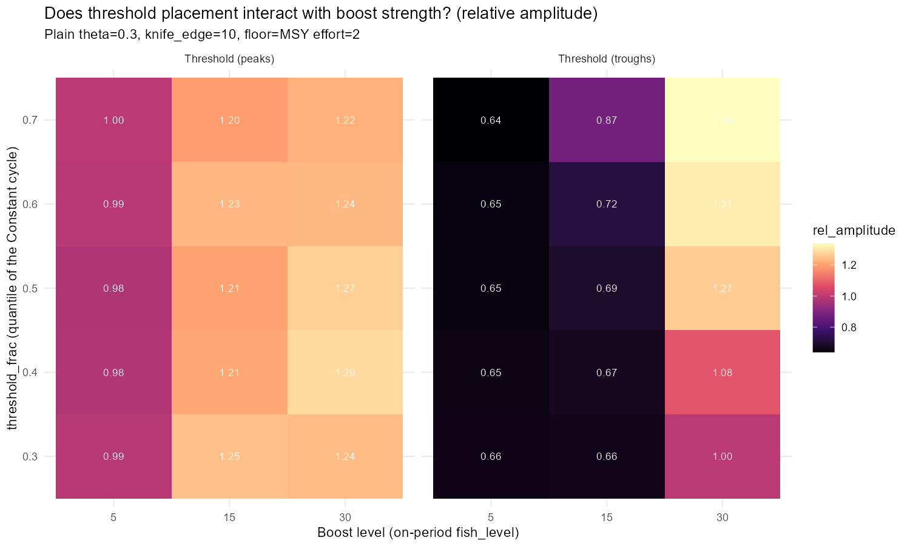

The two schedules could not be more different in how they respond to this second axis. "Peaks" amplitude is almost flat across `threshold_frac` at every boost (`0.98`-`0.99` at boost=5, `1.20`-`1.25` at boost=15, `1.22`-`1.29` at boost=30) -- consistent with Section 3's own finding that peaks' cycle shape barely changes with boost at all, threshold placement doesn't move that story either. "Troughs" is the opposite: at boost=5 it's flat and low (`0.65`-`0.66`) regardless of `threshold_frac`, but at boost=30 it climbs steeply and monotonically with `threshold_frac`, from `1.00` at `0.3` up to `1.34` at `0.7`. A higher `threshold_frac` means "below threshold" is true for more of the cycle, so at high boost the schedule is effectively on for longer -- a real interaction between the two axes that a boost-only sweep, run at the conventional `threshold_frac=0.5`, would never surface.

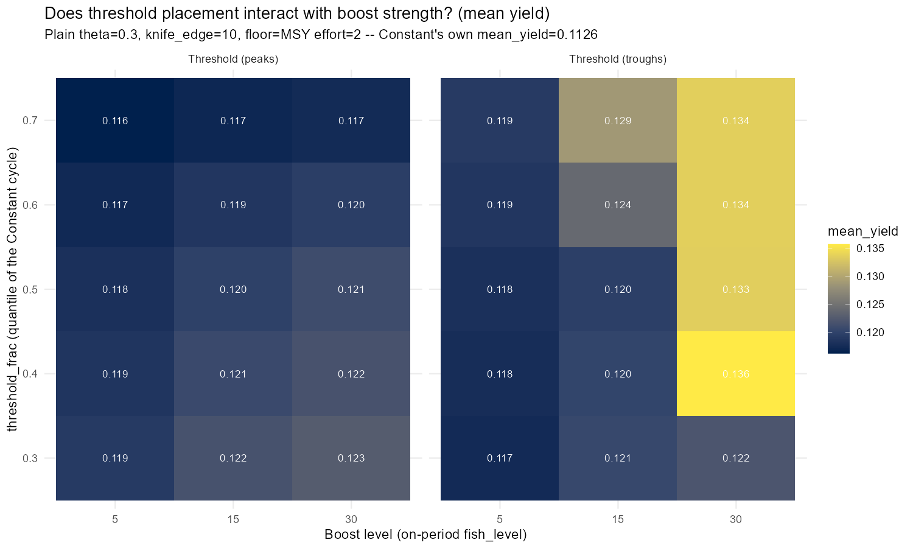

The yield heatmap turns that interaction into something actionable. For "peaks", yield actually *falls* slightly as `threshold_frac` rises (`0.119`-`0.123` at `0.3` down to `0.116`-`0.117` at `0.7`) -- a higher threshold narrows the firing window to right at the very top of the cycle, catching less. For "troughs" at boost=30, yield is emphatically not monotonic in `threshold_frac`: `0.122` at `0.3`, then a jump to `0.136` at `0.4` -- the single best cell anywhere in this grid, beating Constant's own `0.1126` by about 21% -- before *dropping back* to `0.133`-`0.134` at `0.5`-`0.7`. The conventional `threshold_frac=0.5` choice used everywhere else in this project is not the optimum here; it sits just past it. And that same cell (troughs, `threshold_frac=0.4`, boost=30) has a *lower* relative amplitude (`1.08`) than every other troughs cell at boost=30 (`1.27`-`1.34`) -- better yield and less risk than the default threshold, at the same boost. A boost-only sweep fixed at `threshold_frac=0.5` (exactly what Sections 2-3 did) would have reported `0.133` as the best troughs-at-boost=30 result and never found the `0.136` sitting one column over.

Mean total biomass tells a smaller piece of the same story: "peaks" sits above Constant's own `0.6051` everywhere in the grid (`0.624`-`0.642`), "troughs" sits at or below it everywhere except boost=30 (`0.596`-`0.600`) -- both consistent with Section 3's own boost-only findings, with `threshold_frac` moving the numbers only slightly rather than flipping the story.

------------------------------------------------------------------------

## What's Next

Nothing tested today actually broke this model -- every schedule, every boost, every floor tried still left total biomass cycling normally. That's itself the open question: what, short of the extreme high-effort regime Day 39 used on the *original* model, would actually collapse the plain `theta=0.3` model under fishing? A few concrete angles on that, beyond the general follow-ups below:

1.  **Sweep `knife_edge_size` itself.** Everything today used `knife_edge=10`, matched to Section 1's own peak. Day 39's collapse-hunting work found gear cutoff changes the fishing-response picture substantially on the resource-boosted and original models; the plain `theta=0.3` model hasn't had that sweep at all. A smaller knife-edge (catching more of the juvenile boom that cutting cannibalism creates) is the most direct lever available for making this model fishing-sensitive again.
2.  **Let peaks fishing stay on longer once triggered.** `thresholdFMort()`'s self-limiting behaviour -- the mechanism behind "peaks" never damaging this model even at boost=30 -- comes directly from `on_frac` reverting to the background level as soon as biomass ticks back below threshold, so the boosted window is only ever as long as the time spent above the trigger. Decoupling that: once triggered, hold the boosted state on for a fixed minimum duration (or until biomass has fallen a fixed amount below the peak, not just below the threshold) rather than reverting the instant the crossing reverses. That removes the self-limiting escape hatch and is a plausible way to find where "peaks" fishing actually can collapse this model, rather than concluding it can't.
3.  **Make the threshold dynamic rather than fixed.** Right now `threshold_ke` is calibrated once, off the Constant-schedule's own unfished-floor cycle, and held fixed for the whole run. If sustained fishing gradually shrinks the cycle's peaks over time, a fixed absolute threshold catches a shrinking fraction of each peak -- the rule quietly fishes less and less of the population even at a constant nominal boost, which could be part of why nothing collapses here. A threshold that re-calibrates against the *recent* cycle (a rolling quantile, say, rather than one fixed at t=0) would keep fishing the same relative fraction of each peak as the population declines, which is a much harder test of whether the schedule can actually drive a collapse.
4.  **Trigger the schedule off total biomass instead of selected biomass.** Every threshold rule tested so far -- today included -- triggers `thresholdFMort()` off *selected* biomass (`f_ref`-weighted, effectively the harvestable-size compartment), and "peaks"/"troughs" mean peaks and troughs of that quantity, not of the population as a whole. Section 3's own boost-swept sanity check found selected and total biomass can diverge sharply under fishing -- the troughs=30 case crashed the selected compartment while total biomass kept cycling normally on the back of a juvenile boom. A rule triggered on *total* biomass instead would be blind to that same compositional shift and would time its boosted fishing off a completely different signal -- worth building as a genuinely different schedule, not just a parameter change, to see whether it's more or less able to collapse this model than the selected-biomass version.
5.  **Chase the troughs=5 yield optimum from Section 2.** It beat everything else in that sweep, including every point in Section 3's higher-floor version -- worth a finer boost grid around it to see whether it's a genuine local maximum or an artefact of the particular boost values tested.
6.  **Reconcile the sampling-window mismatch.** Section 1's `cannibalism_fishing_probe()` and Section 3's `run_layered_ke_case()` use different post-fork run lengths and different summary windows -- worth standardising on one convention so numbers across sections are directly comparable, rather than flagging the mismatch after the fact each time it surfaces.
7.  **Land the corrected-mortality interaction grid.** `40_changed_mort_experiments.R`'s own "Overnight" section has the `theta x interaction_resource` grid queued (same grid as Day 39 Section 3, redone under the fix) but a first live-session attempt ran over an hour without finishing and was cancelled -- it needs an actual overnight/batch run before Section 6's own open question (was `theta=0.3`/`interaction_resource=1` ever the right point to study?) has an answer.
8.  **Chase the troughs, threshold_frac=0.4, boost=30 optimum from Section 7.** The single best yield in that whole grid, and it sits one column away from the conventional `threshold_frac=0.5` -- worth a finer grid around `threshold_frac in [0.35, 0.45]` and boost near 30 to see whether it's a genuine local maximum or an artefact of the particular grid points tested (the same question Section 2's own troughs=5 optimum, item 5 above, still has open).
9.  **Widen both of Section 7's axes.** `threshold_frac` only ran `0.3`-`0.7` and boost only `5,15,30`. Troughs' amplitude was still climbing with `threshold_frac` at the top of that range (`1.34` at `0.7`, boost=30, no sign of levelling off), and Section 3's own boost_seq (`3,5,7,9,15,20,30`) has finer and wider coverage the heatmap doesn't yet share -- both edges of the grid look like they were cut off before the interaction finished revealing itself, not because the effect stopped.
10. **Test whether `dt` can be raised.** The newly-adopted exact analytic resource stepper (replacing the old explicit-Euler `plankton_logistic()`, now in both `40_experiments.R` and `40_changed_mort_experiments.R`) is exact at any step size, so it no longer forces `dt` small on the resource side specifically. Whether the consumer side (still the default first-order upwind scheme) can also tolerate a larger `dt` is untested -- if it can, every sweep in this project gets proportionally cheaper, including item 7 above.
11. **Rerun Section 7's heatmap under the corrected mortality.** Section 7's whole grid was built on `40_experiments.R`'s own flawed `setAnchovyMort()` (Section 6's own finding) -- the same threshold_frac x boost sweep, redone with the fixed, `ext_mort<-()`-protected mortality function from `40_changed_mort_experiments.R`, is needed before trusting that the `threshold_frac=0.4`/boost=30 optimum (item 8) is a real feature of this model and not another artefact of the wrong background mortality.
