## The Brief

Day 40's own Section 6 found that every model in this project's Days 39-40 -- baseline and every `theta` variant alike -- had been running on a flat, buggy background mortality rather than the paper's own U-shaped curve, and queued a batch of follow-up work rather than answering it in place. This post covers three further sessions on top of that fix. The first (`finding_jams/40_changed_mort_experiments.R`, Sections 2-11) closes out the fix's own immediate follow-ups -- does dt tolerate raising, does the dip-then-rise yield shape survive a finer grid, does the knife_edge collapse boundary survive the fix -- and then goes looking across `theta` and `interaction_resource` for a point that gives a genuinely single-peaked sustainable-yield curve, the thing this project has been chasing since Day 38. None of the four points tested has one. The second session (Sections 12-13) changes the question: instead of hunting for a peak, hunt for an outright collapse. It finds one -- and then finds that regime doesn't have a real MSY either, just a population that cycles faster and faster on its way to extinction. The third session (Section 14) screens 56 candidates surfaced by that search and finds it: `theta=0.3, interaction_resource=3` is the first regime in this whole project with a genuine interior yield peak and a population that's still actually oscillating, not flickering into collapse, at it. A direct check of Section 6's own mechanism against a more accurate numerical scheme (Section 7) comes back inconclusive rather than confirming it -- the scheme itself turns out not to produce a usable comparison. A last, unrelated check -- what happens with cannibalism removed entirely -- turns up something new: Section 8 finds a genuine bistability under Constant fishing, confirmed by hysteresis rather than asserted from a convergence-time proxy alone.

------------------------------------------------------------------------

## Section 1: Closing Out the Mortality Fix's Own Follow-Ups

Day 40 Section 6's own "What's Next" queued five items. All five got done.

**Can `dt` be raised now that the resource step is exact?** No -- not without switching numerical schemes. dt=0.002 tracks the dt=0.001 reference closely (mean_total within 0.1%, amplitude within 2%), but dt=0.005 and dt=0.01 drift further with every doubling (+6.8%/+13.3% on mean_total, -3.9%/-7.5% on amplitude) -- the numerical-diffusion signature of the still-default first-order upwind consumer scheme. A quick check of the documented fix (`second_order_w=TRUE` + `method="tr_bdf2"`) didn't help either: it drove the population to numerical extinction (\~1e-33) even at dt=0.001, most likely because this project's own ad-hoc fork-and-settle convention was never built or validated for that discretisation. `dt` stays at 0.001.

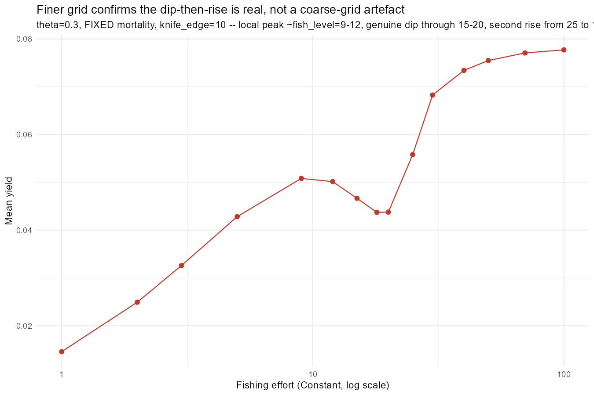

**Is the dip-then-rise shape real?** Yes. An 11-point grid across fish_level=9-100 confirms it: a local peak at 9-12 (yield \~0.050), a genuine dip through 15-20 (down to \~0.044), then a real second rise from 25 to 100 (up to \~0.078) that overtakes the local peak.

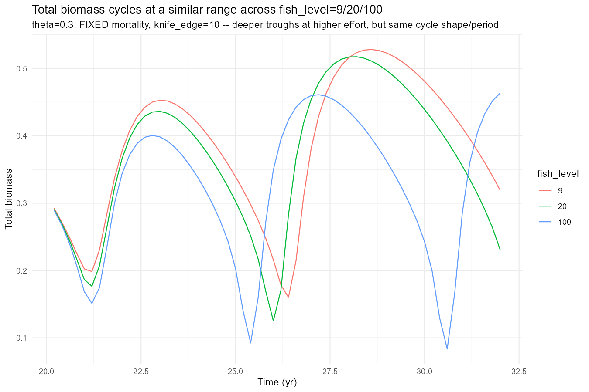

**Is fish_level=100 a different dynamical regime, or just a noisier version of fish_level=9's cycle?** A different regime. Total biomass at fish_level=100 cycles visibly faster and deeper than at fish_level=9 or 20, and the harvestable-size compartment -- already suppressed at fish_level=9 -- is crushed further by fish_level=100. The same compositional-shift mechanism Day 40 found for its threshold schedules turns out to be what drives the dip-then-rise yield curve too: yield keeps climbing past fish_level=25 not because the fishery is healthy, but because a faster-cycling, juvenile-dominated population still throws off catchable biomass even with its harvestable compartment almost entirely gone.

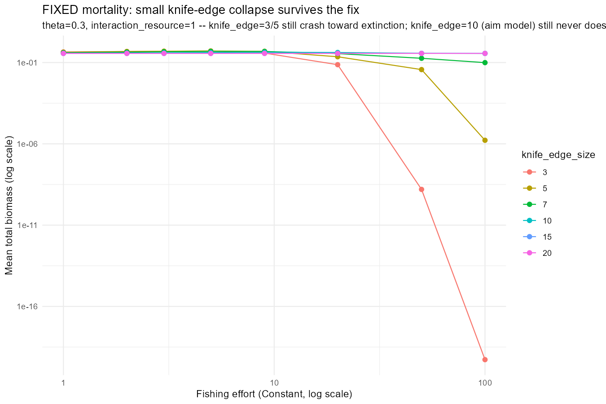

**Does the knife_edge collapse boundary survive the fix?** Yes, essentially unchanged. `knife_edge=3` and `5` still crash to near-extinction by fish_level=100 (1.5e-19 and 4.5e-6 of the unfished reference); `knife_edge=7` is still intermediate (27% remaining); `knife_edge=10` -- this project's own aim gear -- is if anything *less* responsive under the fix (99.4% of unfished remaining) than the buggy version had suggested; `knife_edge=15/20` remain fishing-inert.

**Should `40_experiments.R`'s own results be superseded?** Both, not either/or. Section 1's own headline claim (a clean single-peaked yield curve at `theta=0.3`) does not survive. The structural findings -- the threshold-schedule comparisons, the compositional-shift mechanism, the knife_edge collapse boundary -- do, confirmed independently under the fix rather than overturned by it.

------------------------------------------------------------------------

## Section 2: Searching `theta` x `interaction_resource` for a Cleaner Point

`theta=0.3, interaction_resource=1` was Day 40's own choice, but it was made under the buggy mortality. With the fix in place, the natural question is whether a different point in that grid would have served this project's aim better. Three more points were tested at `knife_edge=10`, matched against `interaction_resource=1.3` (the resource-boosted variant Day 39 had studied) and the two extremes of the Overnight `theta x interaction_resource` grid's own `fishing_sensitivity` column (restricted to `theta<1`, since `theta=1` is already this project's extensively-studied baseline): `theta=0.5, interaction_resource=2` (+0.372, the most positive) and `theta=0.7, interaction_resource=5` (-0.885, the most negative).

![theta=0.3, interaction_resource=1.3: yield climbs monotonically, no peak in \[1,100\].](../interesting_plots/day40_ir13_effort_yield.png)

**`interaction_resource=1.3`** gives a genuinely different failure mode from `ir=1`'s peak-dip-rise: yield climbs smoothly and monotonically across the whole range, never turning over, while total biomass declines gently and steadily (0.351 unfished to 0.307 at fish_level=100). The knife_edge collapse boundary holds (`ke=3/5` collapse, `ke>=15` inert), but `ke=10` is noticeably *more* fishing-responsive here (83.8% of unfished remaining at fish_level=100) than at `ir=1` (99.4%). Both threshold schedules beat Constant on yield at every boost tested -- "troughs" reaches more than 4x Constant's own yield by boost=30 (0.068 vs. 0.016).

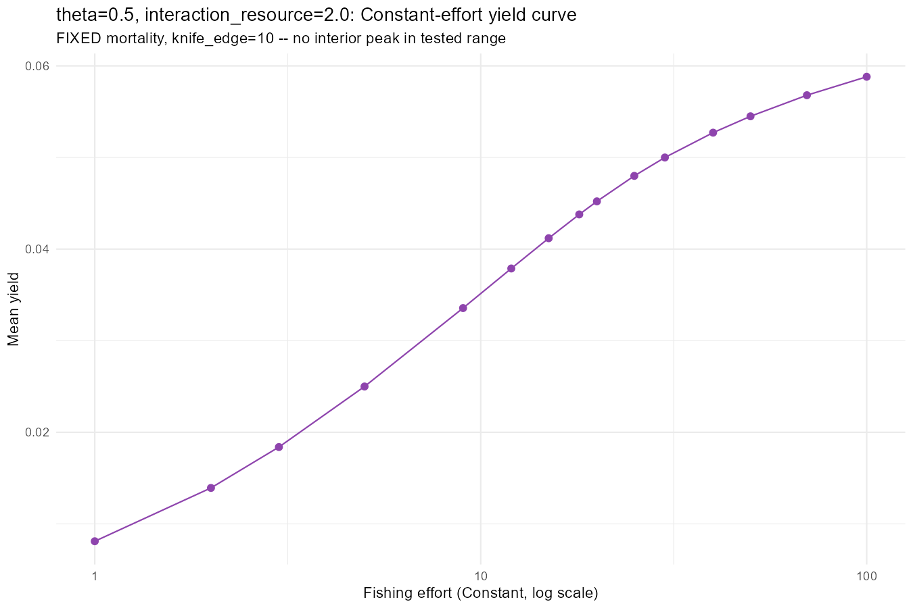

**`theta=0.5, interaction_resource=2`** is the most fishing-responsive point tested anywhere in this project so far: total biomass falls smoothly and steadily from 0.367 (unfished) to 0.229 at fish_level=100, a genuine \~38% decline, with no interior peak. At `knife_edge=10`, only 58.4% of unfished biomass remains at fish_level=100 -- more responsive than every other point tested. The threshold schedule barely matters here: "peaks" almost never fires (the cycle's own amplitude is too small to cross back above its median threshold), and "troughs" produces a smooth, well-behaved yield/biomass trade-off with no oscillation blow-up anywhere.

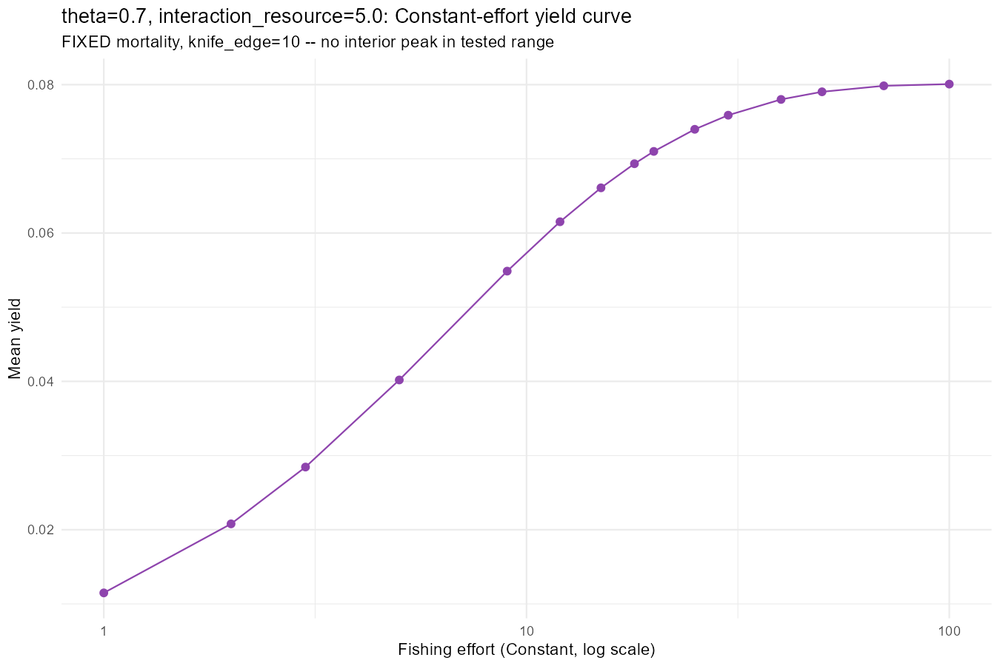

**`theta=0.7, interaction_resource=5`** is the opposite extreme. Total biomass *rises* under fishing at low-to-moderate effort (0.662 unfished to 0.732 at fish_level=9), then declines only slowly, still exceeding the unfished level at fish_level=30 and reaching 87% of unfished even at fish_level=100. No knife_edge tested collapses it -- not even `ke=3`, which crashed to near-extinction at every other `theta`/`ir` combination tested. `ke=15` and `ke=20` actually leave *more* fish in the sea at fish_level=100 than not fishing at all.

None of the four points -- `ir=1`, `ir=1.3`, `theta=0.5/ir=2`, `theta=0.7/ir=5` -- gives a clean single-peaked sustainable-yield curve within \[1,100\]. They fail in different directions (recover-and-climb, monotonic-climb, gentle-monotonic-decline, fishing-boosts-biomass), but none of them turns over.

------------------------------------------------------------------------

## Section 3: The Overnight Fine Sweep -- Knife Edge Is the Real Lever

If none of four hand-picked points collapses, the natural next move is a systematic search rather than more one-off guesses. An overnight batch job swept `theta` (5 values, 1 down to 0.1), `interaction_resource` (8 values, 0.3 up to 10 -- extending *below* 1 for the first time, on the hypothesis that starving the population of resource access would remove the compositional-shift juvenile boom that had buffered every `theta=0.3` variant so far), and `knife_edge_size` (5 values, 3 to 15), each cell probed across 8 fishing efforts from 1 to 100 -- 200 cells, \~1700 simulations, run via `Rscript` rather than the interactive session. No heatmap: a grid this fine on three categorical axes would have been unreadable as a plot, so the deliverable is a CSV (`day40_fine_extinction_sweep.csv`) to filter and sort after the fact.

| knife_edge | cells collapsed (of 40 theta x ir pairs) |
|------------|------------------------------------------|
| 3          | 21                                       |
| 5          | 16                                       |
| 7          | 5                                        |
| 10         | 0                                        |
| 15         | 0                                        |

The result reframes the whole search. **`knife_edge`, not `theta` or `interaction_resource`, is the dominant lever.** 42 of the 200 cells collapse to under 1% of unfished biomass by fish_level=100, and every single one of them sits at `knife_edge<=7`. At `knife_edge=10` -- what every point in Section 2 used -- nothing collapses, regardless of which `theta`/`ir` combination is paired with it.

The single cleanest example needs no new parameters at all: **`theta=0.3, interaction_resource=1, knife_edge=3`** -- this project's own default `theta`/`ir`, just with smaller gear. Its trajectory is a genuine cliff-edge, not a gradual decline: biomass sits *above* the unfished reference at low-to-moderate effort (fraction=1.05-1.40 across fish_level=1-9, the cultivation effect again), crashes hard between fish_level=9 and 20 (fraction 1.05 -\> 0.20), and is functionally extinct by fish_level=50 (4.3e-9) -- well before reaching 100, not marginally at it.

The flip side is just as informative. `interaction_resource=10` is protective against *gear*-driven collapse specifically: every `theta` paired with `ir=10` survives even `knife_edge=3` with 66-88% of unfished biomass intact, the most robust corner of the whole grid. And `theta=0.7/interaction_resource=5` -- Section 2's own most-resilient point -- turns out to only be resilient at `knife_edge=10`; at `ke=3` it drops to 45% remaining, a real decline, just not a collapse. Its Section 2 resilience was gear-specific, not a general immunity to fishing pressure.

------------------------------------------------------------------------

## Section 4: Does the Extinction Regime Have a Real MSY? No.

Finding a regime that collapses raises the obvious next question: does *this* regime at least have a genuine interior yield peak before it crashes -- the sustainable-yield curve this project has been chasing since Day 38, just with a collapse past the edge of it instead of a plateau? Two checks on `theta=0.3, interaction_resource=1, knife_edge=3`: does it still oscillate on the way to collapse, and does its yield curve have a real MSY.

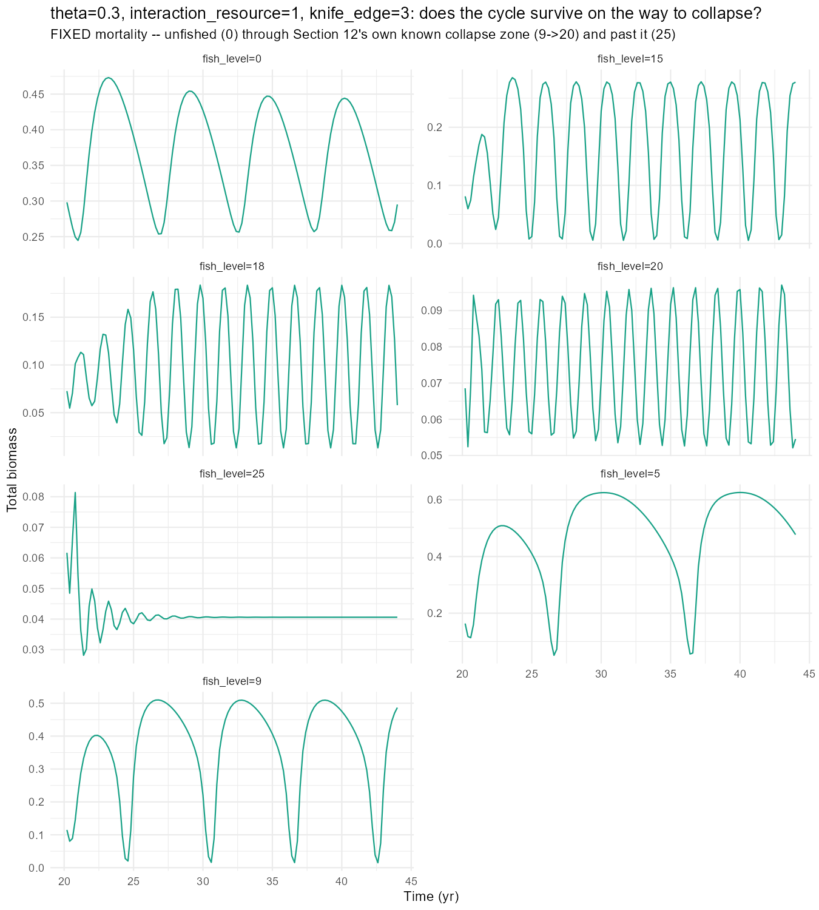

**It oscillates the whole way down -- and not by damping out.** The cycle's *period compresses* as effort rises rather than the population settling into a fixed point or a smooth decay:

| fish_level   | mean period (yr) | peaks (in 24yr) | rel_amplitude |
|--------------|------------------|-----------------|---------------|
| 0 (unfished) | 5.7              | 4               | 0.64          |
| 9            | 5.5              | 4               | 1.89          |
| 15           | 2.2              | 10              | 1.93          |
| 18           | 1.7              | 14              | 1.73          |
| 20           | 1.6              | 15              | 0.60          |
| 25           | 1.2              | 20              | 0.97          |

By fish_level=25 the population is cycling nearly annually, still at large relative amplitude, at an ever-shrinking absolute level -- a population flickering faster and faster on its way to extinction, not quietly declining.

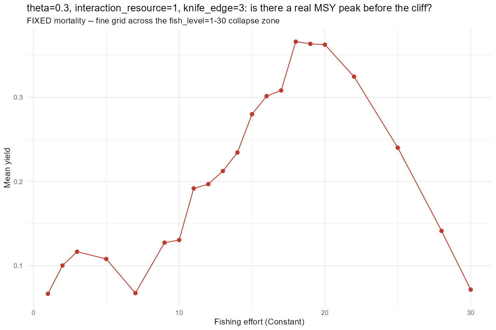

**There is a numerical yield peak (0.366 at fish_level=18) -- but it isn't a real MSY.** `mean_total` biomass declines monotonically across the *entire* fine grid with no sign of restabilising (0.522 at fish_level=7, already down to 0.107 by the yield peak, 0.011 by fish_level=30, and under 1e-9 by fish_level=50 per Section 3's own coarser data). The oscillation check confirms the dynamics underneath the "peak" are still rapidly cycling, not settled. This is exactly the artefact Day 40's own Section 5 caveat warned about: a transient catch spike measured mid-collapse, not a sustainable equilibrium yield. (One data anomaly worth flagging rather than reading into: fish_level=7 shows a yield *dip* despite having the highest biomass in the whole grid -- almost certainly the 12-year averaging window landing on an unusually trough-heavy phase of the still-large-amplitude cycle, the same sampling-window-phase sensitivity flagged elsewhere in this project, not a real feature of that specific effort level.)

So at this point this project had two clean examples and neither was the target: `theta=0.3/ir=1/knife_edge=10` never collapses and never peaks; `theta=0.3/ir=1/knife_edge=3` collapses outright and *also* never peaks -- it just fails a different way, by flickering into extinction rather than declining forever without consequence.

------------------------------------------------------------------------

## Section 5: The Fine MSY Scan Finds It -- `theta=0.3, interaction_resource=3`

Section 4's own screening logic generalises directly: pull every combination from the fine sweep that fishing meaningfully reduces (`0.03 < fraction_of_unfished < 0.6` at fish_level=100) without it already being extinct there -- 56 candidates, spanning `knife_edge=3` (7), `5` (13), `7` (22), and `10` (14) -- and run a Constant-effort grid on each, screening for a genuine interior yield peak. Ten points per combination (`1,3,5,9,15,20,25,30,50,100`, denser below 30 where the extinction regime's own peak sat, deliberately coarse above it to keep this a single-sitting job rather than another overnight run), 560 simulations total. No heatmap -- a CSV to filter afterward, the same call made for Section 3's own three-axis sweep.

**17 of the 56 show a numerical interior peak.** That alone would have been a promising headline. But checking `rel_amplitude`, not just whether the mean stabilises, tells a very different story: **15 of those 17 are the exact same late-uptick-into-flickering-collapse artefact** Section 4 found for the extinction regime. Amplitude climbs to 1.68-2.00 -- Day 39's own near-extinction ceiling -- even at combinations where the *mean* biomass looks like it has settled down, which checking the mean alone would have missed entirely.

**Two combinations pass both tests.**

|   | `knife_edge=3` | `knife_edge=5` |
|----|----|----|
| peak yield | 0.0820 at fish_level=9 | 0.0804 at fish_level=15 |
| biomass, fish_level 1 -\> 100 | 0.786 -\> 0.410 | 0.792 -\> 0.435 |
| max `rel_amplitude` | 0.529 | 0.461 |

Both settle into a reduced-but-stable biomass range by fish_level=50-100 (essentially flat across the last three grid points), with a real interior peak beforehand and amplitude staying well clear of the collapse-flicker ceiling across the entire tested range -- the first candidates in this whole project that look right on both counts at once.

The parameter itself is almost an embarrassment: `interaction_resource=3` was in the *original* Overnight grid from the very start of Day 40's own mortality-fix work (`resource_grid_seq <- c(1, 1.3, 2, 3, 5)`), sitting there the whole time. Every subsequent section -- Sections 2 and 3 above, all of Day 40's own follow-up work -- focused on `ir=1`, `1.3`, `2`, or `5` instead; `ir=3` never got its own dedicated effort/knife_edge sweep until this screen surfaced it by elimination.

Two honest caveats before treating this as fully confirmed. First, this is a coarse 10-point grid, not the 21-point fine grid Section 4 used to pin down the extinction regime's own peak -- the true peak location and shape are not yet precisely resolved. Second, `rel_amplitude` staying low is a summary-statistic proxy for "the cycle looks healthy," not a genuine oscillation check -- Section 4's own convention (full biomass time series across several effort levels, period detection) is what actually confirmed the extinction regime's flickering, and the same check hasn't yet been run on `theta=0.3/ir=3`. Both are the direct next step, not optional polish.

------------------------------------------------------------------------

## Section 6: Why `theta=0.3/ir=3` Works -- a Jam, and Where It Goes When It Breaks Up

Section 5 found *that* `theta=0.3, interaction_resource=3` has a real MSY. It didn't say why. This project's own central framing -- a jam is a pile-up of biomass at a size class rather than a location, the traffic-flow analogy `report-background-mizer.qmd` builds the whole modelling approach on -- gives a direct way to look for a mechanism: plot the size spectrum and the biomass flux (`getFlux(power=1)`, grams/year, mizer's own built-in growth-flux calculation) for four points at `knife_edge=10`, this project's own default gear -- the plain default, each single-parameter change on its own, and both together -- all snapshotted at the same unfished fork state (`t_fork=20`) every other section in this post uses as its own reference point.

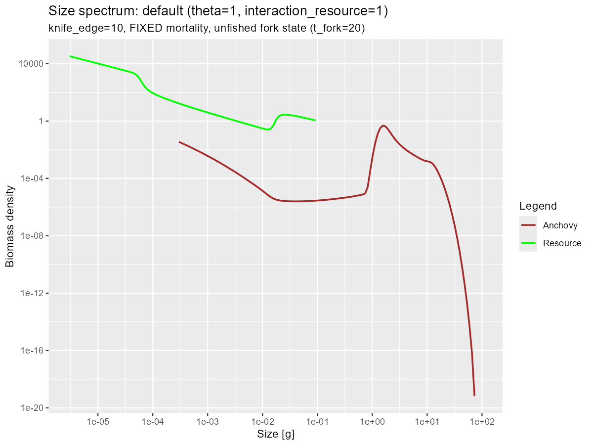

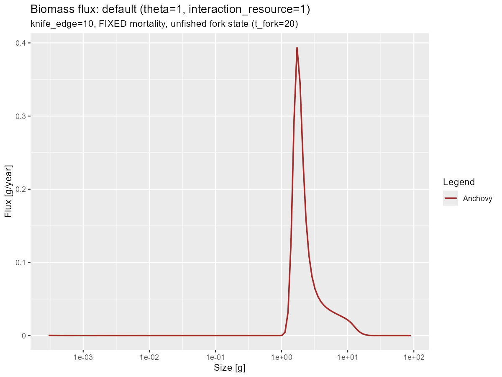

**The default model has a jam, and it's visible in both plots at once.** The size spectrum isn't the smooth, roughly power-law decline a textbook unjammed spectrum would show -- there's a distinct local peak in biomass density right around w=1-2g, sitting on top of an otherwise declining curve. The flux plot shows exactly what that bump is: a sharp spike of 0.395 g/year in growth flux at the same size, meaning a disproportionate share of all the biomass moving through this population's whole size range is funnelled through that one narrow band, not spread out. Biomass is piling up and surging through one choke point rather than flowing evenly.

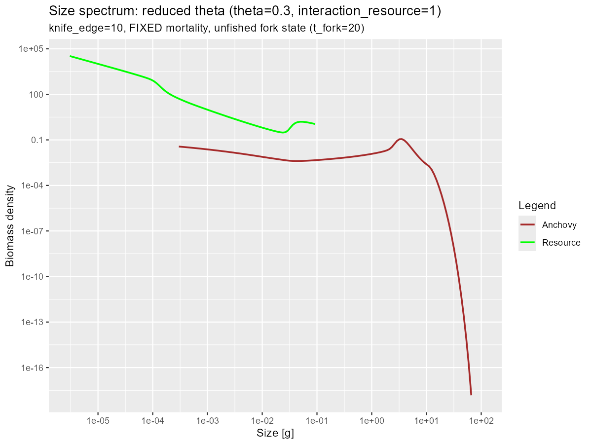

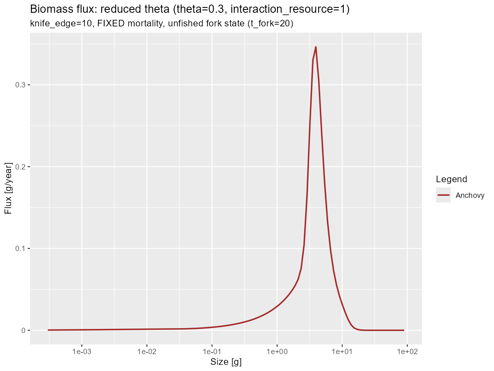

**Cutting cannibalism alone doesn't remove the jam -- it relocates it.** The bump is still there, just pushed out to a larger size (w≈4-5g rather than 1-2g, since juveniles now survive the small sizes for longer before running into whatever *does* constrain them) and reduced in the spectrum's own peak height (roughly 10x lower). The flux peak barely changes in magnitude (0.35 vs. 0.395 g/year) but becomes narrower and sharper. Still one dominant choke point, just moved.

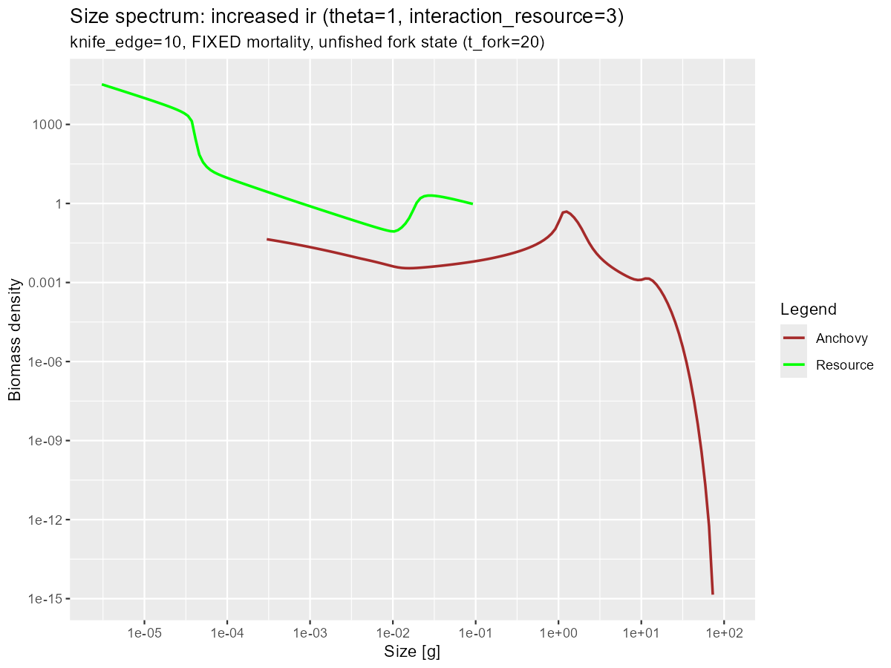

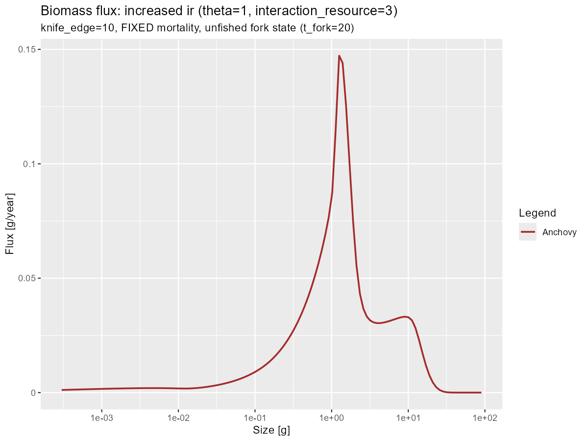

**Boosting resource access alone does even less.** The spectrum's bump sits at essentially the same location as the default (w≈1-2g) and reaches almost the same peak height -- more resource doesn't move the jam anywhere. The flux peak does drop substantially, from 0.395 to 0.147 g/year (roughly a third), and a small secondary shoulder appears around w=8-10g, but the single dominant choke point at w≈1-2g is still clearly the main feature.

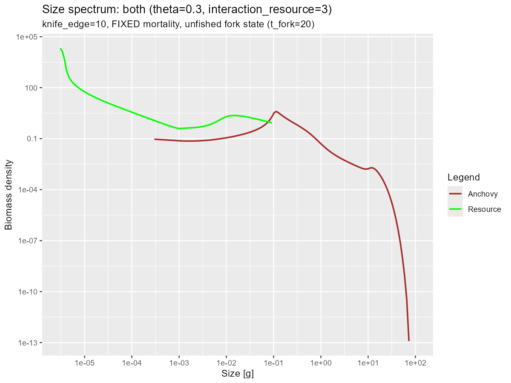

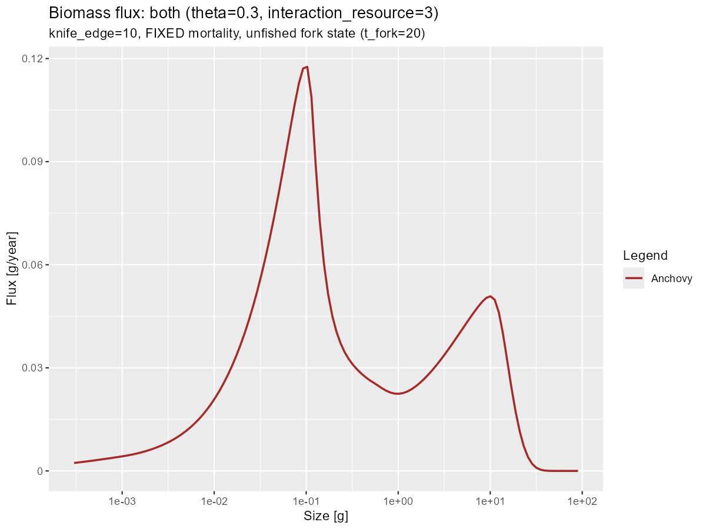

**Only combining both changes actually breaks the jam up.** The size spectrum has no sharp bump at all -- just a gentle, broad rise from w≈0.05-0.3g before declining smoothly, much closer to what an unjammed spectrum should look like. The flux tells the same story more sharply: it's genuinely **bimodal**, with a peak of 0.118 g/year at w≈0.1g, a real trough down to 0.02 g/year at w≈1g -- exactly the size where all three other scenarios have their own single dominant peak -- and a second, smaller peak of 0.05 g/year at w≈8-10g, sitting almost exactly on `w_mat=10`/`knife_edge=10`, the maturity and harvestable size. Growth flux that was concentrated at one choke point in every other scenario is here split across two smaller surges, with the former choke point turned into a trough instead.

That split is very likely the mechanism behind Section 5's own finding. A population with all its growth funnelled through one narrow size band is a population where a single perturbation -- fishing pressure landing on or near that band, in particular -- has an outsized, non-linear effect: relieve the jam even slightly and the compositional-shift dynamics this project has traced since Day 39 take over, producing the recover-and-climb or monotonic-forever shapes Sections 1-3 found everywhere else. A population whose growth is already distributed across two smaller surges instead has no single point of failure for fishing to exploit or relieve that dramatically -- which is consistent with `theta=0.3/ir=3` being the one regime found so far where Constant fishing effort produces an honest trade-off (a real peak, then a real decline) rather than a discontinuous jump between "barely responds" and "collapses."

------------------------------------------------------------------------

## Section 7: Does the Jam-Resolution Finding Survive a More Accurate Scheme?

Section 6's whole mechanism rests on a single-scheme snapshot. MIZER-AGENTS.md's own documented fix for the default scheme's numerical diffusion is `second_order_w(params) <- TRUE` paired with `method="tr_bdf2"` in `project()` -- the natural next question is whether the bimodal flux Section 6 found is a real feature of the dynamics, or an artefact of the default scheme's own smearing that a more accurate scheme would iron out.

**`steady()`/`steadyNewton()` doesn't apply here, so it wasn't used.** Both assume mizer's own standard semichemostat resource dynamics; this project's own custom `plankton_logistic()` (the exact analytic logistic-plus-immigration stepper adopted Day 40) is not that, independent of which consumer-side scheme is attached. This rules it out rather than just avoiding it -- confirmed by checking, not assumed.

**Restarting the second-order run from an arbitrary spectrum was also ruled out**, for a reason already on record: this file's own earlier dt-raising test found that exact procedure (a 10-year settle from an arbitrary tiny spectrum, then rescale by `1e7`) collapses to numerical extinction under `second_order_w`+`tr_bdf2`. So instead: run the first-order fork as usual (known-good, Section 6's own convention) to reach a physically sensible, already-oscillating state, then seed a second-order copy of the *same* params from that *same* state and continue under `tr_bdf2` -- not restarting from scratch, just switching which scheme takes over from a sensible starting point.

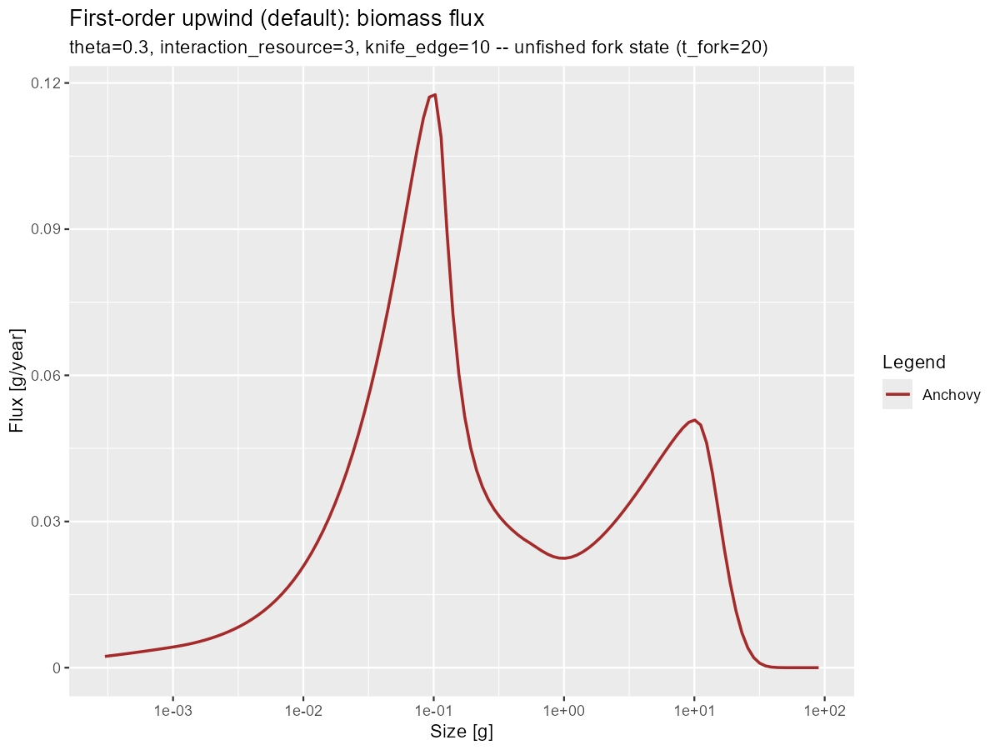

The first-order snapshot reproduces Section 6's own bimodal flux exactly, as it should -- same model, same seed point.

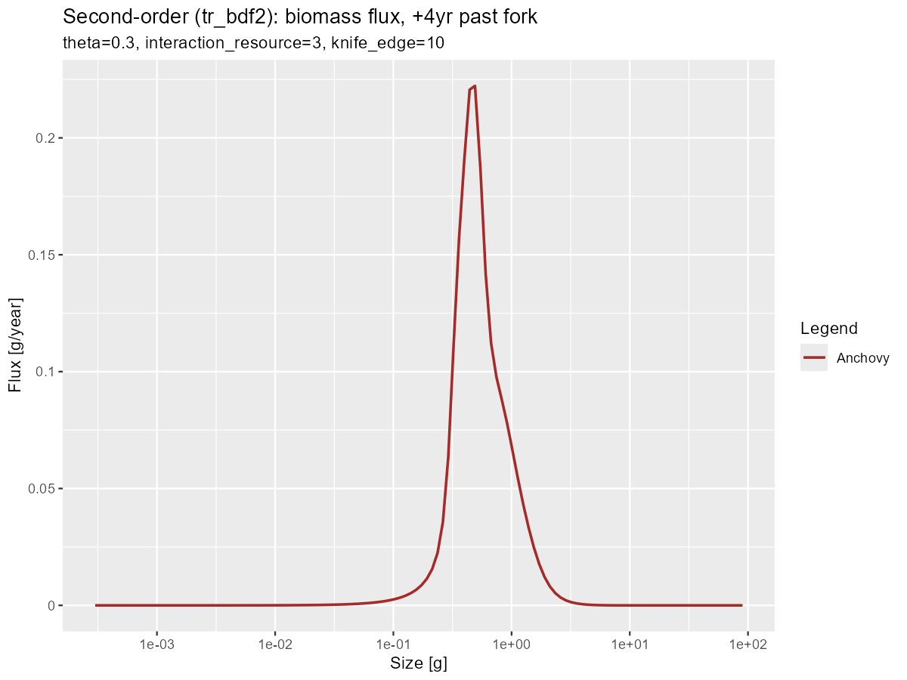

Four years in, the second peak and the trough between them have vanished, replaced by a single sharp peak (0.22 g/year at w≈0.5g) -- the same *shape* of jam Section 6 found in the default/theta-only/ir-only scenarios, not the split structure the whole section's argument was built on. Four years is less than one full cycle at this model's own \~5-6 year period, though, so this alone doesn't distinguish a real correction from an incomplete transient -- extending the check was the obvious next step, not stopping here.

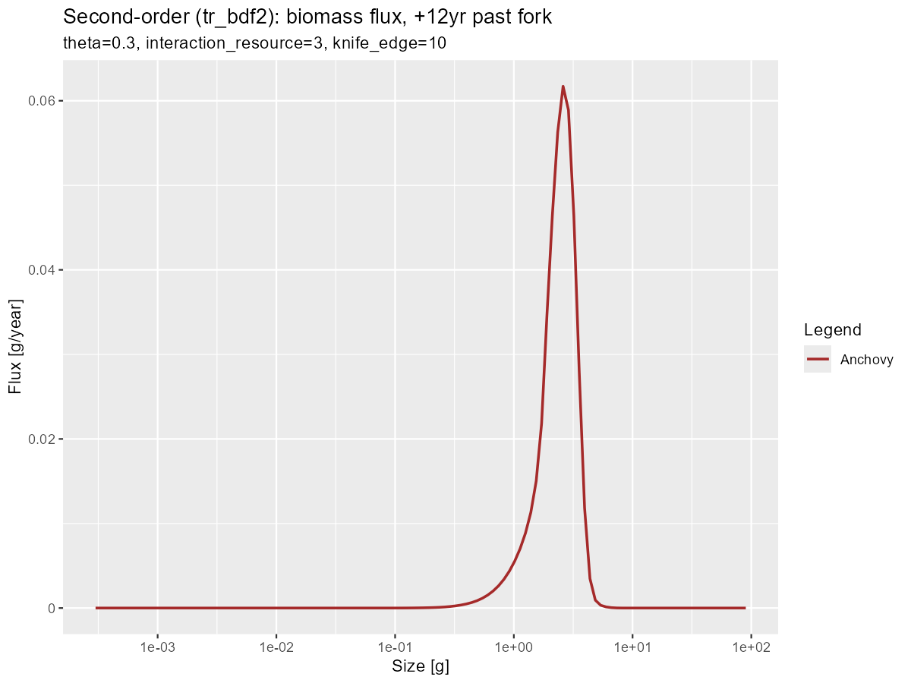

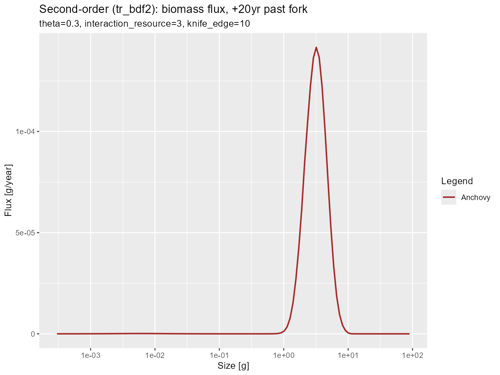

Extending to +12 and +20 years (roughly 3.6 cycles total) resolves the ambiguity, but not toward either of the two readings that mattered. The flux does not re-settle into the bimodal shape (which would have confirmed Section 6's mechanism survives a better scheme), and it does not reveal a genuine alternative single-peaked equilibrium either (which would have refuted it cleanly). Instead it declines monotonically and steepens: 0.22 g/year at +4yr, to 0.062 at +12yr, to 0.00014 at +20yr -- roughly three orders of magnitude in sixteen years -- while the resource spectrum loses its own grazed kink entirely and reverts to an almost untouched power law, because there's barely any anchovy population left under `tr_bdf2` to graze it down. That is a population heading toward extinction under the second-order scheme regardless of where it starts, not a population settling into any comparable state, jammed or otherwise.

The likely cause is a deeper incompatibility between this project's own custom resource dynamics and `tr_bdf2`'s own two-stage rate evaluation, not simply the fork-and-settle constants the earlier dt-raising test blamed -- this run was seeded from a perfectly good state, not an arbitrary one, and still failed the same way, just more slowly. Section 6's mechanism therefore stands **unconfirmed but also un-contradicted** by a more accurate scheme: the tool used to check it doesn't produce a usable comparison at all, which is a different and more basic problem than the mechanism being wrong. Diagnosing that incompatibility properly -- not just re-documenting its symptom -- is queued as its own overnight sweep (see "What's Next").

------------------------------------------------------------------------

## Section 8: No Cannibalism, No Oscillation -- and a Genuine Bistability Hiding Inside It

Every oscillation in this project traces back to cannibalism: self-predation via `interaction_matrix` is the destabilising feedback Datta, Delius and Law (2011) describe for this class of equation, and `report-background-mizer.qmd`'s own background section names it as such. `theta=0.3` cuts that feedback to 30% of baseline; what happens at `theta=0` -- cannibalism removed entirely, `interaction_resource=1`, `knife_edge=10` -- is a clean test of whether removing it outright removes the oscillation, and whether the collapse behaviour found throughout Sections 3/5 above needs the cycling dynamics in the mix at all.

**It does stop oscillating -- but not quickly, and what's underneath that turned out to be more interesting than the original question.** A 60-year unfished run past the usual `t_fork=20` found zero local peaks: not small-amplitude cycling, genuinely none, because the trajectory was still climbing monotonically the entire time (selected biomass +28% from year 20.5 to 80) and had not yet finished settling. `t_fork=20` was tuned for the `theta=0.3` models' own fast oscillatory attractor; theta=0 relaxes on a slower, non-cyclic timescale that convention was never built for.

Mizer's own `projectToSteady()` resolves this properly -- not `steady()`/`steadyNewton()`, which fails here for the same reason it fails for every oscillating model in this project (it assumes standard semichemostat resource dynamics, and this project's own custom `plankton_logistic()` is not that, independent of whether the consumer side happens to cycle). Run directly on a fresh model build, bypassing this project's own fork procedure entirely, it converges to a genuine fixed point (`type="steady"`, not `"cycle"`) in 28.8 years -- and every one of 11 fishing efforts tested from 1 to 100 also converges cleanly to a fixed point, confirming fishing does not induce any oscillation in this regime either.

The corrected numbers change a great deal from an earlier, unconverged pass at the same sweep: `fraction_of_unfished` at `fish_level=100` is 0.368, not the 0.730 that sweep reported -- roughly half. More strikingly, the curve is not monotonic. It declines from 0.986 (`fish_level=1`) to a local minimum of 0.866 (`fish_level=9`), genuinely *recovers* to 0.898-0.905 (`fish_level=15-20`), then drops sharply to 0.515 between `fish_level=20` and `30`, continuing down to 0.368 by 100. The yield curve echoes it: a real interior peak of 0.0514 at `fish_level=9`, a dip to 0.0223 at `fish_level=30` -- exactly where the biomass drop lands -- then a slight rise back to 0.0272 by 100. This project has read that peak-dip-rise shape as a signature of oscillating, compositional-shift dynamics everywhere else it's appeared (Day 40's own headline finding, Sections 1-3 above); here it shows up with **zero oscillation anywhere in the range**.

**Is the sharp drop between `fish_level=20` and `30` actually a bifurcation, or just a steep-but-continuous decline that a coarse 11-point grid makes look sudden?** That's worth being skeptical of rather than asserting from a convergence-time proxy alone, so it was checked directly rather than assumed.

**A fine bracket first.** Stepping through `fish_level=21` to `29` in single-unit steps, from the same unfished branch as the coarse sweep: `fraction_of_unfished` declines smoothly and gently from 0.894 to 0.820 across `fish_level=21`-`27` (about 0.012 per unit of effort), then jumps to 0.578 between `27` and `28` -- a 0.24 drop in a single unit of effort, twenty times steeper than the trend it interrupts. `conv_years` moves in lockstep: 23.0 at `fish_level=21` rising gently to 29.6 at `27`, then jumping to 45.4 at `28`. A genuinely continuous curve, even a steep one, does not do this on a grid this fine -- this looks like a real discontinuity, not a sampling artefact.

**The decisive test is hysteresis, not steepness.** A single curve, however steep, is still single-valued: one state per effort level, regardless of history. A genuine fold means the *same* effort value can have two different stable states depending on which direction you approach it from. So: converge at `fish_level=30` (past the jump), then step *down* through the same effort values the upward sweep already covered, and check whether they land on the same numbers.

They don't. At `fish_level=25`: approached from the unfished branch, `fraction_of_unfished=0.862`, converging in 26.6 years. Approached from above (converged at 30, stepped down), the same effort gives `fraction_of_unfished=0.507`, converging in 0.8 years. At `fish_level=20`: 0.898 from below (22.2yr) versus 0.502 from above (1.0yr). Two different stable equilibria, coexisting at the identical fishing effort, each one reached almost instantly once the system is already in its basin and each one taking decades to reach if the system starts near the *other* branch's own fold. That fast-near-home/slow-near-the-fold asymmetry on both sides is exactly what standard bifurcation theory predicts, not just a plausible-sounding label -- this is genuine bistability, not a steep single curve. Confirmed bistable across `fish_level=20`-`27` at minimum; where the low branch stops being reachable from above, below `fish_level=20`, isn't mapped yet.

What two coexisting equilibria in a *non-oscillating* population might physically represent -- something like two different stable size-compositions, a version of the compositional shift Sections 3-5 found driving oscillation elsewhere, but frozen into two static configurations instead of cycled between -- is exactly the kind of question this project's own traffic-jam framing was built to ask, and hasn't been answered yet. This is a genuinely new phenomenon for this project, not a corollary of anything found so far, and it deserves its own dedicated investigation rather than a paragraph here.

------------------------------------------------------------------------

## What's Next

The concrete target this project has been chasing across this whole post -- **a regime with a genuine interior yield peak where the population is still actually oscillating, not flickering into collapse, at that peak** -- has a real candidate for the first time: `theta=0.3, interaction_resource=3`, at `knife_edge=3` or `knife_edge=5`. That's the precondition for the next real piece of work: applying the threshold-schedule machinery (`thresholdFMort()`, the peaks/troughs rule this project has built and tested since Day 36) *on top of* a Constant-effort MSY that means something, rather than on top of a floor that was either arbitrary or a peak this project has since found reason to doubt.

1.  **Confirm `theta=0.3/ir=3` properly before building anything on top of it.** A finer effort grid around fish_level=9 (`ke=3`) and 15 (`ke=5`) -- Section 4's own 21-point convention -- to pin the peak down precisely, plus a genuine oscillation check (full time series across several effort levels, period detection, Section 4's own convention rather than the `rel_amplitude` proxy Section 5 used to screen 56 candidates cheaply) on both `knife_edge` values.
2.  **Once confirmed, this is the regime to run the threshold schedule on.** Every peaks/troughs comparison so far in this project (Day 40's own Sections 2-3, this post's own `ir=1.3`/`theta=0.5-ir=2`/`theta=0.7-ir=5` reruns) was layered on a floor that turned out to be arbitrary or doubtful. `theta=0.3/ir=3`'s own Constant-effort MSY -- once pinned down by item 1 -- is the first floor in this project that would actually mean "boosting fishing at the population's peaks/troughs, on top of its own best sustainable constant effort."
3.  **If item 1 finds `theta=0.3/ir=3` doesn't hold up under closer inspection, the other 15 near-miss combinations are the fallback list**, not a dead end -- Section 5's own screen ranks them by how close their amplitude gets to the collapse-flicker ceiling, so the next-best candidates are already sorted.
4.  **The Overnight interaction grid's own theta x interaction_resource story** (Day 40 Section 0's `interaction_grid_df`) still hasn't had its own growth-recovery/fishing-sensitivity trade-off read all the way through against this post's own findings -- worth reconciling now that `ir=3` specifically is the regime in hand, not picked from the extinction search alone.
5.  **Day 40 Section 7's threshold_frac x boost heatmap** has still not been rerun under the fixed mortality, or at `theta=0.3/ir=3` rather than `ir=1` -- queued behind item 2.
6.  **Test the jam-breaking mechanism under fishing, not just unfished.** Section 6's own spectrum/flux snapshots are all at the unfished fork state -- the natural next check is whether `theta=0.3/ir=3`'s bimodal, jam-free flux structure survives as Constant effort rises toward its own MSY and past it, or whether fishing pressure on the harvestable-size peak (w≈8-10g) reconstitutes a single choke point the way it does in the other three scenarios. If the two-surge structure holds up under fishing, that would be direct mechanistic confirmation of Section 6's own hypothesis, not just a plausible story fit to the unfished snapshot alone.
7.  **An overnight sweep is queued to test the second-order incompatibility properly**, rather than leave Section 6's own caveat sitting on a single, hand-seeded checkpoint run. The goal is to actually diagnose the failure rather than just keep re-documenting its symptom: sweep `tr_bdf2`/`second_order_w` across a range of `(theta, interaction_resource, knife_edge)` combinations (not just `theta=0.3/ir=3`) and a range of `dt` to check whether the slow decline to extinction is universal across this project's whole model space or specific to particular regions of it; run the same scheme against mizer's own default semichemostat resource dynamics (not this project's own custom `plankton_logistic()`) as a control, to isolate whether the incompatibility is with the custom resource stepper specifically or with `tr_bdf2` more generally in this project's setup; and check whether finer `dt` narrows or widens the gap, which would point toward a stiffness/step-size interaction rather than a structural bug. Only once the actual mechanism of the incompatibility is understood does it make sense to either fix it or trust a workaround.
8.  **Section 8's own bistability is the most novel open thread in this post and deserves a dedicated follow-up, not a footnote.** Concretely: (a) map the lower edge of the bistable window -- how far below `fish_level=20` does the "low" branch stay reachable by approaching from above, and does the window have a sharp lower fold too, or does it taper off; (b) look at *why* -- pull the size spectrum and biomass flux (Section 6's own tools) on both branches at the same effort (e.g. `fish_level=25`) to see whether the two coexisting equilibria are compositionally different populations (a frozen, static version of the compositional shift that drives oscillation elsewhere in this project) or something else entirely; (c) get a cleaner confirmation than the convergence-time/hysteresis combination already gathered -- `getStability()` on `steadyNewton()`'s own fixed points at efforts on either side of the fold would give the leading eigenvalue directly, the textbook way to confirm a fold bifurcation rather than inferring one from trajectory behaviour.
9.  **A dedicated overnight sweep is queued to test whether Section 8's own bistability is a global feature of this model, not a `theta=0`/`ir=1`/`ke=10` curiosity.** Item 8(d) above sketches the single-`theta` version of this question; this formalises it into the same kind of systematic search Section 3's own overnight sweep already ran for collapse: a grid across `theta`, `interaction_resource` and `knife_edge`, at each point running both an *upward* Constant-effort sweep (seeded from the unfished branch, as every earlier sweep in this project has done) and a *downward* one (seeded from a high-effort converged state, stepping down), then comparing the two paths at matching effort values -- any point where they disagree is a bistable point, exactly the test Section 8 already applied once by hand. The direct question is whether hysteresis is a `theta=0`-specific artefact of removing cannibalism entirely, or whether weaker versions of it are sitting undetected in the theta\<1, ir=1 combinations this whole project has already swept using only single-direction (upward) sweeps -- every collapse and every MSY finding so far, including `theta=0.3/ir=3` itself, has only ever been checked from one direction, so a real answer here could mean parts of this project's own story need re-examining for a fold nobody was looking for at the time.

------------------------------------------------------------------------

## Appendix: Building the Model From Scratch

Everything above was produced through layers of helper functions accumulated over many days (`anchovy_params()`, `cannibalism_fishing_probe()`, `run_full_sweep_suite()`, and so on, all in `finding_jams/40_changed_mort_experiments.R`). None of that is visible in the results above, which makes the model itself hard to talk someone through. This appendix builds the same model -- `theta=0.3`, `interaction_resource=1`, `knife_edge=10`, the aim model behind every section above -- once, directly, with nothing hidden behind a helper function. Every piece is exactly what the rest of this project uses, not a simplified stand-in for it: the paper's own parameters, the exact analytic resource stepper adopted on Day 40, the same settle-and-rescale procedure used to reach the oscillating state everywhere above.

```{r appendix-setup}
#| message: false
library(mizer)
library(ggplot2)
library(dplyr)
```

### A.1 The Parameters

These come from the paper this project is based on -- physiological rates (growth, reproduction), the predation kernel's shape, and the background resource's own dynamics. Nothing here is mizer-specific; it's just numbers.

```{r appendix-params}
p <- list(
  dt = 0.001, dx = 0.1, w_min = 0.0003, w_inf = 66.5,
  ppmr_min = 100, ppmr_max = 30000, gamma = 750, alpha = 0.85, K = 0.1,
  mu_l = 0, w_l = 0.03, rho_l = 5,
  mu_0 = 1, rho_b = -0.25,
  w_s = 0.5, rho_s = 1,
  w_mat = 10, rho_m = 15, rho_inf = 0.2, epsilon_R = 0.1,
  w_pp_cutoff = 0.1, r0 = 10, a0 = 100, i0 = 100, rho = 0.85, lambda = 2
)

theta                 <- 0.3   # fraction of baseline cannibalism strength kept
interaction_resource  <- 1     # this species' access to the background resource
knife_edge_size       <- 10    # fishing gear cutoff, in grams
```

### A.2 Two Small Functions mizer Needs

mizer looks up a predator's diet shape and the resource's own dynamics by name, so both need a matching function defined before `newMultispeciesParams()` is called.

**The predation kernel** says which prey sizes a predator will eat: anything within `[ppmr_min, ppmr_max]` of its own mass, in a flat "box" -- no size in that range is preferred over any other.

```{r appendix-kernel}
norm_box_pred_kernel <- function(ppmr, ppmr_min, ppmr_max) {
  phi <- rep(1, length(ppmr))
  phi[ppmr > ppmr_max | ppmr < ppmr_min] <- 0
  phi[1] <- 0
  phi / (sum(phi) * (log(ppmr[2]) - log(ppmr[1])))
}
```

**The resource's own dynamics** follow the logistic-plus-immigration equation $\dot n = \text{immigration} + (r - \mu)n - (r/K)n^2$: ordinary logistic growth toward a carrying capacity $K$, grazed down by predation mortality $\mu$ from the fish population, plus a constant trickle of immigration (production entering from outside the modelled size range, keeping the very smallest size classes topped up). mizer's own default resource stepper takes a single explicit-Euler step of this equation each `dt`; Day 40 of this project replaced that with the exact analytic solution of the same equation instead, adopted here unchanged because it's exact at any step size rather than an approximation that only holds for small `dt`.

```{r appendix-resource-dynamics}
exact_logistic_immigration_step <- function(n, rate, capacity, immigration,
                                            mortality, dt) {
  result <- n
  active <- is.finite(n) & is.finite(rate) & is.finite(capacity) &
    is.finite(immigration) & is.finite(mortality) &
    rate > 0 & capacity > 0 & immigration >= 0
  if (dt == 0 || !any(active)) return(result)

  n0 <- n[active]; r <- rate[active]; k <- capacity[active]
  i  <- immigration[active]; mu <- mortality[active]
  a  <- r - mu; b <- r / k
  next_n <- numeric(length(n0))

  # With immigration the quadratic has one positive and one negative root;
  # the alternative root formulae avoid cancellation when abs(a) is large.
  has_immigration <- i > 0
  if (any(has_immigration)) {
    idx <- which(has_immigration)
    ai <- a[idx]; bi <- b[idx]; ii <- i[idx]
    d  <- sqrt(ai^2 + 4 * bi * ii)
    n_plus  <- ifelse(ai >= 0, (ai + d) / (2 * bi), 2 * ii / (d - ai))
    n_minus <- ifelse(ai <= 0, (ai - d) / (2 * bi), -2 * ii / (ai + d))
    ratio <- ((n0[idx] - n_plus) / (n0[idx] - n_minus)) * exp(-d * dt)
    next_n[idx] <- (n_plus - ratio * n_minus) / (1 - ratio)
  }

  # The zero-immigration limit is handled separately, including rate == mortality.
  no_immigration <- !has_immigration
  if (any(no_immigration)) {
    idx <- which(no_immigration)
    az <- a[idx]; bz <- b[idx]; nz <- n0[idx]
    value <- numeric(length(idx))
    zero_rate <- az == 0
    value[zero_rate] <- nz[zero_rate] / (1 + bz[zero_rate] * nz[zero_rate] * dt)

    positive <- az > 0 & nz > 0
    phi <- -expm1(-az[positive] * dt) / az[positive]
    value[positive] <- nz[positive] / (exp(-az[positive] * dt) + bz[positive] * nz[positive] * phi)

    negative <- az < 0
    exp_adt <- exp(az[negative] * dt)
    phi <- expm1(az[negative] * dt) / az[negative]
    value[negative] <- nz[negative] * exp_adt / (1 + bz[negative] * nz[negative] * phi)
    next_n[idx] <- value
  }

  # Round-off can only create tiny negative values; the analytic solution is
  # non-negative for non-negative initial abundance and immigration.
  result[active] <- pmax(next_n, 0)
  result
}

plankton_logistic <- function(params, n, n_pp, n_other, rates, dt = 0.1, ...) {
  exact_logistic_immigration_step(
    n = n_pp, rate = params@rr_pp, capacity = params@cc_pp,
    immigration = immigration, mortality = rates$resource_mort, dt = dt
  )
}
```

### A.3 Building the Model

One species, described by the parameters above, dropped into `newMultispeciesParams()`.

```{r appendix-build}
kappa <- p$a0 * exp(-6.9 * (p$lambda - 1))

species_params_df <- data.frame(
  species = "Anchovy", w_min = p$w_min, w_mat = p$w_mat, m = p$rho_inf + 2/3,
  w_inf = p$w_inf, erepro = p$epsilon_R, alpha = p$K, ks = 0, gamma = p$gamma,
  q = p$alpha, ppmr_min = p$ppmr_min, ppmr_max = p$ppmr_max,
  pred_kernel_type = "norm_box", h = Inf, R_max = Inf, linecolour = "brown",
  stringsAsFactors = FALSE
)

params <- newMultispeciesParams(
  species_params_df, no_w = round(log(p$w_inf / p$w_min) / p$dx),
  lambda = p$lambda, kappa = kappa, w_pp_cutoff = p$w_pp_cutoff,
  resource_dynamics = "plankton_logistic"
)
resource_rate(params) <- p$r0 * w_full(params)^(p$rho - 1)
immigration            <- p$i0 * w_full(params)^(-p$lambda) * exp(-6.9 * (p$lambda - 1))
```

**Cannibalism and resource access.** `interaction_matrix` controls how much of a species' own predation pressure lands on itself; setting it to `theta` rather than 1 is literally what "cutting cannibalism to 30%" means in this model.

```{r appendix-interaction}
interaction_matrix(params) <- theta
species_params(params)$interaction_resource <- interaction_resource
```

**Fishing gear.** A knife-edge selectivity: nothing below `knife_edge_size` grams is caught, everything above it is, at a fixed catchability.

```{r appendix-gear}
gp                 <- gear_params(params)
gp$sel_func        <- "knife_edge"
gp$knife_edge_size <- knife_edge_size
gp$catchability    <- 1
gear_params(params) <- gp
```

**Background mortality.** This is the one place this model deliberately departs from mizer's own default: instead of a flat mortality rate at every size, the paper specifies a U-shaped curve -- high for larvae, a minimum around half a gram, rising again toward the adult size. `ext_mort<-()` is used rather than writing to `@mu_b` directly so this survives any later parameter change that would otherwise silently recompute it from mizer's own defaults (the bug Day 40 of this project found and fixed).

```{r appendix-mortality}
w    <- w(params)
mu_b <- rep(0, length(w))
mu_b[w <= p$w_s] <- (p$mu_0 * (w / p$w_min)^p$rho_b)[w < p$w_s]
mu_s <- min(mu_b[w <= p$w_s])
mu_b[w >= p$w_s] <- (mu_s * (w / p$w_s)^p$rho_s)[w >= p$w_s]
mu_b <- mu_b + p$mu_l / (1 + (w / p$w_l)^p$rho_l)

mort    <- ext_mort(params)
mort[]  <- mu_b
ext_mort(params) <- mort
```

The model is now fully specified. Everything below just runs it.

### A.4 Does It Oscillate?

The rest of this project reaches the oscillating state through a hand-tuned, two-stage procedure: settle for 10 years from an arbitrary starting spectrum, then rescale down by `1e7` (the settling transient overshoots by many orders of magnitude) before continuing. That procedure is specific to the default first-order scheme -- this section uses mizer's own `projectToSteady()` instead, which projects forward until the population's own oscillation amplitude stops changing by more than `amplitude_tol` between checks, with no hand-tuned settle time or rescale constant. It also switches the *time*-stepping method to `tr_bdf2`, mizer's second-order-in-time scheme -- not `second_order_w` (the *spatial* flux scheme, left at its default here), which is a narrower, different test from the full second-order combination this project's own Day 41 caveat found trouble with. Whether this still shows the same roughly five-to-six year cycle found everywhere else in this project, or whether `projectToSteady()`/`tr_bdf2` changes it, is exactly what running this checks.

```{r appendix-settle}
p$method <- "tr_bdf2"   # time-stepping method only -- second_order_w (the spatial
                        # flux scheme) is left at its own default, deliberately

sim_unfished <- projectToSteady(params, t_max = 150, t_per = 0.2, dt = p$dt,
                                method = p$method, return_sim = TRUE,
                                amplitude_tol = 0.0001)
```

```{r appendix-plot-oscillation}
#| fig-cap: "Unfished biomass under projectToSteady()'s own tr_bdf2 convergence run -- whatever length that took to satisfy amplitude_tol=0.0001, up to its own t_max=150 cap, not a fixed window chosen in advance."
#| message: false
plot(getBiomass(sim_unfished))
```

### A.5 Its Yield Curve

Rather than a fixed-length projection and an arbitrary post-transient window, run `projectToSteady()` again, once per fishing effort -- `finalParams(sim_unfished)` hands the model's own converged state straight back in as the next run's starting parameters, no manual `initialN<-()`/`initialNResource<-()` bookkeeping needed. `projectToSteady()` reports the cycle length it actually detected in `attr(sim, "convergence")$period`; averaging yield only over that final, detected period -- not a hand-picked number of years -- gives a genuinely smooth per-cycle mean rather than one that depends on exactly which stretch happened to be sampled.

```{r appendix-yield-curve}
effort_seq <- c(1, 2, 3, 5, 9, 20, 50, 100)
params <- finalParams(sim_unfished)

mean_yield <- sapply(effort_seq, function(effort) {
  sim <- projectToSteady(params, dt = p$dt, method = p$method, t_per = 0.2,
                 return_sim = TRUE, effort = effort)
  conv <- attr(sim, "convergence")
  start <- conv$years - conv$period
  mean(getYield(sim)[getTimes(sim) >= start, ])
})

yield_df <- data.frame(effort = effort_seq, yield = mean_yield)
```

```{r appendix-plot-yield}
#| fig-cap: "Yield vs. constant fishing effort for the oscillating anchovy model."
ggplot(yield_df, aes(effort, yield)) +
  geom_line() +
  geom_point(size = 2) +
  scale_x_log10() +
  labs(x = "Fishing effort (Constant, log scale)", y = "Mean yield",
       title = "Yield curve: theta=0.3, interaction_resource=1, knife_edge=10") +
  theme_minimal()
```

Under the project's own default settle procedure and first-order scheme (Sections 1-4 above), this curve is **not** a clean single peak -- a local peak around effort 9-12, a genuine dip through 15-20, then a second, larger rise all the way out to 100, driven by the compositional shift rather than a healthy fishery. Whether `projectToSteady()`/`tr_bdf2`'s own different seed state reproduces that same shape, or something else, is an open question this rewrite is set up to answer rather than a foregone conclusion -- worth comparing directly against the earlier figure once this actually runs, not assuming the two must agree.
